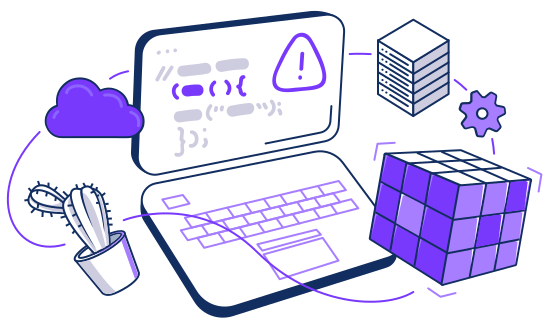

    

 

# Awesome Secure SaaS APIs

_Awesome Secure SaaS APIs is an awesome style list that curates the security aspects of SaaS and SaaS APIs so that you can evaluate them and make your infosec decisions faster._

<!-- START doctoc generated TOC please keep comment here to allow auto update -->
<!-- DON'T EDIT THIS SECTION, INSTEAD RE-RUN doctoc TO UPDATE -->

- [AI APIs](#ai-apis)
- [API Analytics/Monitoring](#api-analyticsmonitoring)
- [API Design/Documentation Platform](#api-designdocumentation-platform)
- [API Industry Specifications](#api-industry-specifications)
- [API Management/API Gateway](#api-managementapi-gateway)
- [API Oriented IT Consulting Firms](#api-oriented-it-consulting-firms)
- [API Platforms](#api-platforms)
- [API Testing](#api-testing)
- [API-Developer Portals](#api-developer-portals)
- [Access Level and Identity Management](#access-level-and-identity-management)
- [Accounting APIs](#accounting-apis)
- [Automation/Orchestration APIs](#automationorchestration-apis)
- [Backend as a Service](#backend-as-a-service)
- [Blockchain APIs](#blockchain-apis)
- [Cloud Storage API](#cloud-storage-api)
- [DBaaS](#dbaas)
- [Data Management API](#data-management-api)
- [Data-as-a-service](#data-as-a-service)
- [Delivery APIs](#delivery-apis)
- [Ecommerce APIs](#ecommerce-apis)
- [Email API](#email-api)
- [Fax/Mail/Voice](#faxmailvoice)
- [GraphQL](#graphql)
- [Headless CMS API](#headless-cms-api)
- [Headless Ecommerce APIs](#headless-ecommerce-apis)
- [Healthcare](#healthcare)
- [Human Resources APIs](#human-resources-apis)
- [Human as a service APIs](#human-as-a-service-apis)
- [IOT Platforms/Networks/Devices API](#iot-platformsnetworksdevices-api)
- [Infrastructure/Cloud/Serverless APIs](#infrastructurecloudserverless-apis)
- [KYC APIs](#kyc-apis)
- [Login APIs](#login-apis)
- [Marketing/Analytics](#marketinganalytics)
- [Messaging APIs/CPaas](#messaging-apiscpaas)
- [Open Banking APIs](#open-banking-apis)
- [Payment APIs](#payment-apis)
- [Search Engine APIs](#search-engine-apis)
- [Smart Home](#smart-home)
- [Streaming APIs](#streaming-apis)

<!-- END doctoc generated TOC please keep comment here to allow auto update -->

## AI APIs

|                                                 | API                  | Website     | SoC2 | PCI | GDPR | ISO27001 | HIPAA  | Bounty | Disclosure |
| ----------------------------------------------- | -------------------- | ----------- | ----------------------- | --- | ---- | -------- | ------ | ---------- | ----- |
|  [:link:](#http-atn-io) | [ATN.io](http://atn.io/) | [http://atn.io/](http://atn.io/) | [:white_check_mark:](https://www.crunchbase.com/organization/atn-io) | [:white_check_mark:](https://www.crunchbase.com/organization/atn-io) | [:white_check_mark:](https://www.crunchbase.com/organization/atn-io)  | :x: | :x: | [:white_check_mark:](https://www.crunchbase.com/organization/atn-io) | [:white_check_mark:](https://www.crunchbase.com/organization/atn-io) |
|  [:link:](#https-attentivemobile-com) | [Attentive](https://attentivemobile.com) | [https://attentivemobile.com](https://attentivemobile.com) | :x: | :x: | [:white_check_mark:](https://www.attentivemobile.com/product)  | :x: | :x: | :x: | [:white_check_mark:](https://docs.attentivemobile.com/pages/api-reference/add-subscribers/) |
|  [:link:](#https-bigml-com) | [BigML](https://bigml.com/) | [https://bigml.com/](https://bigml.com/) | [:white_check_mark:](https://bigml.com/) | :x: | [:white_check_mark:](https://bigml.com/tos/)  | [:white_check_mark:](https://bigml.com/api) | :x: | :x: | :x: |
|  [:link:](#https-clarifai-com) | [Clarifai](https://clarifai.com/) | [https://clarifai.com/](https://clarifai.com/) | [:white_check_mark:](https://www.clarifai.com/) | [:white_check_mark:](https://www.immuniweb.com/ssl/?id=eOC8W2dQ) | [:white_check_mark:](https://www.clarifai.com/company/privacy-policy)  | [:white_check_mark:](https://startup.jobs/devsecops-engineer-clarifai-657601) | [:white_check_mark:](https://www.getapp.com/emerging-technology-software/a/clarifai/features/) | [:white_check_mark:](https://www.bountysource.com/teams/clarifai/issues) | [:white_check_mark:](https://www.clarifai.com/company/privacy-policy) |
|  [:link:](#https-dialogflow-cloud-google-com) | [Dialogflow](https://dialogflow.cloud.google.com/) | [https://dialogflow.cloud.google.com/](https://dialogflow.cloud.google.com/) | [:white_check_mark:](https://cloud.google.com/dialogflow/docs) | [:white_check_mark:](https://cloud.google.com/dialogflow/docs/support/faq?agent=any&category=any) | [:white_check_mark:](https://stackoverflow.com/questions/53052121/privacy-policy-of-google-dialogflow-gdpr)  | :x: | [:white_check_mark:](https://stackoverflow.com/questions/58208624/is-dialogflow-hipaa-compliant) | :x: | [:white_check_mark:](https://developers.google.com/assistant/conversational/df-asdk/reference/webhook/rest/Shared.Types/Disclosure) |
|  [:link:](#https-www-featurelabs-com) | [Feature Labs](https://www.featurelabs.com/) | [https://www.featurelabs.com/](https://www.featurelabs.com/) | :x: | :x: | :x:  | :x: | :x: | :x: | [:white_check_mark:](https://www.featurelabs.com/open/) |
|  [:link:](#http-www-hutoma-ai) | [Hutoma](http://www.hutoma.ai) | [http://www.hutoma.ai](http://www.hutoma.ai) | :x: | :x: | :x:  | :x: | :x: | :x: | :x: |
|  [:link:](#https-infermedica-com) | [Infermedica](https://infermedica.com/) | [https://infermedica.com/](https://infermedica.com/) | [:white_check_mark:](https://infermedica.com/?utm_term=infermedica&utm_campaign=%5BBrand%5D+Infermedica+-+Other&utm_source=adwords&utm_medium=ppc&hsa_acc=3065239655&hsa_cam=13643412170&hsa_grp=124446453735&hsa_ad=529600566664&hsa_src=g&hsa_tgt=kwd-427904187747&hsa_kw=infermedica&hsa_mt=p&hsa_net=adwords&hsa_ver=3&gclid=Cj0KCQjwiqWHBhD2ARIsAPCDzalZyBWcLh7erHtzRw-XAitK-_W3udlZmBx3QCctMdnjdya-sOc6to0aAjh1EALw_wcB) | [:white_check_mark:](https://www.googleadservices.com/pagead/aclk?sa=L&ai=DChcSEwjl4OzIwNjxAhVlGgYAHXRgD4IYABAAGgJ3cw&ae=2&ohost=www.google.com&cid=CAESQeD2U3tTIPTXzwGtcKhoMF1W5np62hD7zT-ldIwc0AN0awrKC9fLDnDtKRa_WTnjb2yWKt9RfQX0V8UNenTCDWZe&sig=AOD64_1FfxaWJS9pd66G4RQeExpo7qrR-Q&q&adurl&ved=2ahUKEwiSt-XIwNjxAhX2D2MBHQKDDvQQ0Qx6BAgCEAE) | [:white_check_mark:](https://infermedica.com/privacy-policy)  | [:white_check_mark:](https://infermedica.com/?utm_term=infermedica&utm_campaign=%5BBrand%5D+Infermedica+-+Other&utm_source=adwords&utm_medium=ppc&hsa_acc=3065239655&hsa_cam=13643412170&hsa_grp=124446453735&hsa_ad=529600566682&hsa_src=g&hsa_tgt=kwd-427904187747&hsa_kw=infermedica&hsa_mt=p&hsa_net=adwords&hsa_ver=3&gclid=Cj0KCQjwiqWHBhD2ARIsAPCDzakdBacPny7Qc-3o1J3hQk5-hFU66El7bGP2iqCL0Kyo9oGrNrr1qlYaAlpNEALw_wcB) | :x: | [:white_check_mark:](https://infermedica.com/?utm_term=infermedica&utm_campaign=%5BBrand%5D+Infermedica+-+Other&utm_source=adwords&utm_medium=ppc&hsa_acc=3065239655&hsa_cam=13643412170&hsa_grp=124446453735&hsa_ad=529600566664&hsa_src=g&hsa_tgt=kwd-427904187747&hsa_kw=infermedica&hsa_mt=p&hsa_net=adwords&hsa_ver=3&gclid=Cj0KCQjwiqWHBhD2ARIsAPCDzak9aNW3BLGIZw0PtDMBoEs7DJGROU-C2xl28nUzc5ZX33ZDRxV-o54aAvNzEALw_wcB) | [:white_check_mark:](https://www.googleadservices.com/pagead/aclk?sa=L&ai=DChcSEwizpZfVwNjxAhUaGgYAHadAC7gYABAAGgJ3cw&ae=2&ohost=www.google.com&cid=CAESQeD2ZRPhl7se_X14poaCLWH5zo7RWeRCr0PlDENYBTjiZ-6nDe9DRHGcCWkApHxqILiH2e--9w2dvm05Zi4H3MrA&sig=AOD64_1TJcFZaQIfqZYE7fH3LY-_g8zsYA&q&adurl&ved=2ahUKEwjAso_VwNjxAhWHDxQKHe-VDHsQ0Qx6BAgCEAE) |
|  [:link:](#https-medium-com@markable) | [Markable](https://medium.com/@markable) | [https://medium.com/@markable](https://medium.com/@markable) | :x: | :x: | [:white_check_mark:](https://markableuae.com/privacy-policy/)  | :x: | :x: | :x: | [:white_check_mark:](https://www.markablesolutions.com/wp-content/uploads/2019/11/Privacy-Policy_Markable-Solutions.pdf) |
|  [:link:](#https-www-myralabs-com) | [Myra labs](https://www.myralabs.com/) | [https://www.myralabs.com/](https://www.myralabs.com/) | :x: | [:white_check_mark:](https://www.crunchbase.com/organization/myra-labs) | :x:  | :x: | :x: | [:white_check_mark:](https://www.crunchbase.com/organization/myra-labs) | [:white_check_mark:](https://www.crunchbase.com/organization/myra-labs) |
|  [:link:](#https-www-datarobot-comnexosis) | [Nexosis](https://www.datarobot.com/nexosis/) | [https://www.datarobot.com/nexosis/](https://www.datarobot.com/nexosis/) | :x: | :x: | [:white_check_mark:](https://apistore.dev/marketplace/nexosis-machine-learning-v1/)  | :x: | :x: | :x: | :x: |
|  [:link:](#http-nstack-com) | [Nstack](http://nstack.com) | [http://nstack.com](http://nstack.com) | :x: | [:white_check_mark:](https://www.immuniweb.com/ssl/nstack.io/5esK5uz5/) | :x:  | :x: | [:white_check_mark:](https://www.immuniweb.com/ssl/nstack.io/5esK5uz5/) | :x: | :x: |
|  [:link:](#https-predictionio-apache-org) | [PredictionIO](https://predictionio.apache.org/) | [https://predictionio.apache.org/](https://predictionio.apache.org/) | [:white_check_mark:](https://predictionio.apache.org/) | :x: | :x:  | :x: | :x: | [:white_check_mark:](https://www.bountysource.com/teams/predictionio/issues) | [:white_check_mark:](https://stackoverflow.com/questions/34796587/predictionio-text-classification-quick-start-failing-when-reading-the-data) |
|  [:link:](#http-qloo-com) | [Qloo](http://qloo.com) | [http://qloo.com](http://qloo.com) | :x: | :x: | [:white_check_mark:](https://qloo.com/privacy-policy/)  | :x: | :x: | :x: | :x: |
|  [:link:](#Restb-ai) | [Restb.ai](Restb.ai) | [Restb.ai](Restb.ai) | [:white_check_mark:](https://restb.ai/) | [:white_check_mark:](https://restb.ai/) | [:white_check_mark:](https://restb.ai/terms-service-privacy-policy/)  | :x: | [:white_check_mark:](https://restb.ai/) | [:white_check_mark:](https://restb.ai/) | [:white_check_mark:](https://restb.ai/terms-service-privacy-policy/) |
|  [:link:](#http-seentient-com) | [Seentient](http://seentient.com/) | [http://seentient.com/](http://seentient.com/) | :x: | :x: | :x:  | :x: | :x: | :x: | :x: |
|  [:link:](#https-docs-skim-it) | [Skim.it](https://docs.skim.it/) | [https://docs.skim.it/](https://docs.skim.it/) | :x: | [:white_check_mark:](https://docs.skim.it/) | [:white_check_mark:](https://skimgroup.com/privacy-policy/)  | :x: | [:white_check_mark:](https://docs.skim.it/) | :x: | [:white_check_mark:](https://docs.skim.it/) |
|  [:link:](#https-spaziodati-euen) | [SpazioDati](https://spaziodati.eu/en/) | [https://spaziodati.eu/en/](https://spaziodati.eu/en/) | :x: | :x: | :x:  | :x: | :x: | :x: | :x: |
|  [:link:](#https-www-spectrumlabsai-com) | [Spectrum Labs](https://www.spectrumlabsai.com/) | [https://www.spectrumlabsai.com/](https://www.spectrumlabsai.com/) | [:white_check_mark:](https://enterprise.spectrum.com/insights/blog/what-SOC-2-compliance-reveals-about-a-technology-partner.html) | :x: | :x:  | [:white_check_mark:](https://www.spectrummedical.com/news/iso-27001-accreditation) | :x: | :x: | [:white_check_mark:](https://www.spectrumlabsai.com/privacy-policy) |
|  [:link:](#https-www-traitify-com) | [Traitify](https://www.traitify.com/) | [https://www.traitify.com/](https://www.traitify.com/) | [:white_check_mark:](https://www.traitify.com/) | :x: | :x:  | :x: | :x: | :x: | [:white_check_mark:](https://www.traitify.com/legal/) |
|  [:link:](#https-www-craft-ai) | [craft ai](https://www.craft.ai/) | [https://www.craft.ai/](https://www.craft.ai/) | [:white_check_mark:](https://www.craft.ai/) | [:white_check_mark:](https://www.craft.ai/) | [:white_check_mark:](https://www.craft.ai/blog/with-craft-ai-gdpr-is-your-friend/)  | [:white_check_mark:](https://www.craft.ai/) | [:white_check_mark:](https://www.craft.ai/) | [:white_check_mark:](https://www.craft.ai/) | [:white_check_mark:](https://www.craft.ai/) |
|  [:link:](#https-www-pingidentity-com) | [elastic beam by ping identity](https://www.pingidentity.com/) | [https://www.pingidentity.com/](https://www.pingidentity.com/) | :x: | [:white_check_mark:](https://www.pingidentity.com/en/company/press-releases-folder/2018/ping-identity-acquires-elastic-beam-launches-new-ai-driven-solution-to-secure-apis.html) | [:white_check_mark:](https://www.pingidentity.com/en/company/press-releases-folder/2018/ping-identity-acquires-elastic-beam-launches-new-ai-driven-solution-to-secure-apis.html)  | :x: | [:white_check_mark:](https://www.pingidentity.com/en/company/press-releases-folder/2018/ping-identity-acquires-elastic-beam-launches-new-ai-driven-solution-to-secure-apis.html) | [:white_check_mark:](https://www.pingidentity.com/en/company/press-releases-folder/2018/ping-identity-acquires-elastic-beam-launches-new-ai-driven-solution-to-secure-apis.html) | [:white_check_mark:](https://techcrunch.com/2018/06/26/ping-identity-acquires-stealthy-api-security-startup-elastic-beam/) |
|  [:link:](#https-indico-io) | [indico Data](https://indico.io/) | [https://indico.io/](https://indico.io/) | [:white_check_mark:](https://indico.io/terms/) | [:white_check_mark:](https://indico.un.org/category/1711/) | :x:  | :x: | [:white_check_mark:](https://indico.io/) | [:white_check_mark:](https://indico.io/) | [:white_check_mark:](https://indico.io/terms/) |
|  [:link:](#https-monkeylearn-com) | [onkeyLearnM](https://monkeylearn.com/) | [https://monkeylearn.com/](https://monkeylearn.com/) | [:white_check_mark:](https://monkeylearn.com/pricing/) | [:white_check_mark:](https://monkeylearn.com/) | [:white_check_mark:](https://help.monkeylearn.com/en/articles/2174293-is-monkeylearn-gdpr-compliant)  | [:white_check_mark:](https://monkeylearn.com/how-it-works/) | [:white_check_mark:](https://monkeylearn.com/security) | :x: | [:white_check_mark:](https://monkeylearn.com/zapier) |
|  [:link:](#https-wit-ai) | [wit.ai](https://wit.ai/) | [https://wit.ai/](https://wit.ai/) | [:white_check_mark:](https://wit.ai/) | [:white_check_mark:](https://wit.ai/docs/quickstart) | [:white_check_mark:](https://wit.ai/privacy)  | [:white_check_mark:](https://wit.ai/) | [:white_check_mark:](https://wit.ai/blog) | :x: | [:white_check_mark:](https://wit.ai/docs/) |

[:top: Top of AI APIs](#AI-APIs)  [:top: Top of list](#awesome-secure-saas)
  
## API Analytics/Monitoring

|                                                 | API                  | Website     | SoC2 | PCI | GDPR | ISO27001 | HIPAA  | Bounty | Disclosure |
| ----------------------------------------------- | -------------------- | ----------- | ----------------------- | --- | ---- | -------- | ------ | ---------- | ----- |
|  [:link:](#https-apifortress-com) | [API Fortress](https://apifortress.com/) | [https://apifortress.com/](https://apifortress.com/) | [:white_check_mark:](https://apifortress.com/) | [:white_check_mark:](https://apifortress.com/) | [:white_check_mark:](https://apifortress.com/)  | [:white_check_mark:](https://apifortress.com/) | [:white_check_mark:](https://apifortress.com/) | [:white_check_mark:](https://apifortress.com/) | [:white_check_mark:](https://apifortress.com/) |
|  [:link:](#https-www-apiscience-com) | [API Science](https://www.apiscience.com/) | [https://www.apiscience.com/](https://www.apiscience.com/) | :x: | [:white_check_mark:](https://www.apiscience.com/docs/api) | :x:  | :x: | :x: | :x: | [:white_check_mark:](https://www.apiscience.com/docs/api) |
|  [:link:](#https-apimetrics-io) | [APImetrics](https://apimetrics.io/) | [https://apimetrics.io/](https://apimetrics.io/) | :x: | [:white_check_mark:](https://apimetrics.io/) | :x:  | :x: | :x: | :x: | :x: |
|  [:link:](#https-www-moesif-com) | [Moesif](https://www.moesif.com/) | [https://www.moesif.com/](https://www.moesif.com/) | [:white_check_mark:](https://www.moesif.com/enterprise/security-compliance) | :x: | [:white_check_mark:](https://www.moesif.com/privacy)  | [:white_check_mark:](https://tyk.io/docs/tyk-configuration-reference/tyk-pump-configuration/moesif/) | [:white_check_mark:](https://www.moesif.com/docs/faq/) | :x: | [:white_check_mark:](https://www.moesif.com/privacy) |
|  [:link:](#https-www-repustate-com) | [Repustate](https://www.repustate.com/) | [https://www.repustate.com/](https://www.repustate.com/) | [:white_check_mark:](https://www.repustate.com/) | [:white_check_mark:](https://www.repustate.com/blog/how-to-extract-images-from-a-web-page/) | :x:  | :x: | :x: | :x: | :x: |
|  [:link:](#https-www-runscope-com) | [Runscope by Broadcom](https://www.runscope.com/) | [https://www.runscope.com/](https://www.runscope.com/) | :x: | [:white_check_mark:](https://www.runscope.com/) | :x:  | [:white_check_mark:](https://www.runscope.com/gdpr) | [:white_check_mark:](https://www.runscope.com/) | [:white_check_mark:](https://www.runscope.com/) | [:white_check_mark:](https://www.runscope.com/) |

[:top: Top of API Analytics/Monitoring](#API-AnalyticsMonitoring)  [:top: Top of list](#awesome-secure-saas)
  
## API Design/Documentation Platform

|                                                 | API                  | Website     | SoC2 | PCI | GDPR | ISO27001 | HIPAA  | Bounty | Disclosure |
| ----------------------------------------------- | -------------------- | ----------- | ----------------------- | --- | ---- | -------- | ------ | ---------- | ----- |
|  [:link:](#https-autoswagger-apizr-io) | [AutoSwagger by APIZR](https://autoswagger.apizr.io/) | [https://autoswagger.apizr.io/](https://autoswagger.apizr.io/) | :x: | :x: | :x:  | :x: | :x: | :x: | :x: |
|  [:link:](#https-www-blobr-io) | [Blobr](https://www.blobr.io/) | [https://www.blobr.io/](https://www.blobr.io/) | :x: | :x: | :x:  | :x: | :x: | :x: | :x: |
|  [:link:](#https-www-datahive-ca) | [Datahive by APIZR](https://www.datahive.ca/) | [https://www.datahive.ca/](https://www.datahive.ca/) | :x: | :x: | :x:  | :x: | :x: | :x: | [:white_check_mark:](https://e-datahive.com/) |
|  [:link:](#https-deployd-com) | [Deployd](https://deployd.com/) | [https://deployd.com/](https://deployd.com/) | :x: | :x: | :x:  | :x: | :x: | :x: | :x: |
|  [:link:](#https-lucybot-com) | [Lucybot](https://lucybot.com/) | [https://lucybot.com/](https://lucybot.com/) | :x: | :x: | :x:  | :x: | :x: | :x: | :x: |
|  [:link:](#https-opticsinc-com) | [Optic](https://opticsinc.com/) | [https://opticsinc.com/](https://opticsinc.com/) | :x: | :x: | :x:  | :x: | :x: | :x: | :x: |
|  [:link:](#https-apiary-io) | [Oracle apiary](https://apiary.io/) | [https://apiary.io/](https://apiary.io/) | :x: | :x: | :x:  | :x: | [:white_check_mark:](https://apiary.io/) | [:white_check_mark:](https://apiary.io/) | [:white_check_mark:](https://apiary.io/tos) |
|  [:link:](#https-readme-com) | [ReadMe](https://readme.com/) | [https://readme.com/](https://readme.com/) | [:white_check_mark:](https://readme.com/pricing) | :x: | [:white_check_mark:](https://readme.com/privacy)  | :x: | :x: | :x: | :x: |
|  [:link:](#https-stoplight-io) | [StopLight](https://stoplight.io/) | [https://stoplight.io/](https://stoplight.io/) | [:white_check_mark:](https://stoplight.io/studio/) | [:white_check_mark:](https://meta.stoplight.io/docs/studio/docs/Documentation/04-using-images.md) | [:white_check_mark:](https://stoplight.io/)  | [:white_check_mark:](https://meta.stoplight.io/docs/platform) | :x: | :x: | [:white_check_mark:](https://stoplight.io/) |
|  [:link:](#https-superface-ai) | [Superface](https://superface.ai/) | [https://superface.ai/](https://superface.ai/) | :x: | :x: | [:white_check_mark:](https://superface.ai/privacy-policy)  | :x: | :x: | :x: | :x: |
|  [:link:](#https-swagger-io) | [Swagger.io by Smartbear](https://swagger.io/) | [https://swagger.io/](https://swagger.io/) | [:white_check_mark:](https://swagger.io/about/) | [:white_check_mark:](https://swagger.io/tools/swaggerhub/) | [:white_check_mark:](https://swagger.io/about/)  | [:white_check_mark:](https://petstore.swagger.io/?url=) | [:white_check_mark:](https://swagger.io/) | [:white_check_mark:](https://swagger.io/) | [:white_check_mark:](https://swagger.io/) |
|  [:link:](#https-swagger-iotoolsswaggerhub) | [swaggerhub by smartbear](https://swagger.io/tools/swaggerhub/) | [https://swagger.io/tools/swaggerhub/](https://swagger.io/tools/swaggerhub/) | [:white_check_mark:](https://swagger.io/tools/swaggerhub/enterprise/) | [:white_check_mark:](https://swagger.io/tools/swaggerhub/) | :x:  | :x: | :x: | :x: | :x: |

[:top: Top of API Design/Documentation Platform](#API-DesignDocumentation-Platform)  [:top: Top of list](#awesome-secure-saas)
  
## API Industry Specifications

|                                                 | API                  | Website     | SoC2 | PCI | GDPR | ISO27001 | HIPAA  | Bounty | Disclosure |
| ----------------------------------------------- | -------------------- | ----------- | ----------------------- | --- | ---- | -------- | ------ | ---------- | ----- |
|  [:link:](#https-www-asyncapi-com) | [AsyncAPI](https://www.asyncapi.com/) | [https://www.asyncapi.com/](https://www.asyncapi.com/) | [:white_check_mark:](https://www.asyncapi.com/docs/specifications/2.0.0) | [:white_check_mark:](https://www.asyncapi.com/docs/specifications/2.0.0) | :x:  | :x: | :x: | :x: | :x: |
|  [:link:](#https-www-berlin-group-org) | [Berlin group](https://www.berlin-group.org/) | [https://www.berlin-group.org/](https://www.berlin-group.org/) | :x: | :x: | [:white_check_mark:](https://www.berlin-group.org/disclaimer-dataprivacy-policy)  | :x: | [:white_check_mark:](https://www.berlin-group.org/disclaimer-dataprivacy-policy) | [:white_check_mark:](https://www.berlin-group.org/) | [:white_check_mark:](https://www.berlin-group.org/disclaimer-dataprivacy-policy) |
|  [:link:](#https-www-openbanking-org-uk) | [Open Banking UK](https://www.openbanking.org.uk/) | [https://www.openbanking.org.uk/](https://www.openbanking.org.uk/) | [:white_check_mark:](https://www.openbanking.org.uk/) | [:white_check_mark:](https://www.openbanking.org.uk/) | [:white_check_mark:](https://standards.openbanking.org.uk/tpp-operational-guidelines/data-privacy-gdpr/latest/)  | [:white_check_mark:](https://www.openbanking.org.uk/wp-content/uploads/Guidelines-for-Open-Data-Participants.pdf) | [:white_check_mark:](https://www.openbanking.org.uk/) | [:white_check_mark:](https://www.openbanking.org.uk/) | [:white_check_mark:](https://www.openbanking.org.uk/wp-content/uploads/Guidelines-for-Read-Write-Participants.pdf) |
|  [:link:](#https-openinsurance-io) | [Open Insurance Initiative](https://openinsurance.io/) | [https://openinsurance.io/](https://openinsurance.io/) | [:white_check_mark:](https://openinsurance.io/) | [:white_check_mark:](https://openinsurance.io/) | [:white_check_mark:](https://openinsurance.io/)  | [:white_check_mark:](https://openinsurance.io/about/) | [:white_check_mark:](https://openinsurance.io/) | [:white_check_mark:](https://openinsurance.io/) | [:white_check_mark:](https://openinsurance.io/) |
|  [:link:](#https-www-openapis-org) | [OpenAPI Initiative](https://www.openapis.org/) | [https://www.openapis.org/](https://www.openapis.org/) | [:white_check_mark:](https://www.openapis.org/) | [:white_check_mark:](https://www.openapis.org/) | [:white_check_mark:](https://www.openapis.org/)  | :x: | [:white_check_mark:](https://www.openapis.org/) | [:white_check_mark:](https://www.openapis.org/) | [:white_check_mark:](https://www.openapis.org/) |
|  [:link:](#https-www-stet-euenpsd2) | [stet api](https://www.stet.eu/en/psd2/) | [https://www.stet.eu/en/psd2/](https://www.stet.eu/en/psd2/) | [:white_check_mark:](https://www.stet.eu/en/psd2/) | [:white_check_mark:](https://www.stet.eu/en/psd2/) | [:white_check_mark:](https://www.stet.eu/assets/files/PSD2/1-5/api-dsp2-stet-v1.5.0.43-part-1-framework.pdf)  | [:white_check_mark:](https://www.stet.eu/en/news/) | [:white_check_mark:](https://www.stet.eu/en/psd2/) | [:white_check_mark:](https://www.stet.eu/en/psd2/) | [:white_check_mark:](https://www.stet.eu/assets/files/PSD2/API-DSP2-STET_V1.2.3_final.pdf) |

[:top: Top of API Industry Specifications](#API-Industry-Specifications)  [:top: Top of list](#awesome-secure-saas)
  
## API Management/API Gateway

|                                                 | API                  | Website     | SoC2 | PCI | GDPR | ISO27001 | HIPAA  | Bounty | Disclosure |
| ----------------------------------------------- | -------------------- | ----------- | ----------------------- | --- | ---- | -------- | ------ | ---------- | ----- |
|  [:link:](#https-www-3scale-net) | [3Scale](https://www.3scale.net/) | [https://www.3scale.net/](https://www.3scale.net/) | [:white_check_mark:](https://www.3scale.net/) | :x: | :x:  | :x: | :x: | :x: | :x: |
|  [:link:](#www-apinf-com) | [APInf](www.apinf.com) | [www.apinf.com](www.apinf.com) | :x: | :x: | :x:  | :x: | :x: | :x: | :x: |
|  [:link:](#https-www-akana-com) | [Akana by Perforce](https://www.akana.com/) | [https://www.akana.com/](https://www.akana.com/) | [:white_check_mark:](https://docs.akana.com/cm/learnmore/api_admin_testing_tc.htm) | [:white_check_mark:](https://docs.akana.com/sp/docker/docker.htm) | [:white_check_mark:](https://www.akana.com/privacy-policy)  | [:white_check_mark:](https://www.akana.com/terms-use) | [:white_check_mark:](https://www.akana.com/blog/mitigating-top-five-common-api-weaknesses) | :x: | [:white_check_mark:](https://www.akana.com/) |
|  [:link:](#https-aws-amazon-comapi-gateway) | [Amazon API gateway](https://aws.amazon.com/api-gateway/) | [https://aws.amazon.com/api-gateway/](https://aws.amazon.com/api-gateway/) | [:white_check_mark:](https://aws.amazon.com/compliance/soc-faqs/) | [:white_check_mark:](https://aws.amazon.com/premiumsupport/knowledge-center/api-gateway-upload-image-s3/) | [:white_check_mark:](https://docs.aws.amazon.com/apigateway/latest/developerguide/data-protection.html)  | [:white_check_mark:](https://aws.amazon.com/compliance/iso-27001-faqs/) | [:white_check_mark:](https://aws.amazon.com/blogs/aws/roundup-of-aws-hipaa-eligible-service-announcements/) | [:white_check_mark:](https://aws.amazon.com/api-gateway/) | [:white_check_mark:](https://aws.amazon.com/api-gateway/) |
|  [:link:](#https-www-axway-comen) | [Axway](https://www.axway.com/en) | [https://www.axway.com/en](https://www.axway.com/en) | [:white_check_mark:](https://www.axway.com/en/customers/axway-quality-and-security-compliance) | :x: | [:white_check_mark:](https://docs.axway.com/bundle/AISuite_240_AdministratorGuide_allOS_en_HTML5/page/Content/UserGuide/Acc_Int/ReferenceGuide/birt_reports/Using_Images.htm)  | [:white_check_mark:](https://www.axway.com/en/customers/axway-quality-and-security-compliance) | [:white_check_mark:](https://www.axway.com/en/solutions/healthcare) | [:white_check_mark:](https://docs.axway.com/bundle/Titanium_SDK_allOS_en/page/how_to_report_a_bug_or_make_a_feature_request.html) | [:white_check_mark:](https://www.axway.com/en/privacy-statement) |
|  [:link:](#https-www-f5-comproductsnginx) | [F5 NGINX](https://www.f5.com/products/nginx) | [https://www.f5.com/products/nginx](https://www.f5.com/products/nginx) | [:white_check_mark:](https://www.nginx.com/blog/nginx-is-now-officially-part-of-f5/) | [:white_check_mark:](https://www.nginx.com/blog/achieving-pci-dss-compliance-with-nginx-app-protect/) | [:white_check_mark:](https://www.f5.com/company/policies/privacy-notice)  | :x: | [:white_check_mark:](https://support.f5.com/csp/article/K34105002) | [:white_check_mark:](https://support.f5.com/csp/article/K04884013) | [:white_check_mark:](https://support.f5.com/csp/article/K12331123) |
|  [:link:](#https-www-fiorano-com) | [Fiorano Software](https://www.fiorano.com/) | [https://www.fiorano.com/](https://www.fiorano.com/) | [:white_check_mark:](https://www.fiorano.com/) | [:white_check_mark:](https://www.fiorano.com/) | [:white_check_mark:](https://www.fiorano.com/company/privacy)  | :x: | [:white_check_mark:](https://www.fiorano.com/) | [:white_check_mark:](https://www.fiorano.com/) | [:white_check_mark:](https://www.fiorano.com/company/privacy) |
|  [:link:](#https-www-fuseinc-org) | [Fuse](https://www.fuseinc.org/) | [https://www.fuseinc.org/](https://www.fuseinc.org/) | [:white_check_mark:](https://www.fuze.com/trust) | :x: | [:white_check_mark:](https://www.fuze.com/GDPR)  | :x: | :x: | :x: | [:white_check_mark:](https://www.fuse.tv/privacy-policy) |
|  [:link:](#https-www-fusio-net) | [Fusio](https://www.fusio.net/) | [https://www.fusio.net/](https://www.fusio.net/) | :x: | :x: | :x:  | :x: | :x: | :x: | :x: |
|  [:link:](#https-cloud-google-com) | [Google Cloud](https://cloud.google.com/) | [https://cloud.google.com/](https://cloud.google.com/) | [:white_check_mark:](https://cloud.google.com/security/compliance/soc-2) | [:white_check_mark:](https://cloud.google.com/blog/products/storage-data-transfer/uploading-images-directly-to-cloud-storage-by-using-signed-url) | [:white_check_mark:](https://cloud.google.com/security/gdpr)  | [:white_check_mark:](https://cloud.google.com/security/compliance/iso-27001) | [:white_check_mark:](https://cloud.google.com/security/compliance/hipaa) | :x: | [:white_check_mark:](https://cloud.google.com/terms) |
|  [:link:](#https-www-gravitee-io) | [Gravitee](https://www.gravitee.io/) | [https://www.gravitee.io/](https://www.gravitee.io/) | [:white_check_mark:](https://docs.gravitee.io/apim/3.x/apim_resources_oauth2_am.html) | [:white_check_mark:](https://www.immuniweb.com/ssl/?id=lwK75pXU) | [:white_check_mark:](https://www.gravitee.io/privacy-policy)  | [:white_check_mark:](https://gitter.im/gravitee-io/gravitee-io?at=5ccffad4375bac74706405ea) | [:white_check_mark:](https://www.immuniweb.com/ssl/?id=lwK75pXU) | :x: | [:white_check_mark:](https://gitter.im/gravitee-io/gravitee-io?at=5ccffad4375bac74706405ea) |
|  [:link:](#https-www-ibm-comcloudapi-connect) | [IBM API Connect](https://www.ibm.com/cloud/api-connect) | [https://www.ibm.com/cloud/api-connect](https://www.ibm.com/cloud/api-connect) | [:white_check_mark:](https://www.ibm.com/docs/en/cloud-paks/cp-integration/2021.1?topic=managing-apis-api-connect) | [:white_check_mark:](.ihttps://wwwbm.com/downloads/cas/OPLDK4Q2) | [:white_check_mark:](https://www.ibm.com/downloads/cas/EEO0NVLK)  | [:white_check_mark:](https://www.ibm.com/docs/en/api-connect/5.0.x?topic=overview-considerations-gdpr-readiness) | [:white_check_mark:](https://www.ibm.com/cloud/compliance) | [:white_check_mark:](https://www.ibm.com/docs/en/api-connect/5.0.x?topic=catalogs-creating-configuring-v506-earlier) | [:white_check_mark:](https://www.ibm.com/support/pages/security-bulletin-api-connect-v5impacted-information-disclosure-cve-2018-1991-) |
|  [:link:](#https-www-informatica-com) | [Informatica](https://www.informatica.com/) | [https://www.informatica.com/](https://www.informatica.com/) | [:white_check_mark:](https://www.informatica.com/trust-center/compliance-reports_3326.html) | [:white_check_mark:](https://docs.informatica.com/data-security-group/test-data-management/10-1-0/_user-guide_test-data-management_10-1-0_ditamap/policies/policy_packs.html) | [:white_check_mark:](https://www.informatica.com/gb/solutions/data-governance/gdpr.html)  | [:white_check_mark:](https://www.informatica.com/au/trust-center/certifications-assessments-standards.html) | [:white_check_mark:](https://www.informatica.com/ca/solutions/industry-solutions/healthcare/hipaa-hl7-data-transformation.html) | :x: | [:white_check_mark:](https://www.informatica.com/trust-center/responsible-disclosure-program.html) |
|  [:link:](#http-www-kongcompany-com) | [Kong](http://www.kongcompany.com) | [http://www.kongcompany.com](http://www.kongcompany.com) | :x: | :x: | :x:  | :x: | :x: | :x: | :x: |
|  [:link:](#http-www-kony-com) | [Kony](http://www.kony.com) | [http://www.kony.com](http://www.kony.com) | :x: | :x: | :x:  | :x: | :x: | :x: | :x: |
|  [:link:](#https-www-lunchbadger-com) | [LunchBadger](https://www.lunchbadger.com/) | [https://www.lunchbadger.com/](https://www.lunchbadger.com/) | [:white_check_mark:](https://www.lunchbadger.com/) | :x: | [:white_check_mark:](https://twitter.com/lunchbadger?lang=en)  | :x: | :x: | :x: | [:white_check_mark:](https://www.lunchbadger.com/privacy/) |
|  [:link:](#https-www-mulesoft-com) | [MuleSoft](https://www.mulesoft.com/) | [https://www.mulesoft.com/](https://www.mulesoft.com/) | [:white_check_mark:](https://www.mulesoft.com/trust-center) | [:white_check_mark:](https://help.mulesoft.com/s/question/0D52T00004mXXzF/how-to-download-image-using-a-url) | [:white_check_mark:](https://www.mulesoft.com/lp/whitepaper/api/mule-gdpr-anypoint-platform)  | [:white_check_mark:](https://www.mulesoft.com/trust-center) | [:white_check_mark:](https://help.mulesoft.com/s/question/0D52T00004mXXjoSAG/is-mulesoft-hipaa-complaint) | [:white_check_mark:](https://help.mulesoft.com/s/question/0D52T00004mXWEXSA4/where-can-i-report-bugs-in-mulesoft-champions-) | [:white_check_mark:](https://www.mulesoft.com/privacy-policy-old) |
|  [:link:](#www-netifi-com) | [Netifi](www.netifi.com) | [www.netifi.com](www.netifi.com) | :x: | :x: | :x:  | :x: | :x: | :x: | :x: |
|  [:link:](#https-nevatech-com) | [Nevatech](https://nevatech.com/) | [https://nevatech.com/](https://nevatech.com/) | [:white_check_mark:](https://nevatech.com/) | :x: | :x:  | :x: | :x: | :x: | :x: |
|  [:link:](#https-apiary-io) | [Oracle Apiary](https://apiary.io/) | [https://apiary.io/](https://apiary.io/) | [:white_check_mark:](https://docs.oracle.com/en/cloud/paas/api-platform-cloud/apfad/link-oracle-apiary-specification.html) | [:white_check_mark:](https://docs.oracle.com/en/cloud/paas/api-platform-cloud/apfad/link-oracle-apiary-specification.html) | [:white_check_mark:](https://docs.oracle.com/en/cloud/paas/api-platform-cloud/apfad/link-oracle-apiary-specification.html)  | [:white_check_mark:](https://docs.oracle.com/en/cloud/paas/api-platform-cloud/apfad/link-oracle-apiary-specification.html#GUID-2EBE0E08-E58F-4A88-B20A-A13633B8B536) | [:white_check_mark:](https://docs.oracle.com/en/cloud/paas/api-platform-cloud/apfad/link-oracle-apiary-specification.html#GUID-2EBE0E08-E58F-4A88-B20A-A13633B8B536) | [:white_check_mark:](https://docs.oracle.com/en/cloud/paas/api-platform-cloud/apfad/link-oracle-apiary-specification.html#GUID-2EBE0E08-E58F-4A88-B20A-A13633B8B536) | [:white_check_mark:](https://docs.oracle.com/en/cloud/paas/api-platform-cloud/apfad/link-oracle-apiary-specification.html#GUID-2EBE0E08-E58F-4A88-B20A-A13633B8B536) |
|  [:link:](#https-www-reprezen-com) | [RepreZen](https://www.reprezen.com/) | [https://www.reprezen.com/](https://www.reprezen.com/) | :x: | :x: | :x:  | :x: | :x: | :x: | :x: |
|  [:link:](#http-restlet-com) | [Restlet](http://restlet.com) | [http://restlet.com](http://restlet.com) | :x: | :x: | :x:  | :x: | [:white_check_mark:](https://iwayinfocenter.informationbuilders.com/pdfs/iway_hipaa_user.pdf) | :x: | [:white_check_mark:](https://stackoverflow.com/questions/3011129/restlet-access-elements-of-the-request-url/3011603) |
|  [:link:](#https-www-seeburger-com) | [SEEBURGER](https://www.seeburger.com/) | [https://www.seeburger.com/](https://www.seeburger.com/) | [:white_check_mark:](https://www.seeburger.com/) | :x: | [:white_check_mark:](https://www.seeburger.com/data-privacy-policy/)  | [:white_check_mark:](https://www.seeburger.com/company/certifications/) | [:white_check_mark:](https://www.seeburger.com/fileadmin/pdf/SEEBURGER-MFT-Simple-Secure-and-Reliable-File-Transfers-for-Mobile-Users-EN.pdf) | [:white_check_mark:](https://www.seeburger.com/) | [:white_check_mark:](https://www.seeburger.com/data-privacy-policy/) |
|  [:link:](#https-www-sensedia-com) | [Sensedia](https://www.sensedia.com/) | [https://www.sensedia.com/](https://www.sensedia.com/) | [:white_check_mark:](https://www.sensedia.com/) | [:white_check_mark:](https://www.sensedia.com/pci-certified) | [:white_check_mark:](https://www.sensedia.com/pci-certified)  | [:white_check_mark:](https://www.sensedia.com/) | :x: | [:white_check_mark:](https://www.openbugbounty.org/reports/863233/) | :x: |
|  [:link:](#https-www-softwareag-comen_corporate-html) | [Software AG](https://www.softwareag.com/en_corporate.html) | [https://www.softwareag.com/en_corporate.html](https://www.softwareag.com/en_corporate.html) | [:white_check_mark:](https://www.softwareag.com/kr/Images/2019_SAG_SOC3_Report_WMIC-20191217_tcm416-176244.pdf) | [:white_check_mark:](https://www.softwareag.com/ru/images/20200721_webMethods_io_hybrid_tcm404-191737.pdf) | [:white_check_mark:](https://www.softwareag.com/en_corporate/privacy.html)  | [:white_check_mark:](https://www.softwareag.com/en_corporate/company/iso-certified.html) | [:white_check_mark:](https://documentation.softwareag.com/webmethods/adapters_estandards/eStandards/HIPAA/HIPAA_9-6/9-6_Module_for_HIPAA_Install_and_Users_Guide.pdf) | :x: | [:white_check_mark:](https://www.softwareag.com/en_corporate/privacy.html) |
|  [:link:](#https-syncano-io) | [Syncano](https://syncano.io/) | [https://syncano.io/](https://syncano.io/) | :x: | :x: | [:white_check_mark:](https://apistore.dev/marketplace/syncano/)  | :x: | :x: | :x: | :x: |
|  [:link:](#https-www-tibco-com) | [Tibco Mashery](https://www.tibco.com/) | [https://www.tibco.com/](https://www.tibco.com/) | :x: | :x: | :x:  | :x: | :x: | :x: | :x: |
|  [:link:](#https-tyk-io) | [Tyk](https://tyk.io/) | [https://tyk.io/](https://tyk.io/) | [:white_check_mark:](https://tyk.io/api-management-for-financial-services-healthcare-and-government/) | [:white_check_mark:](https://tyk.io/api-management-for-financial-services-healthcare-and-government/) | [:white_check_mark:](https://tyk.io/)  | :x: | [:white_check_mark:](https://tyk.io/docs/transform-traffic/url-rewriting/) | [:white_check_mark:](https://tyk.io/docs/basic-config-and-security/security/) | [:white_check_mark:](https://tyk.io/) |
|  [:link:](#https-wso2-com) | [WSO2](https://wso2.com/) | [https://wso2.com/](https://wso2.com/) | [:white_check_mark:](https://wso2.com/cloud/managed/security-policy/) | [:white_check_mark:](https://wso2.com/library/blog-post/2013/12/achieving-pci-dss-compliancy-inwith-wso2-middleware/) | [:white_check_mark:](https://docs.wso2.com/display/IS570/General+Data+Protection+Regulation)  | :x: | [:white_check_mark:](https://docs.wso2.com/display/AM260/Enabling+Role-Based+Access+Control+Using+XACML) | [:white_check_mark:](https://docs.wso2.com/display/Security/WSO2+Security+Reward+and+Acknowledgement+Program) | [:white_check_mark:](https://wso2.com/technical-reports/wso2-secure-engineering-guidelines) |
|  [:link:](#https-www-broadcom-comproductssoftwareapi-management) | [ca api management by broadcom](https://www.broadcom.com/products/software/api-management) | [https://www.broadcom.com/products/software/api-management](https://www.broadcom.com/products/software/api-management) | [:white_check_mark:](https://www.broadcom.com/products/software/api-management/layer7-api-gateways) | [:white_check_mark:](https://www.broadcom.com/products/software/api-management/layer7-api-gateways) | [:white_check_mark:](https://community.broadcom.com/viewdocument?DocumentKey=7071189e-e20d-4760-8547-c1736bd3801a)  | [:white_check_mark:](https://www.broadcom.com/products/software/api-management) | [:white_check_mark:](https://www.broadcom.com/products/software/api-management/layer7-api-gateways) | [:white_check_mark:](https://www.broadcom.com/products/software/api-management/layer7-api-gateways) | [:white_check_mark:](https://www.broadcom.com/products/software/api-management) |
|  [:link:](#https-www-digitalml-com) | [digitalML](https://www.digitalml.com/) | [https://www.digitalml.com/](https://www.digitalml.com/) | [:white_check_mark:](https://www.digitalml.com/) | [:white_check_mark:](https://www.digitalml.com/banking-payments/) | [:white_check_mark:](https://www.digitalml.com/banking-payments/)  | :x: | :x: | :x: | :x: |
|  [:link:](#https-www-dreamfactory-com) | [dreamfactory software](https://www.dreamfactory.com/) | [https://www.dreamfactory.com/](https://www.dreamfactory.com/) | [:white_check_mark:](https://www.dreamfactory.com/) | [:white_check_mark:](https://www.dreamfactory.com/) | [:white_check_mark:](https://www.dreamfactory.com/)  | [:white_check_mark:](https://blog.dreamfactory.com/) | [:white_check_mark:](https://guide.dreamfactory.com/docs/appendices/b-security-faq/) | [:white_check_mark:](https://www.dreamfactory.com/termsofuse/) | [:white_check_mark:](https://www.dreamfactory.com/termsofuse/) |
|  [:link:](#https-www-ibi-com) | [information builders](https://www.ibi.com/) | [https://www.ibi.com/](https://www.ibi.com/) | :x: | :x: | [:white_check_mark:](https://www.ibi.com/wp-content/uploads/2018-08/fs_ib_solutions_gdpr_omni-gen.pdf)  | :x: | [:white_check_mark:](https://iwayinfocenter.informationbuilders.com/pdfs/iway_hipaa_user.pdf) | [:white_check_mark:](https://iwayinfocenter.informationbuilders.com/pdfs/iway_hipaa_user.pdf) | [:white_check_mark:](https://techsupport.informationbuilders.com/disclaimer.html) |
|  [:link:](#https-azure-microsoft-comen-usservicesapi-management) | [microsoft azure api management](https://azure.microsoft.com/en-us/services/api-management/) | [https://azure.microsoft.com/en-us/services/api-management/](https://azure.microsoft.com/en-us/services/api-management/) | [:white_check_mark:](https://www.googleadservices.com/pagead/aclk?sa=L&ai=DChcSEwjOpLTnpNnxAhVIsO0KHZQIDqMYABAAGgJkZw&ae=2&ohost=www.google.com&cid=CAESQeD2BoSsr-B5FZ2nSPLmXHOcZf4h8AE2bpoIVCoBaPP2MgIMFtL9zuggBOauTV6L9IJM4xH-_JUVGh8BagF_4_g_&sig=AOD64_3d3bGcZBTTj8F-yYzZM7PXi_cf4Q&q&adurl&ved=2ahUKEwi3y6rnpNnxAhVlR0EAHSlKCxQQ0Qx6BAgCEAE) | [:white_check_mark:](https://docs.microsoft.com/en-us/security/benchmark/azure/baselines/api-management-security-baseline) | [:white_check_mark:](https://azure.microsoft.com/en-us/blog/protecting-privacy-in-microsoft-azure-gdpr-azure-policy-updates/)  | [:white_check_mark:](https://docs.microsoft.com/en-us/azure/api-management/import-app-service-as-api) | [:white_check_mark:](https://azure.microsoft.com/en-us/services/azure-api-for-fhir/) | [:white_check_mark:](https://azure.microsoft.com/en-us/services/api-management/) | [:white_check_mark:](https://azure.microsoft.com/en-us/services/api-management/) |
|  [:link:](#https-www-oracle-comcloud-nativeapi-management) | [oracle api management](https://www.oracle.com/cloud-native/api-management/) | [https://www.oracle.com/cloud-native/api-management/](https://www.oracle.com/cloud-native/api-management/) | [:white_check_mark:](https://www.oracle.com/cloud/cloud-infrastructure-compliance/) | [:white_check_mark:](https://docs.oracle.com/cloud/17d/servicecs_gs/FASEC/_security_standalone-5.htm) | [:white_check_mark:](https://www.oracle.com/pk/security/gdpr/)  | [:white_check_mark:](https://docs.oracle.com/en/cloud/paas/api-platform-cloud/apfrm/QuickStart.html) | [:white_check_mark:](https://docs.oracle.com/en/cloud/saas/marketing/eloqua-user/Help/DataPrivacyHIPAA/HIPAA.htm) | [:white_check_mark:](https://www.oracle.com/pk/cloud-native/api-management/) | [:white_check_mark:](https://docs.oracle.com/middleware/1213/apimgr/OSBAM.pdf) |
|  [:link:](#http-www-shephertz-com) | [shephertz technologies](http://www.shephertz.com) | [http://www.shephertz.com](http://www.shephertz.com) | [:white_check_mark:](http://api.shephertz.com/terms.php) | [:white_check_mark:](https://www.shephertz.com/privacy_policy.php) | [:white_check_mark:](https://www.shephertz.com/privacy_policy.php)  | :x: | [:white_check_mark:](https://www.shephertz.com/terms_conditions.php) | [:white_check_mark:](http://api.shephertz.com/) | [:white_check_mark:](https://www.shephertz.com/privacy_policy.php) |

[:top: Top of API Management/API Gateway](#API-ManagementAPI-Gateway)  [:top: Top of list](#awesome-secure-saas)
  
## API Oriented IT Consulting Firms

|                                                 | API                  | Website     | SoC2 | PCI | GDPR | ISO27001 | HIPAA  | Bounty | Disclosure |
| ----------------------------------------------- | -------------------- | ----------- | ----------------------- | --- | ---- | -------- | ------ | ---------- | ----- |
|  [:link:](#https-apiida-com) | [APIIDA](https://apiida.com/) | [https://apiida.com/](https://apiida.com/) | [:white_check_mark:](https://apiida.com/?lang=en) | [:white_check_mark:](https://broadcom.apiida.com/privacy/) | [:white_check_mark:](https://broadcom.apiida.com/privacy/)  | :x: | :x: | :x: | :x: |
|  [:link:](#http-www-apizr-fr) | [APIZR](http://www.apizr.fr) | [http://www.apizr.fr](http://www.apizr.fr) | :x: | :x: | :x:  | :x: | :x: | :x: | :x: |
|  [:link:](#http-www-apiware-io) | [Apiware](http://www.apiware.io/) | [http://www.apiware.io/](http://www.apiware.io/) | :x: | :x: | :x:  | :x: | :x: | :x: | :x: |
|  [:link:](#https-byteflair-com) | [Byteflair](https://byteflair.com/) | [https://byteflair.com/](https://byteflair.com/) | :x: | :x: | :x:  | :x: | :x: | :x: | :x: |
|  [:link:](#https-everydeveloper-com) | [EveryDeveloper](https://everydeveloper.com/) | [https://everydeveloper.com/](https://everydeveloper.com/) | :x: | :x: | :x:  | :x: | :x: | :x: | :x: |
|  [:link:](#http-thefivebyfive-com) | [FiveByFive](http://thefivebyfive.com) | [http://thefivebyfive.com](http://thefivebyfive.com) | :x: | :x: | [:white_check_mark:](https://fivebyfiveglobal.com/privacy-policy/us)  | :x: | :x: | :x: | :x: |
|  [:link:](#http-www-hexgrid-io) | [Hexgrid Consulting](http://www.hexgrid.io) | [http://www.hexgrid.io](http://www.hexgrid.io) | :x: | :x: | :x:  | :x: | :x: | :x: | [:white_check_mark:](https://www.crunchbase.com/organization/hexgrid-consulting) |
|  [:link:](#https-ipt-chen) | [Innovation Process Technology AG](https://ipt.ch/en/) | [https://ipt.ch/en/](https://ipt.ch/en/) | [:white_check_mark:](https://ipt.ch/) | [:white_check_mark:](https://ipt.ch/en/about-us/) | [:white_check_mark:](https://ipt.ch/)  | :x: | [:white_check_mark:](https://ipt.ch/en/about-us/) | [:white_check_mark:](https://ipt.ch/en/about-us/) | [:white_check_mark:](https://ipt.ch/en/about-us/) |
|  [:link:](#https-launchany-com) | [LaunchAny](https://launchany.com/) | [https://launchany.com/](https://launchany.com/) | [:white_check_mark:](https://www.slideshare.net/launchany) | :x: | :x:  | :x: | :x: | :x: | :x: |
|  [:link:](#https-les-tilleuls-coopen) | [Les Tilleuls Coop](https://les-tilleuls.coop/en) | [https://les-tilleuls.coop/en](https://les-tilleuls.coop/en) | [:white_check_mark:](https://les-tilleuls.coop/en) | [:white_check_mark:](https://les-tilleuls.coop/) | [:white_check_mark:](https://les-tilleuls.coop/)  | [:white_check_mark:](https://les-tilleuls.coop/) | [:white_check_mark:](https://les-tilleuls.coop/) | [:white_check_mark:](https://les-tilleuls.coop/en) | [:white_check_mark:](https://les-tilleuls.coop/) |
|  [:link:](#https-www-octo-comen) | [Octo Tehcnology](https://www.octo.com/en/) | [https://www.octo.com/en/](https://www.octo.com/en/) | [:white_check_mark:](https://www.octo.com/contact/) | [:white_check_mark:](https://www.octo.com/en/) | [:white_check_mark:](https://www.octo.com/en/)  | :x: | [:white_check_mark:](https://www.octo.com/en/) | [:white_check_mark:](https://www.bountysource.com/trackers/755476-octo-technology-sonar-objective-c) | [:white_check_mark:](https://www.octo.com/en/) |
|  [:link:](#https-www-onyxinc-ca) | [Onyx](https://www.onyxinc.ca/) | [https://www.onyxinc.ca/](https://www.onyxinc.ca/) | :x: | :x: | :x:  | :x: | [:white_check_mark:](https://www.onyxautomotive.com/privacy-policy/) | [:white_check_mark:](https://www.tabletop.to/onyx-squadron-presents-smugglers-bounty) | [:white_check_mark:](https://onyx.legal/privacy-policy/) |
|  [:link:](#https-bcgplatinion-com) | [Platinion by BCG](https://bcgplatinion.com/) | [https://bcgplatinion.com/](https://bcgplatinion.com/) | [:white_check_mark:](https://bcgplatinion.com/) | [:white_check_mark:](https://bcgplatinion.com/) | [:white_check_mark:](https://bcgplatinion.com/)  | [:white_check_mark:](https://bcgplatinion.com/) | [:white_check_mark:](https://www.bcg.com/beyond-consulting/bcg-platinion/default) | [:white_check_mark:](https://bcgplatinion.com/) | [:white_check_mark:](https://bcgplatinion.com/) |
|  [:link:](#https-pronovix-com) | [Pronovix](https://pronovix.com/) | [https://pronovix.com/](https://pronovix.com/) | [:white_check_mark:](https://pronovix.com/) | :x: | :x:  | :x: | :x: | :x: | [:white_check_mark:](https://pronovix.com/blog/analyzing-api-docs-and-dx-patterns-best-media-developer-portals) |
|  [:link:](#https-www-truefit-comenHome) | [Truefit](https://www.truefit.com/en/Home) | [https://www.truefit.com/en/Home](https://www.truefit.com/en/Home) | :x: | :x: | [:white_check_mark:](https://www.truefit.com/en/Privacy-Policy)  | :x: | :x: | :x: | [:white_check_mark:](https://www.truefit.com/en/Home) |
|  [:link:](#http-www-pkglobal-com) | [Vanick Digital](http://www.pkglobal.com) | [http://www.pkglobal.com](http://www.pkglobal.com) | [:white_check_mark:](https://www.valtix.com/blog/soc2compliance/) | [:white_check_mark:](https://www.linkedin.com/company/vanick-digital) | [:white_check_mark:](https://www.linkedin.com/company/vanick-digital)  | :x: | [:white_check_mark:](https://www.zoominfo.com/c/vanick-digital-llc/40648731) | [:white_check_mark:](https://www.linkedin.com/company/vanick-digital) | [:white_check_mark:](https://www.crunchbase.com/organization/vanick-digital) |

[:top: Top of API Oriented IT Consulting Firms](#API-Oriented-IT-Consulting-Firms)  [:top: Top of list](#awesome-secure-saas)
  
## API Platforms

|                                                 | API                  | Website     | SoC2 | PCI | GDPR | ISO27001 | HIPAA  | Bounty | Disclosure |
| ----------------------------------------------- | -------------------- | ----------- | ----------------------- | --- | ---- | -------- | ------ | ---------- | ----- |
|  [:link:](#https-www-bearer-sh) | [Bearer.sh](https://www.bearer.sh/) | [https://www.bearer.sh/](https://www.bearer.sh/) | :x: | :x: | [:white_check_mark:](https://www.bearer.sh/)  | [:white_check_mark:](https://blog.bearer.sh/iso-27001-compliance-apis/) | :x: | [:white_check_mark:](https://www.bearer.sh/security) | [:white_check_mark:](https://www.bearer.sh/vulnerability-disclosure-policy) |
|  [:link:](#https-cloud-elements-com) | [Cloud Elements](https://cloud-elements.com/) | [https://cloud-elements.com/](https://cloud-elements.com/) | [:white_check_mark:](https://cloud-elements.com/security-compliance/) | [:white_check_mark:](https://cloud-elements.com/security-compliance/) | [:white_check_mark:](https://cloud-elements.com/privacy/)  | [:white_check_mark:](https://cloud-elements.com/security-compliance/) | [:white_check_mark:](https://cloud-elements.com/security-compliance/) | [:white_check_mark:](https://cloud-elements.com/security-compliance/) | [:white_check_mark:](https://cloud-elements.com/) |
|  [:link:](#https-cloudrail-com) | [CloudRail](https://cloudrail.com/) | [https://cloudrail.com/](https://cloudrail.com/) | :x: | :x: | [:white_check_mark:](https://cloudrail.com/privacy-policy/)  | :x: | :x: | :x: | :x: |
|  [:link:](#https-rapidapi-com) | [RapidAPI](https://rapidapi.com/) | [https://rapidapi.com/](https://rapidapi.com/) | [:white_check_mark:](https://rapidapi.com/search/data+privacy+compliance) | [:white_check_mark:](https://rapidapi.com/readable-readable-default/api/extract-content-from-url/pricing) | [:white_check_mark:](https://docs.rapidapi.com/docs/gdpr-information)  | [:white_check_mark:](https://docs.rapidapi.com/docs/basics-creating-a-project) | [:white_check_mark:](https://rapidapi.com/search/data+privacy+compliance/) | :x: | [:white_check_mark:](https://rapidapi.com/privacy/) |
|  [:link:](#https-www-snaplogic-com) | [SnapLogic](https://www.snaplogic.com/) | [https://www.snaplogic.com/](https://www.snaplogic.com/) | [:white_check_mark:](https://www.snaplogic.com/products/security-compliance) | [:white_check_mark:](https://docs-snaplogic.atlassian.net/wiki/spaces/SD/pages/837714333/Dashboard+Data+Lineage+Wall?src=contextnavpagetreemode) | [:white_check_mark:](https://www.snaplogic.com/privacy-policy)  | [:white_check_mark:](https://docs-snaplogic.atlassian.net/wiki/spaces/SD/pages/1438013/Expression+Language+Examples?showComments=true&showCommentArea=true) | [:white_check_mark:](https://www.snaplogic.com/blog/intelligent-connectivity-meets-continuous-integration) | :x: | [:white_check_mark:](https://www.snaplogic.com/privacy-policy) |
|  [:link:](#https-vap-is) | [VisuAI APIs](https://vap.is/) | [https://vap.is/](https://vap.is/) | :x: | :x: | :x:  | :x: | :x: | :x: | :x: |
|  [:link:](#https-www-xapix-io) | [Xapix](https://www.xapix.io/) | [https://www.xapix.io/](https://www.xapix.io/) | [:white_check_mark:](https://www.xapix.io/) | :x: | [:white_check_mark:](https://www.xapix.io/privacy)  | :x: | :x: | :x: | [:white_check_mark:](https://www.xapix.io/privacy) |

[:top: Top of API Platforms](#API-Platforms)  [:top: Top of list](#awesome-secure-saas)
  
## API Testing

|                                                 | API                  | Website     | SoC2 | PCI | GDPR | ISO27001 | HIPAA  | Bounty | Disclosure |
| ----------------------------------------------- | -------------------- | ----------- | ----------------------- | --- | ---- | -------- | ------ | ---------- | ----- |
|  [:link:](#https-autoswagger-apizr-io) | [AutoSwagger by APIZR](https://autoswagger.apizr.io/) | [https://autoswagger.apizr.io/](https://autoswagger.apizr.io/) | :x: | :x: | :x:  | :x: | :x: | :x: | :x: |
|  [:link:](#https-www-blobr-io) | [Blobr](https://www.blobr.io) | [https://www.blobr.io](https://www.blobr.io) | :x: | :x: | :x:  | :x: | :x: | :x: | :x: |
|  [:link:](#https-www-datahive-ca) | [Datahive by APIZR](https://www.datahive.ca/) | [https://www.datahive.ca/](https://www.datahive.ca/) | :x: | :x: | [:white_check_mark:](https://www.datahive.ca/)  | :x: | :x: | :x: | :x: |
|  [:link:](#https-www-parasoft-com) | [Parasoft](https://www.parasoft.com/) | [https://www.parasoft.com/](https://www.parasoft.com/) | [:white_check_mark:](https://www.parasoft.com/) | [:white_check_mark:](https://www.parasoft.com/solutions/compliance/pci-dss/) | [:white_check_mark:](https://www.parasoft.com/)  | [:white_check_mark:](https://www.parasoft.com/) | [:white_check_mark:](https://www.parasoft.com/products/parasoft-soatest/technical-specs/) | :x: | [:white_check_mark:](https://docs.parasoft.com/display/SOAVIRT9108CTP314/Configuring+LDAP) |
|  [:link:](#https-paw-cloud) | [Paw](https://paw.cloud/) | [https://paw.cloud/](https://paw.cloud/) | :x: | :x: | :x:  | :x: | :x: | :x: | :x: |
|  [:link:](#https-www-postman-com) | [Postman](https://www.postman.com/) | [https://www.postman.com/](https://www.postman.com/) | [:white_check_mark:](https://blog.postman.com/postman-is-soc-2-certified/) | [:white_check_mark:](https://www.postman.com/security/) | [:white_check_mark:](https://www.postman.com/security/)  | [:white_check_mark:](https://learning.postman.com/docs/sending-requests/requests/) | [:white_check_mark:](https://www.postman.com/security/shared-responsibility/) | [:white_check_mark:](https://www.postman.com/security/vulnerability-reporting/) | [:white_check_mark:](https://www.postman.com/security/vulnerability-reporting/) |
|  [:link:](#https-stoplight-io) | [StopLight](https://stoplight.io/) | [https://stoplight.io/](https://stoplight.io/) | [:white_check_mark:](https://stoplight.io/studio/) | [:white_check_mark:](https://hubuc.stoplight.io/docs/hubuc-docs/docs/developer-guides/Quick-Start.md) | [:white_check_mark:](https://pepipost.docs.stoplight.io/gdpr/userdelete)  | :x: | :x: | :x: | [:white_check_mark:](https://stoplight.io/) |
|  [:link:](#https-superface-ai) | [Superface](https://superface.ai/) | [https://superface.ai/](https://superface.ai/) | :x: | :x: | [:white_check_mark:](https://superface.ai/privacy-policy)  | :x: | :x: | :x: | :x: |
|  [:link:](#https-opticsinc-com) | [optic](https://opticsinc.com/) | [https://opticsinc.com/](https://opticsinc.com/) | :x: | :x: | [:white_check_mark:](https://www.imagine-optic.com/privacy-policy/)  | :x: | :x: | :x: | :x: |
|  [:link:](#https-www-runscope-com) | [runscope by broadcom](https://www.runscope.com/) | [https://www.runscope.com/](https://www.runscope.com/) | [:white_check_mark:](https://docs.broadcom.com/doc/runscope) | [:white_check_mark:](https://docs.broadcom.com/doc/runscope) | [:white_check_mark:](https://www.runscope.com/gdpr)  | [:white_check_mark:](https://docs.broadcom.com/doc/runscope) | [:white_check_mark:](https://docs.broadcom.com/doc/runscope) | [:white_check_mark:](https://docs.broadcom.com/doc/runscope) | [:white_check_mark:](https://docs.broadcom.com/docs/runscope) |
|  [:link:](#https-smartbear-com) | [smartbear software](https://smartbear.com/) | [https://smartbear.com/](https://smartbear.com/) | [:white_check_mark:](https://smartbear.com/privacy/) | [:white_check_mark:](https://smartbear.com/product/collaborator/industries/financial-services/) | [:white_check_mark:](https://smartbear.com/privacy/)  | [:white_check_mark:](https://smartbear.com/news/news-releases/smartbear-and-cigniti-technologies-sign-strategic/) | [:white_check_mark:](https://smartbear.com/product/testcomplete/overview/) | [:white_check_mark:](https://smartbear.com/blog/the-first-bug-bounty-program-for-airlines-may-be-d/) | [:white_check_mark:](https://smartbear.com/terms-of-use/) |
|  [:link:](#https-vrest-io) | [vREST](https://vrest.io/) | [https://vrest.io/](https://vrest.io/) | :x: | :x: | [:white_check_mark:](https://loginssteps.com/vrest-login/)  | :x: | :x: | :x: | [:white_check_mark:](https://cloud.vrest.io/) |

[:top: Top of API Testing](#API-Testing)  [:top: Top of list](#awesome-secure-saas)
  
## API-Developer Portals

|                                                 | API                  | Website     | SoC2 | PCI | GDPR | ISO27001 | HIPAA  | Bounty | Disclosure |
| ----------------------------------------------- | -------------------- | ----------- | ----------------------- | --- | ---- | -------- | ------ | ---------- | ----- |
|  [:link:](#https-www-apicloud-com) | [APICloud](https://www.apicloud.com/) | [https://www.apicloud.com/](https://www.apicloud.com/) | :x: | :x: | :x:  | :x: | :x: | :x: | :x: |
|  [:link:](#http-apimatic-io) | [APIMatic](http://apimatic.io/) | [http://apimatic.io/](http://apimatic.io/) | [:white_check_mark:](https://apimatic.io/) | [:white_check_mark:](https://apimatic.io/) | [:white_check_mark:](https://www.apimatic.io/privacy/)  | [:white_check_mark:](https://docs.apimatic.io/manage-apis/create-or-import-api) | :x: | :x: | :x: |
|  [:link:](#https-hitch-works) | [Hitch](https://hitch.works/) | [https://hitch.works/](https://hitch.works/) | :x: | :x: | :x:  | :x: | :x: | :x: | :x: |
|  [:link:](#http-restlet-com) | [Restlet](http://restlet.com) | [http://restlet.com](http://restlet.com) | :x: | :x: | :x:  | :x: | :x: | :x: | :x: |

[:top: Top of API-Developer Portals](#API-Developer-Portals)  [:top: Top of list](#awesome-secure-saas)
  
## Access Level and Identity Management

|                                                 | API                  | Website     | SoC2 | PCI | GDPR | ISO27001 | HIPAA  | Bounty | Disclosure |
| ----------------------------------------------- | -------------------- | ----------- | ----------------------- | --- | ---- | -------- | ------ | ---------- | ----- |
|  [:link:](#https-alloy-ai) | [Alloy](https://alloy.ai/) | [https://alloy.ai/](https://alloy.ai/) | [:white_check_mark:](https://www.alloy.com/blog/5-reasons-to-do-your-soc-2-early-as-a-fintech-startup) | [:white_check_mark:](http://www.alloyimages.com/) | [:white_check_mark:](https://www.realalloy.com/eu/data-protection)  | :x: | [:white_check_mark:](https://docs.alloysoftware.com/alloynavigatorexpress/8/docs/adminguide/adminguide/configuring-the-self-service-portal/specifing-the-ssp-url.htm?TocPath=Customizing%20the%20Self%20Service%20Portal%7CCustomizing%20Workflow%20Items%20that%20the%20SSP%20Uses%20to%20Display%20and%20Create%20Objects%7C_____5) | :x: | [:white_check_mark:](https://www.altempalloys.com/privacy-policy.html) |
|  [:link:](#Apility-io) | [Apility.io](Apility.io) | [Apility.io](Apility.io) | :x: | [:white_check_mark:](https://exchange.xforce.ibmcloud.com/hub/extension/3b968d8d18ca5caf3007859d05eff082) | :x:  | :x: | :x: | [:white_check_mark:](https://www.crunchbase.com/organization/apility-io) | [:white_check_mark:](https://www.crunchbase.com/organization/apility-io) |
|  [:link:](#https-authy-com) | [Authy](https://authy.com/) | [https://authy.com/](https://authy.com/) | [:white_check_mark:](https://authy.com/) | [:white_check_mark:](https://support.authy.com/hc/en-us/articles/360002908333-Adding-custom-logos-in-the-Authy-app) | [:white_check_mark:](https://authy.com/blog/how-authy-uses-personal-and-device-data/)  | [:white_check_mark:](https://authy.com/download/) | :x: | [:white_check_mark:](https://www.bountysource.com/trackers/237023-twilio-authy-devise) | [:white_check_mark:](https://authy.com/blog/format-injection-vulnerability/) |
|  [:link:](#https-www-bitium-com) | [Bitium](https://www.bitium.com) | [https://www.bitium.com](https://www.bitium.com) | :x: | [:white_check_mark:](https://www.facebook.com/Bitium/) | [:white_check_mark:](https://slack.com/apps/A0F81FK70-bitium-legacy)  | :x: | [:white_check_mark:](https://slack.com/apps/A0F81FK70-bitium-legacy) | :x: | [:white_check_mark:](https://slack.com/apps/A0F81FK70-bitium-legacy) |
|  [:link:](#https-www-blueid-net) | [BlueID](https://www.blueid.net/) | [https://www.blueid.net/](https://www.blueid.net/) | :x: | [:white_check_mark:](https://blueid.mtsu.edu/docs/blueid_online_photo_upload.pdf) | [:white_check_mark:](https://www.blueid.net/)  | :x: | :x: | :x: | :x: |
|  [:link:](#https-castleusa-com) | [Castle](https://castleusa.com/) | [https://castleusa.com/](https://castleusa.com/) | [:white_check_mark:](https://castle.io/) | :x: | [:white_check_mark:](https://docs.castle.io/v1/tutorials/advanced-features/gdpr-compliance/)  | :x: | :x: | [:white_check_mark:](https://www.bouncycastle.org/) | [:white_check_mark:](https://castle.io/privacy/) |
|  [:link:](#https-www-centrify-com) | [Centrify](https://www.centrify.com/) | [https://www.centrify.com/](https://www.centrify.com/) | [:white_check_mark:](https://www.centrify.com/support/centrify-trust/overview/) | [:white_check_mark:](https://www.centrify.com/) | [:white_check_mark:](https://www.centrify.com/resources/white-papers/gdpr/)  | [:white_check_mark:](https://www.centrify.com/support/centrify-trust/overview/) | [:white_check_mark:](https://www.centrify.com/resources/webinars/hipaa-compliance/) | :x: | [:white_check_mark:](https://docs.centrify.com/en/css/2020.1/centrify-unix-config-guide.pdf) |
|  [:link:](#https-crysp-com) | [Crysp](https://crysp.com/) | [https://crysp.com/](https://crysp.com/) | :x: | :x: | :x:  | :x: | :x: | :x: | :x: |
|  [:link:](#http-www-distilnetworks-com) | [Distil Networks](http://www.distilnetworks.com) | [http://www.distilnetworks.com](http://www.distilnetworks.com) | [:white_check_mark:](https://www.drupal.org/distil-networks) | [:white_check_mark:](https://www.drupal.org/distil-networks) | [:white_check_mark:](https://www.enterprisetimes.co.uk/2016/11/07/distil-networks-to-fingerprint-bots/)  | :x: | [:white_check_mark:](https://www.radwarebotmanager.com/distil-networks-alternative/) | [:white_check_mark:](https://www.drupal.org/distil-networks) | [:white_check_mark:](https://www.globenewswire.com/news-release/2017/09/28/1183707/0/en/Distil-Networks-Significantly-Increases-Website-Performance-and-Security-with-Enhanced-CDN.html) |
|  [:link:](#https-www-empowerid-com) | [EmpowerID](https://www.empowerid.com/) | [https://www.empowerid.com/](https://www.empowerid.com/) | [:white_check_mark:](https://www.empowerid.com/) | [:white_check_mark:](https://docs.empowerid.com/admin/brandingthewebsite/changingtheloginpageimage) | [:white_check_mark:](https://www.empowerid.com/en/privacypolicy)  | [:white_check_mark:](https://www.empowerid.com/) | [:white_check_mark:](https://www.empowerid.com/en/Industry-Healthcare) | :x: | [:white_check_mark:](https://www.empowerid.com/en/privacypolicy) |
|  [:link:](#https-www-envkey-com) | [EnvKey](https://www.envkey.com/) | [https://www.envkey.com/](https://www.envkey.com/) | [:white_check_mark:](https://www.envkey.com/) | [:white_check_mark:](https://www.envkey.com/) | :x:  | [:white_check_mark:](https://www.envkey.com/) | [:white_check_mark:](https://www.findbestopensource.com/product/envkey-envkey-source) | :x: | :x: |
|  [:link:](#https-fallible-co) | [Fallible](https://fallible.co/) | [https://fallible.co/](https://fallible.co/) | :x: | [:white_check_mark:](https://journals.sagepub.com/doi/10.1177/0170840614559257) | :x:  | :x: | :x: | [:white_check_mark:](https://fallible.co/blog/) | [:white_check_mark:](https://fallible.co/blog/) |
|  [:link:](#https-www-forgerock-com) | [ForgeRock](https://www.forgerock.com/) | [https://www.forgerock.com/](https://www.forgerock.com/) | [:white_check_mark:](https://www.forgerock.com/security-compliance) | [:white_check_mark:](https://www.forgerock.com/node/97766) | [:white_check_mark:](https://www.forgerock.com/privacy/gdpr)  | [:white_check_mark:](https://www.forgerock.com/about-us/press-releases/forgerock-achieves-iso-27001-compliance-demonstrates-commitment-data) | [:white_check_mark:](https://www.forgerock.com/industries/healthcare) | :x: | [:white_check_mark:](https://backstage.forgerock.com/) |
|  [:link:](#https-gluu-org) | [Gluu](https://gluu.org/) | [https://gluu.org/](https://gluu.org/) | [:white_check_mark:](https://gluu.org/docs/gluu-server/4.0/admin-guide/uma/) | [:white_check_mark:](https://gluu.org/docs/gluu-server/4.0/reference/schema/) | [:white_check_mark:](https://gluu.org/)  | [:white_check_mark:](https://gluu.org/) | [:white_check_mark:](https://tyk.io/docs/tyk-developer-portal/gluu-dcr/) | [:white_check_mark:](https://support.gluu.org/) | [:white_check_mark:](https://gluu.org/docs/gluu-server/4.0/admin-guide/attribute/) |
|  [:link:](#http-www-identacor-com) | [Identacor](http://www.identacor.com/) | [http://www.identacor.com/](http://www.identacor.com/) | :x: | :x: | :x:  | :x: | :x: | :x: | :x: |
|  [:link:](#https-www-lastpass-com) | [LastPass](https://www.lastpass.com/) | [https://www.lastpass.com/](https://www.lastpass.com/) | [:white_check_mark:](https://blog.lastpass.com/2019/04/lastpass-achieves-soc2-soc3-c5-compliance-standards/) | [:white_check_mark:](https://blog.lastpass.com/2019/03/new-improved-look-lastpass/) | [:white_check_mark:](https://blog.lastpass.com/2018/05/getting-lastpass-ready-gdpr/)  | [:white_check_mark:](https://www.lastpass.com/security/zero-knowledge-security) | :x: | [:white_check_mark:](https://www.lastpass.com/security) | [:white_check_mark:](https://www.lastpass.com/security) |
|  [:link:](#https-metacert-com) | [MetaCert](https://metacert.com/) | [https://metacert.com/](https://metacert.com/) | [:white_check_mark:](https://metacert.com/) | [:white_check_mark:](https://metacert.com/) | [:white_check_mark:](https://tracxn.com/d/companies/metacertprotocol.com)  | [:white_check_mark:](https://metacert.com/) | :x: | [:white_check_mark:](https://metacertprotocol.com/cryptonite-beta) | :x: |
|  [:link:](#https-developer-microsoft-comen-usidentity) | [Microsoft Identity Platform](https://developer.microsoft.com/en-us/identity) | [https://developer.microsoft.com/en-us/identity](https://developer.microsoft.com/en-us/identity) | [:white_check_mark:](https://docs.microsoft.com/en-us/azure/active-directory/develop/v2-oauth2-auth-code-flow) | [:white_check_mark:](https://docs.microsoft.com/en-us/azure/active-directory/develop/v2-protocols-oidc) | [:white_check_mark:](https://docs.microsoft.com/en-us/azure/devops/organizations/accounts/add-privacy-policy-url)  | [:white_check_mark:](https://docs.microsoft.com/en-us/compliance/regulatory/offering-iso-27001) | [:white_check_mark:](https://docs.microsoft.com/en-us/azure/active-directory/develop/v2-protocols-oidc) | [:white_check_mark:](https://www.microsoft.com/en-us/msrc/bounty-microsoft-identity) | [:white_check_mark:](https://docs.microsoft.com/en-us/azure/active-directory/develop/v2-protocols-oidc) |
|  [:link:](#https-www-netiq-com) | [NetIQ](https://www.netiq.com/) | [https://www.netiq.com/](https://www.netiq.com/) | [:white_check_mark:](https://www.netiq.com/documentation/access-manager-45-appliance/security-guide/data/t40jhr1rcbcy.html) | [:white_check_mark:](https://www.netiq.com/documentation/identity-manager-47/setup_linux/data/configuring-identity-applications.html) | [:white_check_mark:](https://www.netiq.com/documentation/advanced-authentication-62/server-administrator-guide/data/configuring_policy.html)  | [:white_check_mark:](https://www.netiq.com/industries/federal/regulations-standards-compliance/iso-27002.html) | [:white_check_mark:](https://www.netiq.com/documentation/netiqaccessmanager32_appliance/pdfdoc/sb_installation/sb_installation.pdf) | :x: | [:white_check_mark:](https://www.netiq.com/documentation/cloudaccess/nca-nam-integration_techref/data/nca-nam-integration_techref.html) |
|  [:link:](#https-www-opswat-com) | [OPSWAT](https://www.opswat.com/) | [https://www.opswat.com/](https://www.opswat.com/) | [:white_check_mark:](https://www.opswat.com/company/compliance-and-certifications) | [:white_check_mark:](https://www.opswat.com/blog/tag/image-malware) | [:white_check_mark:](https://www.opswat.com/blog/tag/gdpr)  | [:white_check_mark:](https://www.opswat.com/blog/opswat-achieves-iso-27001-certification) | [:white_check_mark:](https://www.opswat.com/blog/hipaa-compliance-enforcement-endpoints) | [:white_check_mark:](https://owasp.org/www-project-top-ten/) | [:white_check_mark:](https://onlinehelp.opswat.com/policies/OPSWAT.com_Privacy_Policy.html) |
|  [:link:](#https-www-oneidentity-com) | [One Identity](https://www.oneidentity.com/) | [https://www.oneidentity.com/](https://www.oneidentity.com/) | [:white_check_mark:](https://www.oneidentity.com/) | [:white_check_mark:](https://www.oneidentity.com/community/identity-manager/f/forum/31356/how-can-i-insert-an-image-in-a-forum-question) | [:white_check_mark:](https://www.oneidentity.com/legal/gdpr-hq.aspx)  | [:white_check_mark:](https://www.oneidentity.com/compliance/) | [:white_check_mark:](https://www.oneidentity.com/) | [:white_check_mark:](https://www.oneidentity.com/) | [:white_check_mark:](https://www.oneidentity.com/) |
|  [:link:](#https-www-onelogin-com) | [OneLogin](https://www.onelogin.com/) | [https://www.onelogin.com/](https://www.onelogin.com/) | [:white_check_mark:](https://www.onelogin.com/compliance/soc-2-type-2) | [:white_check_mark:](https://www.onelogin.com/) | [:white_check_mark:](https://www.onelogin.com/privacy)  | [:white_check_mark:](https://www.onelogin.com/compliance/iso-27001-2013) | [:white_check_mark:](http://resources.onelogin.com/SB-HIPAA-Compliance-Solution.pdf) | [:white_check_mark:](https://www.onelogin.com/learn) | [:white_check_mark:](https://www.onelogin.com/customers) |
|  [:link:](#https-www-onegini-com) | [Onegini](https://www.onegini.com/) | [https://www.onegini.com/](https://www.onegini.com/) | [:white_check_mark:](https://www.onegini.com/) | :x: | [:white_check_mark:](https://www.onegini.com/)  | [:white_check_mark:](https://www.onegini.com/) | :x: | [:white_check_mark:](https://www.onegini.com/security/disclosure) | [:white_check_mark:](https://www.onegini.com/security/disclosure) |
|  [:link:](#https-www-oracle-com) | [Oracle Identity Governance](https://www.oracle.com/) | [https://www.oracle.com/](https://www.oracle.com/) | [:white_check_mark:](https://www.oracle.com/middleware/technologies/identity-management/governance.html) | [:white_check_mark:](https://docs.oracle.com/en/middleware/idm/identity-governance/12.2.1.3/tutorial-deploy-oig-on-oci/) | [:white_check_mark:](https://www.oracle.com/security/identity-management/governance/)  | [:white_check_mark:](https://www.oracle.com/security/identity-management/technologies/governance/) | [:white_check_mark:](https://www.oracle.com/technetwork/middleware/id-mgmt/overview/oig-12cps3-business-whitepaper-3867799.pdf) | [:white_check_mark:](https://www.oracle.com/middleware/technologies/identity-management/governance.html) | [:white_check_mark:](https://www.oracle.com/middleware/technologies/identity-management/governance.html) |
|  [:link:](#https-www-sailpoint-com) | [SailPoint](https://www.sailpoint.com/) | [https://www.sailpoint.com/](https://www.sailpoint.com/) | [:white_check_mark:](https://www.sailpoint.com/press-releases/iso-iec-270012013-certification-soc-2-type-2-attestation/) | [:white_check_mark:](https://www.sailpoint.com/) | [:white_check_mark:](https://www.sailpoint.com/legal/privacy/)  | [:white_check_mark:](https://www.sailpoint.com/iso-27001-certificate/) | [:white_check_mark:](https://www.sailpoint.com/identity-library/hipaa/) | [:white_check_mark:](https://www.sailpoint.com/legal/security/) | [:white_check_mark:](https://www.sailpoint.com/legal/privacy/) |
|  [:link:](#https-salt-security) | [Salt security](https://salt.security/) | [https://salt.security/](https://salt.security/) | [:white_check_mark:](https://salt.security/blog/were-committed-to-security-and-have-soc-2-to-prove-it) | [:white_check_mark:](https://salt.security/) | [:white_check_mark:](https://salt.security/privacy-policy)  | [:white_check_mark:](https://salt.security/) | [:white_check_mark:](https://salt.security/privacy-policy) | [:white_check_mark:](https://salt.security/) | [:white_check_mark:](https://salt.security/) |
|  [:link:](#https-www-smyte-com) | [Smyte](https://www.smyte.com/) | [https://www.smyte.com/](https://www.smyte.com/) | :x: | [:white_check_mark:](https://www.businessinsider.com/smyte-helps-kick-abusive-people-off-popular-internet-sites-2018-4) | :x:  | :x: | :x: | :x: | :x: |
|  [:link:](#https-virgilsecurity-com) | [Virgil Security](https://virgilsecurity.com/) | [https://virgilsecurity.com/](https://virgilsecurity.com/) | [:white_check_mark:](https://virgilsecurity.com/) | [:white_check_mark:](https://virgilsecurity.com/) | [:white_check_mark:](https://virgilsecurity.com/)  | [:white_check_mark:](https://virgilsecurity.com/) | [:white_check_mark:](https://virgilsecurity.com/blog/hipaa-firebase-2020) | [:white_check_mark:](https://virgilsecurity.com/) | [:white_check_mark:](https://virgilsecurity.com/) |
|  [:link:](#https-wso2-comidentity-server) | [WSO2 Identity Server](https://wso2.com/identity-server/) | [https://wso2.com/identity-server/](https://wso2.com/identity-server/) | [:white_check_mark:](https://wso2.com/library/articles/how-to-comply-with-iso-27000-with-wso2-identity-server/) | [:white_check_mark:](https://is.docs.wso2.com/en/5.10.0/learn/user-portal/) | [:white_check_mark:](https://docs.wso2.com/display/IS570/General+Data+Protection+Regulation)  | [:white_check_mark:](https://wso2.com/library/articles/how-to-comply-with-iso-27000-with-wso2-identity-server/) | [:white_check_mark:](https://wso2.com/cloud/managed/security-policy/) | [:white_check_mark:](https://wso2.com/identity-server/) | [:white_check_mark:](https://wso2.com/identity-server/) |
|  [:link:](#https-www-pingidentity-com) | [ping identity](https://www.pingidentity.com/) | [https://www.pingidentity.com/](https://www.pingidentity.com/) | [:white_check_mark:](https://www.pingidentity.com/en/company/security-at-ping-identity.html) | [:white_check_mark:](https://www.pingidentity.com/) | [:white_check_mark:](https://www.pingidentity.com/content/dam/ping-6-2-assets/Assets/solution-briefs/en/3256-gdpr-solutionbrief.pdf)  | [:white_check_mark:](https://www.pingidentity.com/en/company/press-releases-folder/2018/ping-identity-achieves-iso-27001-certification.html) | [:white_check_mark:](https://www.pingidentity.com/en/industry/healthcare.html) | [:white_check_mark:](https://www.pingidentity.com/en/company/security-at-ping-identity.html) | [:white_check_mark:](https://www.pingidentity.com/en/company/security-at-ping-identity.html) |
|  [:link:](#https-www-salesforce-com) | [salesforce identity](https://www.salesforce.com/) | [https://www.salesforce.com/](https://www.salesforce.com/) | [:white_check_mark:](https://compliance.salesforce.com/en/soc-2) | [:white_check_mark:](https://documentation.b2c.commercecloud.salesforce.com/DOC1/topic/com.demandware.dochelp/content/b2c_commerce/topics/image_management/b2c_image_management.html) | [:white_check_mark:](https://www.salesforce.com/content/dam/web/en_us/www/documents/faq/gdpr-faq.pdf)  | [:white_check_mark:](https://compliance.salesforce.com/) | [:white_check_mark:](https://www.salesforce.com/content/dam/web/en_us/www/documents/white-papers/Salesforce-HIPAA-FAQs.pdf) | [:white_check_mark:](https://developer.salesforce.com/docs/atlas.en-us.identityImplGuide.meta/identityImplGuide/identity_overview.htm) | [:white_check_mark:](https://www.salesforce.com/eu/products/platform/products/identity/) |

[:top: Top of Access Level and Identity Management](#Access-Level-and-Identity-Management)  [:top: Top of list](#awesome-secure-saas)
  
## Accounting APIs

|                                                 | API                  | Website     | SoC2 | PCI | GDPR | ISO27001 | HIPAA  | Bounty | Disclosure |
| ----------------------------------------------- | -------------------- | ----------- | ----------------------- | --- | ---- | -------- | ------ | ---------- | ----- |
|  [:link:](#https-billecta-com) | [Billecta](https://billecta.com/) | [https://billecta.com/](https://billecta.com/) | :x: | [:white_check_mark:](https://docs.billecta.com/reference) | [:white_check_mark:](https://docs.billecta.com/api)  | :x: | :x: | :x: | :x: |
|  [:link:](#https-debitoor-com) | [Debitoor](https://debitoor.com/) | [https://debitoor.com/](https://debitoor.com/) | :x: | [:white_check_mark:](https://www.getapp.com/finance-accounting-software/a/debitoor/alternatives/) | [:white_check_mark:](https://debitoor.com/privacy)  | :x: | [:white_check_mark:](https://www.getapp.com/finance-accounting-software/a/debitoor/alternatives/) | :x: | [:white_check_mark:](https://debitoor.com/privacy-terms) |
|  [:link:](#https-www-expensify-com) | [Expensify](https://www.expensify.com/) | [https://www.expensify.com/](https://www.expensify.com/) | [:white_check_mark:](https://community.expensify.com/discussion/3985/soc-2-report) | [:white_check_mark:](https://community.expensify.com/discussion/5677/deep-dive-security-how-expensify-protects-your-information) | [:white_check_mark:](https://www.expensify.com/?portalId=53&_preview=true&cacheBust=1594720451930&preview_key=pSOAWoAu&inpageEditorUI=true&benderPackage=InpageEditorUI&staticVersion=static-1.22392&scriptPath=bundles%2Fapp.js&cssPath=bundles%2Fapp.css&hubs_signup-url=preview.hs-sites.com/_hcms/preview/content/5241498400&hubs_signup-cta=null&hubs_post=blog.hubspot.jp/gdpr&hubs_post-cta=null&hubs_content=www.hubspot.jp/partners/solutions&hubs_content-cta=%E7%84%A1%E6%96%99%E3%81%AE%E3%83%95%E3%82%A9%E3%83%BC%E3%83%A0%E4%BD%9C%E6%88%90%E3%83%84%E3%83%BC%E3%83%AB&_ga=2.189189099.1188042978.1601428000-1598539295.1601428000)  | [:white_check_mark:](https://www.expensify.com/) | [:white_check_mark:](https://www.immuniweb.com/ssl/?id=hhFC3T2M) | :x: | [:white_check_mark:](https://use.expensify.com/terms) |
|  [:link:](#https-www-freeagent-comen) | [FreeAgent](https://www.freeagent.com/en/) | [https://www.freeagent.com/en/](https://www.freeagent.com/en/) | [:white_check_mark:](https://www.freeagent.com/en/features/security/) | [:white_check_mark:](https://www.getapp.com/finance-accounting-software/a/freeagent/alternatives/) | [:white_check_mark:](https://www.freeagent.com/en/company/gdpr/)  | [:white_check_mark:](https://www.freeagent.com/en/features/security/) | [:white_check_mark:](https://freeagentcrm.com/legal/product-privacy-policy/) | [:white_check_mark:](https://www.freeagent.com/features/disclosure/) | [:white_check_mark:](https://www.freeagent.com/en/features/disclosure/) |
|  [:link:](#https-www-intuit-com) | [Intuit](https://www.intuit.com/) | [https://www.intuit.com/](https://www.intuit.com/) | :x: | [:white_check_mark:](https://security.intuit.com/compliance/) | [:white_check_mark:](https://www.intuit.com/privacy/statement/)  | :x: | :x: | [:white_check_mark:](https://security.intuit.com/responsible-disclosure) | [:white_check_mark:](https://www.intuit.com/privacy/) |
|  [:link:](#https-www-kashflow-com) | [KashFlow](https://www.kashflow.com/) | [https://www.kashflow.com/](https://www.kashflow.com/) | [:white_check_mark:](https://www.kashflow.com/) | [:white_check_mark:](https://www.immuniweb.com/websec/?id=SFdQTRtV) | [:white_check_mark:](https://www.kashflow.com/support/kb/gdpr-key-facts/)  | [:white_check_mark:](https://www.iris.co.uk/assets/Terms/Kashflow-HR-GDPR-FAQs-.pdf) | [:white_check_mark:](https://www.softwareadvice.com/accounting/kashflow-profile/reviews/) | :x: | [:white_check_mark:](https://www.immuniweb.com/websec/?id=SFdQTRtV) |
|  [:link:](#https-quickbooks-intuit-comglobal) | [Quickbooks](https://quickbooks.intuit.com/global/) | [https://quickbooks.intuit.com/global/](https://quickbooks.intuit.com/global/) | [:white_check_mark:](https://quickbooks.intuit.com/learn-support/en-us/account-management/what-does-it-take-to-get-a-soc2-report-from-quickbooks-one-week/00/456046) | [:white_check_mark:](https://quickbooks.intuit.com/learn-support/en-us/data-security/quickbooks-pci-service-faqs/00/200817) | [:white_check_mark:](https://quickbooks.intuit.com/uk/gdpr/)  | [:white_check_mark:](https://quickbooks.intuit.com/uk/legal/data-security/) | [:white_check_mark:](https://quickbooks.intuit.com/in/resources/privacy/) | [:white_check_mark:](https://quickbooks.intuit.com/commerce/catalog/category.jsp?categoryId=cat0000000000006340411) | [:white_check_mark:](https://quickbooks.intuit.com/global/terms-of-service/) |
|  [:link:](#https-www-sageintacct-com) | [Sage Intacct](https://www.sageintacct.com/) | [https://www.sageintacct.com/](https://www.sageintacct.com/) | [:white_check_mark:](https://www.sageintacct.com/trust-sageintacct) | [:white_check_mark:](https://www.sageintacct.com/secure-accounting-software) | [:white_check_mark:](https://www.sageintacct.com/press/new-sage-offerings-support-hipaa-and-gdpr-compliance)  | [:white_check_mark:](https://www.sageintacct.com/trust-sageintacct) | [:white_check_mark:](https://www.sageintacct.com/hipaa-guidelines) | [:white_check_mark:](https://www.sageintacct.com/responsible-disclosure) | [:white_check_mark:](https://www.sageintacct.com/responsible-disclosure) |
|  [:link:](#http-subledger-com) | [Subledger](http://subledger.com/) | [http://subledger.com/](http://subledger.com/) | :x: | :x: | [:white_check_mark:](https://powerofus.force.com/s/article/ASL-ASL-Product-Info-for-GDPR)  | :x: | :x: | :x: | [:white_check_mark:](https://docs.oracle.com/cd/B40089_10/current/acrobat/120xlaig.pdf) |
|  [:link:](#https-truelayer-com) | [TrueLayer](https://truelayer.com/) | [https://truelayer.com/](https://truelayer.com/) | [:white_check_mark:](https://truelayer.com/) | [:white_check_mark:](https://sourceforge.net/software/product/TrueLayer/alternatives) | [:white_check_mark:](https://truelayer.com/privacy)  | [:white_check_mark:](https://truelayer.com/security) | [:white_check_mark:](https://www.immuniweb.com/ssl/?id=amwI3qZv) | [:white_check_mark:](https://truelayer.com/security) | [:white_check_mark:](https://truelayer.com/privacy) |
|  [:link:](#https-www-e-conomic-com) | [e-conomic](https://www.e-conomic.com/) | [https://www.e-conomic.com/](https://www.e-conomic.com/) | :x: | [:white_check_mark:](https://www.e-conomic.com/developer/connect) | [:white_check_mark:](https://www.e-conomic.com/privacy)  | :x: | :x: | [:white_check_mark:](https://www.e-conomic.com/developer/connect) | [:white_check_mark:](https://www.e-conomic.com/privacy) |

[:top: Top of Accounting APIs](#Accounting-APIs)  [:top: Top of list](#awesome-secure-saas)
  
## Automation/Orchestration APIs

|                                                 | API                  | Website     | SoC2 | PCI | GDPR | ISO27001 | HIPAA  | Bounty | Disclosure |
| ----------------------------------------------- | -------------------- | ----------- | ----------------------- | --- | ---- | -------- | ------ | ---------- | ----- |
|  [:link:](#https-azuqua-com) | [Azuqua](https://azuqua.com/) | [https://azuqua.com/](https://azuqua.com/) | [:white_check_mark:](https://azuqua.com/) | :x: | :x:  | :x: | :x: | :x: | [:white_check_mark:](https://www.quora.com/As-a-developer-what-are-the-core-differences-between-Zapier-RunDEXTER-Tray-io-and-Azuqua) |
|  [:link:](#https-cloudworks-co) | [CloudWork](https://cloudworks.co/) | [https://cloudworks.co/](https://cloudworks.co/) | :x: | :x: | :x:  | :x: | :x: | :x: | :x: |
|  [:link:](#https-cyclr-com) | [Cyclr](https://cyclr.com/) | [https://cyclr.com/](https://cyclr.com/) | :x: | :x: | [:white_check_mark:](https://cyclr.com/legal/gdpr-compliance)  | :x: | :x: | :x: | :x: |
|  [:link:](#https-secure-dome9-comv2) | [Dome9](https://secure.dome9.com/v2/) | [https://secure.dome9.com/v2/](https://secure.dome9.com/v2/) | :x: | :x: | :x:  | :x: | :x: | :x: | :x: |
|  [:link:](#https-ifttt-com) | [IFTTT](https://ifttt.com/) | [https://ifttt.com/](https://ifttt.com/) | [:white_check_mark:](https://ifttt.com/terms) | [:white_check_mark:](https://www.immuniweb.com/ssl/ifttt.com/QIIjEmaI/) | [:white_check_mark:](https://ifttt.com/terms)  | [:white_check_mark:](https://ifttt.com/) | [:white_check_mark:](https://ifttt.com/terms) | [:white_check_mark:](https://ifttt.com/ios_reminders) | [:white_check_mark:](https://platform.ifttt.com/docs/api_reference) |
|  [:link:](#https-www-usermind-com) | [Usermind](https://www.usermind.com/) | [https://www.usermind.com/](https://www.usermind.com/) | :x: | :x: | :x:  | :x: | [:white_check_mark:](https://www.usermind.com/industries/healthcare) | :x: | :x: |
|  [:link:](#https-zapier-com) | [Zapier](https://zapier.com/) | [https://zapier.com/](https://zapier.com/) | [:white_check_mark:](https://zapier.com/help/account/data-management/security-at-zapier) | [:white_check_mark:](https://zapier.com/help/account/data-management/data-privacy-at-zapier) | [:white_check_mark:](https://zapier.com/help/account/data-management/data-privacy-at-zapier)  | [:white_check_mark:](https://zapier.com/blog/updates/1729/esendex-integrations) | [:white_check_mark:](https://zapier.com/help/account/data-management/data-privacy-at-zapier) | [:white_check_mark:](https://zapier.com/engineering/bug-bounty-program/) | [:white_check_mark:](https://zapier.com/privacy) |
|  [:link:](#https-www-elastic-io) | [elastic.io](https://www.elastic.io/) | [https://www.elastic.io/](https://www.elastic.io/) | [:white_check_mark:](https://www.elastic.io/) | [:white_check_mark:](https://www.elastic.io/) | [:white_check_mark:](https://www.elastic.io/)  | [:white_check_mark:](https://docs.elastic.io/getting-started/webhooks-flow.html) | [:white_check_mark:](https://www.elastic.co/blog/announcing-elasticsearch-service-with-hipaa-compliance) | [:white_check_mark:](https://docs.elastic.io/components/rest-api/) | [:white_check_mark:](https://api.elastic.io/docs/) |
|  [:link:](#https-tray-io) | [tray.io](https://tray.io/) | [https://tray.io/](https://tray.io/) | [:white_check_mark:](https://tray.io/products/why-tray/trust) | [:white_check_mark:](https://tray.io/documentation/platform/security/tray-security-policies/) | [:white_check_mark:](https://tray.io/privacy)  | :x: | [:white_check_mark:](https://tray.io/products/why-tray/trust) | [:white_check_mark:](https://tray.io/documentation/connectors/service/hackerone/) | [:white_check_mark:](https://tray.io/privacy) |

[:top: Top of Automation/Orchestration APIs](#AutomationOrchestration-APIs)  [:top: Top of list](#awesome-secure-saas)
  
## Backend as a Service

|                                                 | API                  | Website     | SoC2 | PCI | GDPR | ISO27001 | HIPAA  | Bounty | Disclosure |
| ----------------------------------------------- | -------------------- | ----------- | ----------------------- | --- | ---- | -------- | ------ | ---------- | ----- |
|  [:link:](#http-www-anypresence-com) | [AnyPresence](http://www.anypresence.com) | [http://www.anypresence.com](http://www.anypresence.com) | :x: | :x: | :x:  | :x: | :x: | :x: | :x: |
|  [:link:](#http-www-apiomat-com) | [ApiOmat](http://www.apiomat.com/) | [http://www.apiomat.com/](http://www.apiomat.com/) | :x: | [:white_check_mark:](https://apiomat.com/wp-content/uploads/data/extern/Datenschutzbestimmung.pdf) | [:white_check_mark:](https://apiomat.com/wp-content/uploads/data/extern/Datenschutzbestimmung.pdf)  | :x: | :x: | :x: | :x: |
|  [:link:](#https-backendless-com) | [Backendless](https://backendless.com/) | [https://backendless.com/](https://backendless.com/) | [:white_check_mark:](https://backendless.com/) | [:white_check_mark:](https://backendless.com/privacy-policy/) | [:white_check_mark:](https://backendless.com/how-to-restrict-access-to-files-using-backendless-console/)  | [:white_check_mark:](https://backendless.com/docs/rest/backendless_error_codes.html) | :x: | [:white_check_mark:](https://backendless.com/privacy-policy/) | :x: |
|  [:link:](#https-www-brightwork-com) | [BrightWork](https://www.brightwork.com/) | [https://www.brightwork.com/](https://www.brightwork.com/) | :x: | [:white_check_mark:](https://www.brightwork.com/product/fedramp-jumpstart) | :x:  | [:white_check_mark:](https://www.brightwork.com/) | [:white_check_mark:](https://www.brightwork.com/) | :x: | [:white_check_mark:](https://www.brightworkresearch.com/the-problem-with-idgs-media-conflict-of-interests/) |
|  [:link:](#https-www-convertigo-com) | [Convertigo](https://www.convertigo.com/) | [https://www.convertigo.com/](https://www.convertigo.com/) | [:white_check_mark:](https://www.convertigo.com/documentation/latest/reference-manual/convertigo-mbaas-server/interfaces-to-convertigo/) | :x: | :x:  | [:white_check_mark:](https://www.convertigo.com/download/) | :x: | :x: | [:white_check_mark:](https://www.convertigo.com/en/license.txt) |
|  [:link:](#https-darklang-com) | [Dark](https://darklang.com/) | [https://darklang.com/](https://darklang.com/) | :x: | :x: | :x:  | :x: | :x: | :x: | :x: |
|  [:link:](#https-firebase-google-com) | [Firebase](https://firebase.google.com/) | [https://firebase.google.com/](https://firebase.google.com/) | [:white_check_mark:](https://firebase.google.com/support/privacy) | [:white_check_mark:](https://firebase.google.com/support/privacy) | [:white_check_mark:](https://firebase.google.com/support/privacy)  | [:white_check_mark:](https://firebase.google.com/support/privacy?hl=nb) | [:white_check_mark:](https://firebase.google.com/support/privacy) | [:white_check_mark:](https://blog.securitybreached.org/2020/02/04/exploiting-insecure-firebase-database-bugbounty/) | [:white_check_mark:](https://firebase.google.com/support/privacy) |
|  [:link:](#https-www-goodbarber-com) | [GoodBarber](https://www.goodbarber.com/) | [https://www.goodbarber.com/](https://www.goodbarber.com/) | [:white_check_mark:](https://www.goodbarber.com/) | :x: | [:white_check_mark:](https://www.goodbarber.com/privacy/)  | [:white_check_mark:](https://www.immuniweb.com/websec/www.goodbarber.com/7XxmwMQy/) | [:white_check_mark:](https://www.goodbarber.com/privacy/) | :x: | :x: |
|  [:link:](#https-en-kii-comcompany) | [Kii](https://en.kii.com/company/) | [https://en.kii.com/company/](https://en.kii.com/company/) | :x: | :x: | [:white_check_mark:](https://en.kii.com/gdpr/)  | :x: | :x: | :x: | :x: |
|  [:link:](#https-www-progress-comkinvey) | [Kinvey](https://www.progress.com/kinvey) | [https://www.progress.com/kinvey](https://www.progress.com/kinvey) | :x: | :x: | [:white_check_mark:](https://support.kinvey.com/support/discussions/topics/12000020571)  | :x: | :x: | :x: | :x: |
|  [:link:](#https-www-kumulos-com) | [Kumulos](https://www.kumulos.com/) | [https://www.kumulos.com/](https://www.kumulos.com/) | [:white_check_mark:](https://www.kumulos.com/) | :x: | [:white_check_mark:](https://www.kumulos.com/kumulos-the-mixpanel-alternative/)  | :x: | [:white_check_mark:](https://www.kumulos.com/features/mbaas/) | :x: | [:white_check_mark:](https://www.kumulos.com/privacy-policy/) |
|  [:link:](#http-www-materia-inc-com) | [Materia](http://www.materia-inc.com) | [http://www.materia-inc.com](http://www.materia-inc.com) | :x: | :x: | :x:  | :x: | :x: | :x: | :x: |
|  [:link:](#http-perfect-org) | [PerfectlySoft](http://perfect.org) | [http://perfect.org](http://perfect.org) | :x: | :x: | [:white_check_mark:](https://tracxn.com/d/companies/perfect.org)  | :x: | :x: | [:white_check_mark:](https://www.bountysource.com/teams/perfectlysoft/issues) | [:white_check_mark:](https://www.businesswire.com/news/home/20160912006481/en/PerfectlySoft-Releases-Perfect-2.0-Framework-for-Server-Side-Development-With-Swift-3.0) |
|  [:link:](#https-www-sencha-com) | [Sencha](https://www.sencha.com/) | [https://www.sencha.com/](https://www.sencha.com/) | [:white_check_mark:](https://www.sencha.com/support/faqs/category/topics/privacy/) | [:white_check_mark:](https://forum.sencha.com/forum/showthread.php?20793-Editable-Column-Tree-example) | [:white_check_mark:](https://www.sencha.com/support/faqs/category/topics/privacy/)  | [:white_check_mark:](https://docs.sencha.com/sencha_test/2.2.1/guides/testing_applications/understanding_sencha_test_urls.html) | [:white_check_mark:](https://www.sencha.com/webinars/building-and-deploying-modern-secure-hipaa-compliant-healthcare-applications-with-sencha/) | [:white_check_mark:](https://www.bountysource.com/teams/sencha/issues) | [:white_check_mark:](https://forum.sencha.com/forum/showthread.php?144498-How-do-I-change-the-default-disclosure-icon&p=1318778) |
|  [:link:](#https-www-appcelerator-com) | [axway appcelerator](https://www.appcelerator.com/) | [https://www.appcelerator.com/](https://www.appcelerator.com/) | [:white_check_mark:](https://www.appcelerator.com/) | [:white_check_mark:](https://www.appcelerator.com/) | [:white_check_mark:](https://www.axway.com/en/privacy-statement)  | :x: | [:white_check_mark:](https://www.appcelerator.com/) | [:white_check_mark:](https://www.appcelerator.com/responsible-disclosure-of-security-vulnerabilities/) | [:white_check_mark:](https://www.appcelerator.com/legal/) |

[:top: Top of Backend as a Service](#Backend-as-a-Service)  [:top: Top of list](#awesome-secure-saas)
  
## Blockchain APIs

|                                                 | API                  | Website     | SoC2 | PCI | GDPR | ISO27001 | HIPAA  | Bounty | Disclosure |
| ----------------------------------------------- | -------------------- | ----------- | ----------------------- | --- | ---- | -------- | ------ | ---------- | ----- |
|  [:link:](#https-biilabs-io) | [BiiLabs](https://biilabs.io/) | [https://biilabs.io/](https://biilabs.io/) | :x: | :x: | :x:  | :x: | :x: | :x: | :x: |
|  [:link:](#http-www-bitbutter-com) | [Bitbutter](http://www.bitbutter.com/) | [http://www.bitbutter.com/](http://www.bitbutter.com/) | :x: | :x: | :x:  | :x: | :x: | :x: | :x: |
|  [:link:](#https-bitcore-io) | [Bitcore](https://bitcore.io/) | [https://bitcore.io/](https://bitcore.io/) | :x: | :x: | :x:  | :x: | :x: | :x: | :x: |
|  [:link:](#https-coinkite-com) | [Coinkite](https://coinkite.com/) | [https://coinkite.com/](https://coinkite.com/) | :x: | :x: | :x:  | :x: | :x: | :x: | [:white_check_mark:](https://coinkite.com/) |
|  [:link:](#https-www-luno-comen) | [Luno](https://www.luno.com/en/) | [https://www.luno.com/en/](https://www.luno.com/en/) | [:white_check_mark:](https://www.luno.com/en/developers/api) | :x: | :x:  | :x: | :x: | :x: | [:white_check_mark:](https://www.luno.com/en/legal/safe) |
|  [:link:](#https-www-qredo-com) | [Qredo](https://www.qredo.com/) | [https://www.qredo.com/](https://www.qredo.com/) | [:white_check_mark:](https://www.qredo.com/) | :x: | :x:  | :x: | :x: | :x: | :x: |
|  [:link:](#https-block-io) | [block.io](https://block.io/) | [https://block.io/](https://block.io/) | [:white_check_mark:](https://block.io/faq) | [:white_check_mark:](https://block.io/) | [:white_check_mark:](https://block.io/privacy)  | [:white_check_mark:](https://block.io/api/) | :x: | [:white_check_mark:](https://block.io/docs/notifications) | [:white_check_mark:](https://hackerone.com/blockio) |
|  [:link:](#https-www-blockcypher-com) | [blockcypher](https://www.blockcypher.com/) | [https://www.blockcypher.com/](https://www.blockcypher.com/) | [:white_check_mark:](https://www.blockcypher.com/) | [:white_check_mark:](https://www.immuniweb.com/websec/?id=wu1e3DWZ) | [:white_check_mark:](https://www.blockcypher.com/privacy.html)  | :x: | :x: | [:white_check_mark:](https://www.bountysource.com/teams/blockcypher/issues) | :x: |

[:top: Top of Blockchain APIs](#Blockchain-APIs)  [:top: Top of list](#awesome-secure-saas)
  
## Cloud Storage API

|                                                 | API                  | Website     | SoC2 | PCI | GDPR | ISO27001 | HIPAA  | Bounty | Disclosure |
| ----------------------------------------------- | -------------------- | ----------- | ----------------------- | --- | ---- | -------- | ------ | ---------- | ----- |
|  [:link:](#http-www-cloudvelox-com) | [CloudVelox](http://www.cloudvelox.com) | [http://www.cloudvelox.com](http://www.cloudvelox.com) | :x: | :x: | :x:  | :x: | :x: | :x: | :x: |
|  [:link:](#https-kloudless-com) | [Kloudless](https://kloudless.com/) | [https://kloudless.com/](https://kloudless.com/) | :x: | :x: | [:white_check_mark:](https://prighter.com/verify/11545886)  | :x: | :x: | :x: | :x: |
|  [:link:](#https-www-netlify-com) | [Netlify](https://www.netlify.com/) | [https://www.netlify.com/](https://www.netlify.com/) | [:white_check_mark:](https://www.netlify.com/security/) | [:white_check_mark:](https://www.netlify.com/security/) | [:white_check_mark:](https://www.netlify.com/gdpr-ccpa/)  | :x: | :x: | [:white_check_mark:](https://hackerone.com/netlify) | [:white_check_mark:](https://www.netlify.com/privacy/) |

[:top: Top of Cloud Storage API](#Cloud-Storage-API)  [:top: Top of list](#awesome-secure-saas)
  
## DBaaS

|                                                 | API                  | Website     | SoC2 | PCI | GDPR | ISO27001 | HIPAA  | Bounty | Disclosure |
| ----------------------------------------------- | -------------------- | ----------- | ----------------------- | --- | ---- | -------- | ------ | ---------- | ----- |
|  [:link:](#https-www-dreamfactory-com) | [DreamFactory](https://www.dreamfactory.com/) | [https://www.dreamfactory.com/](https://www.dreamfactory.com/) | [:white_check_mark:](https://www.dreamfactory.com/) | [:white_check_mark:](https://www.dreamfactory.com/products/) | [:white_check_mark:](https://www.dreamfactory.com/privacy/)  | [:white_check_mark:](https://guide.dreamfactory.com/docs/using-remote-http-and-soap-connectors/) | :x: | :x: | [:white_check_mark:](https://blog.dreamfactory.com/securely-mobilizing-data-with-a-rest-api-backend/) |
|  [:link:](#https-www-slashdb-com) | [SlashDB](https://www.slashdb.com/) | [https://www.slashdb.com/](https://www.slashdb.com/) | :x: | :x: | :x:  | :x: | :x: | :x: | :x: |
|  [:link:](#https-xtralife-cloud) | [XtraLife](https://xtralife.cloud/) | [https://xtralife.cloud/](https://xtralife.cloud/) | :x: | :x: | :x:  | :x: | :x: | :x: | :x: |
|  [:link:](#https-restdb-io) | [restdb.io](https://restdb.io/) | [https://restdb.io/](https://restdb.io/) | [:white_check_mark:](https://restdb.io/) | [:white_check_mark:](https://restdb.io/) | [:white_check_mark:](https://restdb.io/privacy/)  | [:white_check_mark:](https://restdb.io/docs/quick-start) | [:white_check_mark:](https://restdb.io/privacy/) | [:white_check_mark:](https://restdb.io/media/restdb-cheat-sheet.pdf) | [:white_check_mark:](https://restdb.io/privacy/) |

[:top: Top of DBaaS](#DBaaS)  [:top: Top of list](#awesome-secure-saas)
  
## Data Management API

|                                                 | API                  | Website     | SoC2 | PCI | GDPR | ISO27001 | HIPAA  | Bounty | Disclosure |
| ----------------------------------------------- | -------------------- | ----------- | ----------------------- | --- | ---- | -------- | ------ | ---------- | ----- |
|  [:link:](#https-www-chaossearch-io) | [ChaosSearch](https://www.chaossearch.io/) | [https://www.chaossearch.io/](https://www.chaossearch.io/) | [:white_check_mark:](https://www.chaossearch.io/news-and-media/chaoss-earns-soc-2-type-1-cert) | [:white_check_mark:](https://www.chaossearch.io/blocked) | [:white_check_mark:](https://www.chaossearch.io/blocked)  | [:white_check_mark:](https://www.chaossearch.io/blocked) | [:white_check_mark:](https://www.chaossearch.io/blocked) | :x: | :x: |
|  [:link:](#https-www-lingk-io) | [LingK](https://www.lingk.io/) | [https://www.lingk.io/](https://www.lingk.io/) | :x: | :x: | :x:  | :x: | :x: | :x: | :x: |
|  [:link:](#https-www-opendatasoft-com) | [OpenDataSoft](https://www.opendatasoft.com/) | [https://www.opendatasoft.com/](https://www.opendatasoft.com/) | [:white_check_mark:](https://www.opendatasoft.com/) | [:white_check_mark:](https://data.opendatasoft.com/explore/dataset/plan-cadastral-informatise@opendatamef/) | [:white_check_mark:](https://help.opendatasoft.com/platform/en/configuring_domain/02_managing_legal_information/legals.html)  | [:white_check_mark:](https://www.opendatasoft.com/) | :x: | :x: | [:white_check_mark:](https://legal.opendatasoft.com/en/privacy-policy.html) |
|  [:link:](#https-www-timekit-io) | [Timekit](https://www.timekit.io/) | [https://www.timekit.io/](https://www.timekit.io/) | [:white_check_mark:](https://www.timekit.io/) | :x: | [:white_check_mark:](https://help.timekit.io/en/articles/1345997-global-privacy-policy)  | [:white_check_mark:](https://www.timekit.io/) | [:white_check_mark:](https://www.timekit.io/) | :x: | [:white_check_mark:](https://help.timekit.io/en/articles/1345997-global-privacy-policy) |
|  [:link:](#https-whoapi-com) | [WhoAPI](https://whoapi.com/) | [https://whoapi.com/](https://whoapi.com/) | [:white_check_mark:](https://whoapi.com/api-documentation/) | :x: | [:white_check_mark:](https://whoapi.com/how-to-use-our-apis/)  | [:white_check_mark:](https://whoapi.com/api-documentation/) | :x: | :x: | [:white_check_mark:](https://whoapi.com/) |
|  [:link:](#https-www-awhere-com) | [aWhere](https://www.awhere.com/) | [https://www.awhere.com/](https://www.awhere.com/) | :x: | :x: | [:white_check_mark:](https://www.awhere.com/privacy-policy/)  | :x: | :x: | :x: | [:white_check_mark:](https://www.awhere.com/privacy-policy/) |

[:top: Top of Data Management API](#Data-Management-API)  [:top: Top of list](#awesome-secure-saas)
  
## Data-as-a-service

|                                                 | API                  | Website     | SoC2 | PCI | GDPR | ISO27001 | HIPAA  | Bounty | Disclosure |
| ----------------------------------------------- | -------------------- | ----------- | ----------------------- | --- | ---- | -------- | ------ | ---------- | ----- |
|  [:link:](#https-www-bing-commaps) | [Bings map](https://www.bing.com/maps) | [https://www.bing.com/maps](https://www.bing.com/maps) | [:white_check_mark:](https://www.bing.com/maps/) | :x: | :x:  | :x: | :x: | :x: | :x: |
|  [:link:](#https-www-cbinsights-com) | [CB Insights](https://www.cbinsights.com/) | [https://www.cbinsights.com/](https://www.cbinsights.com/) | :x: | [:white_check_mark:](https://app.cbinsights.com/login) | [:white_check_mark:](https://www.cbinsights.com/privacy-policy)  | :x: | [:white_check_mark:](https://healthzaa.com/sites/cbinsights.com/) | [:white_check_mark:](https://app.cbinsights.com/login) | [:white_check_mark:](https://www.cbinsights.com/privacy-policy) |
|  [:link:](#https-clearbit-com) | [Clearbit](https://clearbit.com/) | [https://clearbit.com/](https://clearbit.com/) | [:white_check_mark:](https://help.clearbit.com/hc/en-us/articles/360010357014-Information-Security-Policy) | [:white_check_mark:](https://www.immuniweb.com/websec/?id=7EYcaeXR) | [:white_check_mark:](https://clearbit.com/gdpr)  | :x: | [:white_check_mark:](https://aritic.com/docs/aritic-pinpoint/kb/clearbit-integration/) | [:white_check_mark:](https://clearbit.com/docs) | [:white_check_mark:](https://clearbit.com/privacy) |
|  [:link:](#https-www-dowjones-com) | [Dow Jones](https://www.dowjones.com/) | [https://www.dowjones.com/](https://www.dowjones.com/) | [:white_check_mark:](http://factiva.com/en/cp/collateral/files/djwl_risk_score_qrc_en.pdf) | [:white_check_mark:](https://markets.businessinsider.com/index/dow_jones) | [:white_check_mark:](https://global.factiva.com/factivalogin/privacy/default.aspx?fcpil=en)  | [:white_check_mark:](https://images.dowjones.com/wp-content/uploads/sites/43/2018/10/04145030/RiskCenter-KYBP-product-sheet_digital.pdf) | [:white_check_mark:](https://markets.businessinsider.com/index/dow_jones) | [:white_check_mark:](https://markets.businessinsider.com/index/dow_jones) | [:white_check_mark:](https://www.forbes.com/advisor/investing/what-is-djia/) |
|  [:link:](#https-www-yodlee-com) | [Envestnet | Yodlee](https://www.yodlee.com/) | [https://www.yodlee.com/](https://www.yodlee.com/) | [:white_check_mark:](https://www.yodlee.com/) | [:white_check_mark:](https://www.yodlee.com/fintech/quickstart-service-support-package-developers-financial-data-api) | [:white_check_mark:](https://www.yodlee.com/)  | :x: | [:white_check_mark:](https://www.yodlee.com/) | [:white_check_mark:](https://www.yodlee.com/) | [:white_check_mark:](https://www.yodlee.com/) |
|  [:link:](#https-www-esri-com) | [Esri](https://www.esri.com/) | [https://www.esri.com/](https://www.esri.com/) | [:white_check_mark:](https://www.esri.com/content/dam/esrisites/en-us/about/events/media/UC-2019/technical-workshops/tw-6380-1025.pdf) | [:white_check_mark:](https://www.esri.com/~/media/Files/Pdfs/partners/partner-network/docs/norway.pdf) | [:white_check_mark:](https://www.esri.com/en-us/privacy/overview)  | [:white_check_mark:](http://proceedings.esri.com/library/userconf/proc11/papers/3272_125.pdf) | [:white_check_mark:](https://www.esri.com/arcgis-blog/products/arcgis-online/administration/emergency-event-geospatial-security-and-privacy-guidance/) | [:white_check_mark:](https://www.esri.com/content/dam/esrisites/en-us/media/pdf/geoinquiries/world-history/5_africasbountyborders-worldhistory-geoInquiry.pdf) | [:white_check_mark:](https://www.esri.com/en-us/legal/terms/web-site-service) |
|  [:link:](#https-www-estimize-com) | [Estimize](https://www.estimize.com/) | [https://www.estimize.com/](https://www.estimize.com/) | [:white_check_mark:](https://www.estimize.com/) | :x: | [:white_check_mark:](https://www.estimize.com/sales)  | :x: | :x: | :x: | :x: |
|  [:link:](#https-www-factual-com) | [Factual](https://www.factual.com/) | [https://www.factual.com/](https://www.factual.com/) | :x: | :x: | [:white_check_mark:](https://www.factual.com/cookie-declaration/)  | :x: | :x: | :x: | :x: |
|  [:link:](#https-www-finicity-com) | [Finicity](https://www.finicity.com/) | [https://www.finicity.com/](https://www.finicity.com/) | [:white_check_mark:](https://www.finicity.com/security/) | [:white_check_mark:](https://www.finicity.com/security/) | [:white_check_mark:](https://www.finicity.com/privacy/)  | :x: | :x: | :x: | [:white_check_mark:](https://connect.finicity.com/assets/html/connect-eula.html) |
|  [:link:](#https-www-fullcontact-com) | [FullContact](https://www.fullcontact.com/) | [https://www.fullcontact.com/](https://www.fullcontact.com/) | [:white_check_mark:](https://www.fullcontact.com/) | [:white_check_mark:](https://www.fullcontact.com/privacy/privacy-policy/) | [:white_check_mark:](https://www.fullcontact.com/privacy/privacy-policy/)  | :x: | [:white_check_mark:](https://aritic.com/docs/aritic-pinpoint/kb/fullcontact-integration/) | [:white_check_mark:](https://bountify.co/pipl-fullcontact-and-rapportive-php-script) | [:white_check_mark:](https://www.fullcontact.com/privacy/privacy-policy/) |
|  [:link:](#https-www-geoportail-gouv-fr) | [Geoportail](https://www.geoportail.gouv.fr/) | [https://www.geoportail.gouv.fr/](https://www.geoportail.gouv.fr/) | :x: | [:white_check_mark:](https://www.geoportail.gouv.fr/faq) | :x:  | :x: | [:white_check_mark:](https://www.jahia.com/resources/case-study/geoportail-de-la-wallonie) | [:white_check_mark:](https://www.bountysource.com/teams/geoportail-luxembourg/issues) | [:white_check_mark:](https://www.epfl.ch/campus/services/website/web-services/plan-geoportail-help/geoportail-features/) |
|  [:link:](#https-www-google-comfit) | [Google Fit](https://www.google.com/fit/) | [https://www.google.com/fit/](https://www.google.com/fit/) | [:white_check_mark:](https://www.google.com/fit/) | [:white_check_mark:](https://developers.google.com/fit/policy) | [:white_check_mark:](https://developers.google.com/fit/policy)  | [:white_check_mark:](https://www.apkmirror.com/apk/google-inc/fit/fit-2-51-19-release/) | [:white_check_mark:](https://developers.google.com/fit/terms) | [:white_check_mark:](https://developers.google.com/fit) | [:white_check_mark:](https://developers.google.com/fit/policy) |
|  [:link:](#https-www-google-commaps) | [Google Maps](https://www.google.com/maps) | [https://www.google.com/maps](https://www.google.com/maps) | [:white_check_mark:](https://www.digitalmarketplace.service.gov.uk/g-cloud/services/190534308885860) | [:white_check_mark:](https://complianz.io/google-maps-and-gdpr-what-you-should-know/) | [:white_check_mark:](https://developers.google.com/maps/documentation/urls/get-started)  | [:white_check_mark:](https://complianz.io/google-maps-and-gdpr-what-you-should-know/) | [:white_check_mark:](https://developers.google.com/maps/documentation/urls/get-started) | [:white_check_mark:](https://developers.google.com/maps/documentation/urls/get-started) | [:white_check_mark:](https://www.google.com/search?q=Google+Maps+disclosure+url&sxsrf=ALeKk02hpSSp328G3WmIHbbBRA4neDFeBQ%3A1625928822709&ei=drTpYNzwKsXClwTlkoPICQ&oq=Google+Maps+disclosure+url&gs_lcp=Cgdnd3Mtd2l6EANKBAhBGABQ4N4nWODeJ2DU5SdoAHACeACAAf0CiAHcBJIBBTItMS4xmAEAoAECoAEBqgEHZ3dzLXdpesABAQ&sclient=gws-wiz&ved=0ahUKEwjcg6Hv4NjxAhVF4YUKHWXJAJkQ4dUDCA4&uact=5) |
|  [:link:](#https-www-humanapi-co) | [Human API](https://www.humanapi.co/) | [https://www.humanapi.co/](https://www.humanapi.co/) | [:white_check_mark:](https://www.humanapi.co/data-security-privacy) | [:white_check_mark:](https://www.humanapi.co/) | [:white_check_mark:](https://www.humanapi.co/privacy-policy)  | :x: | [:white_check_mark:](https://www.humanapi.co/data-security-privacy) | [:white_check_mark:](https://www.humanapi.co/) | [:white_check_mark:](https://www.humanapi.co/privacy-policy) |
|  [:link:](#https-hunter-io) | [Hunter](https://hunter.io/) | [https://hunter.io/](https://hunter.io/) | [:white_check_mark:](http://www.hunter.cuny.edu/sociology/undergraduate/course-listings-selected-syllabi) | [:white_check_mark:](https://www.hunterindustries.com/en-metric/irrigation-product/controllers/pro-cr) | [:white_check_mark:](https://hunter.io/gdpr)  | :x: | [:white_check_mark:](http://www.hunter.cuny.edu/irb/education-training/what-is-hipaa) | :x: | :x: |
|  [:link:](#https-infotrie-com) | [InfoTrie](https://infotrie.com/) | [https://infotrie.com/](https://infotrie.com/) | :x: | :x: | :x:  | :x: | :x: | :x: | :x: |
|  [:link:](#https-www-infobip-com) | [Infobip](https://www.infobip.com/) | [https://www.infobip.com/](https://www.infobip.com/) | [:white_check_mark:](https://www.infobip.com/news/pci-dss-compliance-top-security-certificate) | [:white_check_mark:](https://www.infobip.com/) | [:white_check_mark:](https://www.infobip.com/policies/privacy)  | :x: | [:white_check_mark:](https://www.immuniweb.com/ssl/?id=fd5YzKU5) | [:white_check_mark:](https://www.openbugbounty.org/reports/1068335/) | [:white_check_mark:](https://www.infobip.com/policies/privacy) |
|  [:link:](#https-www-internationalshowtimes-com) | [International Showtimes API](https://www.internationalshowtimes.com/) | [https://www.internationalshowtimes.com/](https://www.internationalshowtimes.com/) | [:white_check_mark:](https://www.internationalshowtimes.com/) | [:white_check_mark:](https://www.internationalshowtimes.com/) | [:white_check_mark:](https://www.internationalshowtimes.com/)  | [:white_check_mark:](https://www.internationalshowtimes.com/service.html) | [:white_check_mark:](https://www.internationalshowtimes.com/) | [:white_check_mark:](https://www.internationalshowtimes.com/) | [:white_check_mark:](https://www.internationalshowtimes.com/) |
|  [:link:](#https-intrinio-com) | [Intrinio](https://intrinio.com/) | [https://intrinio.com/](https://intrinio.com/) | [:white_check_mark:](https://www.imperva.com/learn/data-security/soc-2-compliance/) | :x: | [:white_check_mark:](https://about.intrinio.com/privacy)  | :x: | :x: | :x: | :x: |
|  [:link:](#https-www-mapquest-com) | [MapQuest](https://www.mapquest.com/) | [https://www.mapquest.com/](https://www.mapquest.com/) | [:white_check_mark:](https://developer.mapquest.com/documentation/tools/link-to-mapquest/) | [:white_check_mark:](https://www.mapquest.com/us/tennessee/pci-356540342) | [:white_check_mark:](https://developer.mapquest.com/legal)  | [:white_check_mark:](https://developer.mapquest.com/documentation/tools/link-to-mapquest/) | :x: | [:white_check_mark:](https://developer.mapquest.com/forum/free-api-key) | [:white_check_mark:](https://developer.mapquest.com/legal) |
|  [:link:](#https-www-mapbox-com) | [Mapbox](https://www.mapbox.com/) | [https://www.mapbox.com/](https://www.mapbox.com/) | [:white_check_mark:](https://www.mapbox.com/platform/security/) | [:white_check_mark:](https://www.mapbox.com/platform/security/) | [:white_check_mark:](https://www.mapbox.com/legal/privacy)  | [:white_check_mark:](https://demos.mapbox.com/vt_polygons/?country=DZ&layer=adm2&worldview=US) | [:white_check_mark:](https://www.mapbox.com/atlas) | [:white_check_mark:](https://hackerone.com/mapbox) | [:white_check_mark:](https://hackerone.com/mapbox) |
|  [:link:](#https-fr-mappy-com) | [Mappy](https://fr.mappy.com) | [https://fr.mappy.com](https://fr.mappy.com) | :x: | [:white_check_mark:](https://fr.mappy.com/poi/50b05c6684aea406615f61df) | :x:  | :x: | :x: | :x: | :x: |
|  [:link:](#https-mattermark-com) | [Mattermark](https://mattermark.com/) | [https://mattermark.com/](https://mattermark.com/) | [:white_check_mark:](https://mattermark.com/) | :x: | [:white_check_mark:](https://apistore.dev/marketplace/mattermark/)  | :x: | [:white_check_mark:](https://www.immuniweb.com/ssl/docs.mattermark.com/wIgqlzoL/) | :x: | [:white_check_mark:](https://mattermark.com/privacy-policy/) |
|  [:link:](#http-motordata-neten) | [Motor Data](http://motordata.net/en) | [http://motordata.net/en](http://motordata.net/en) | :x: | :x: | :x:  | :x: | :x: | :x: | :x: |
|  [:link:](#https-openlayers-org) | [OpenLayers](https://openlayers.org/) | [https://openlayers.org/](https://openlayers.org/) | [:white_check_mark:](https://openlayers.org/) | [:white_check_mark:](https://openlayers.org/en/latest/examples/) | [:white_check_mark:](https://www.wpgmaps.com/demo/openlayers-map-demo-basic/)  | [:white_check_mark:](https://openlayers.org/en/latest/apidoc/module-ol_source_XYZ-XYZ.html) | :x: | [:white_check_mark:](https://github.com/openlayers/openlayers/issues/2683) | :x: |
|  [:link:](#https-www-openstreetmap-org) | [OpenStreetMap](https://www.openstreetmap.org/) | [https://www.openstreetmap.org/](https://www.openstreetmap.org/) | [:white_check_mark:](https://www.openstreetmap.org/#map=6/30.671/69.360) | :x: | [:white_check_mark:](https://wiki.openstreetmap.org/w/images/8/88/GDPR_Position_Paper.pdf)  | [:white_check_mark:](https://www.openstreetmap.org/export#map=6/30.671/69.360) | [:white_check_mark:](https://www.openstreetmap.org/copyright) | [:white_check_mark:](https://wiki.openstreetmap.org/wiki/Tag:place%3Dcity) | [:white_check_mark:](https://wiki.openstreetmap.org/wiki/Potential_Datasources) |
|  [:link:](#https-www-page2images-com) | [Page2Images](https://www.page2images.com/) | [https://www.page2images.com/](https://www.page2images.com/) | [:white_check_mark:](https://www.page2images.com/Create-Website-Screenshot-with-IMG-API) | :x: | [:white_check_mark:](https://wpsocket.com/plugin/easy-smart-phone-tablet-desktop-website-thumbnail-preview/)  | [:white_check_mark:](https://softwarerecs.stackexchange.com/questions/tagged/web-browser?page=3&sort=Newest&pageSize=50) | [:white_check_mark:](https://stackshare.io/stackups/imgix-vs-page2images) | :x: | [:white_check_mark:](https://page2images.com.atlaq.com/) |
|  [:link:](#https-www-planet-com) | [Planet](https://www.planet.com/) | [https://www.planet.com/](https://www.planet.com/) | [:white_check_mark:](https://www.planet.com/products/planet-imagery/) | :x: | [:white_check_mark:](https://www.websiteplanet.com/blog/make-privacy-policy-gdpr-compliant/)  | :x: | [:white_check_mark:](https://www.planethipaa.com/) | [:white_check_mark:](https://www.planetpayment.com/en/home/) | [:white_check_mark:](https://www.planet.com/security/) |
|  [:link:](#https-rootant-com) | [RootAnt](https://rootant.com/) | [https://rootant.com/](https://rootant.com/) | :x: | :x: | :x:  | :x: | :x: | :x: | :x: |
|  [:link:](#https-www-capitaliq-com) | [S&P Capital IQ](https://www.capitaliq.com/) | [https://www.capitaliq.com/](https://www.capitaliq.com/) | [:white_check_mark:](https://www.spglobal.com/marketintelligence/en/solutions/sp-capital-iq-platform) | [:white_check_mark:](https://www.capitaliq.com/) | [:white_check_mark:](https://www.spglobal.com/marketintelligence/en/solutions/sp-capital-iq-platform)  | [:white_check_mark:](https://www.capitaliq.com/) | [:white_check_mark:](https://www.capitaliq.com/) | [:white_check_mark:](https://www.capitaliq.com/) | [:white_check_mark:](https://www.investopedia.com/terms/c/capital-iq.asp) |
|  [:link:](#https-skedgo-com) | [Skedgo](https://skedgo.com/) | [https://skedgo.com/](https://skedgo.com/) | [:white_check_mark:](https://skedgo.com/) | [:white_check_mark:](https://www.immuniweb.com/websec/skedgo.com/mngfl4aX/) | [:white_check_mark:](https://skedgo.com/privacy-policy/)  | :x: | :x: | [:white_check_mark:](https://www.bountysource.com/teams/skedgo/issues) | [:white_check_mark:](https://skedgo.com/privacy-policy/) |
|  [:link:](#https-smartlane-deen) | [Smartlane](https://smartlane.de/en/) | [https://smartlane.de/en/](https://smartlane.de/en/) | :x: | :x: | :x:  | :x: | :x: | :x: | :x: |
|  [:link:](#www-strikeiron-com) | [StrikeIron](www.strikeiron.com) | [www.strikeiron.com](www.strikeiron.com) | :x: | [:white_check_mark:](https://www.immuniweb.com/ssl/?id=iKUzzlla) | [:white_check_mark:](https://apistore.dev/marketplace/strikeiron-ip-address-lookup/)  | :x: | :x: | :x: | :x: |
|  [:link:](#https-utilityapi-com) | [UtilityAPI](https://utilityapi.com/) | [https://utilityapi.com/](https://utilityapi.com/) | :x: | :x: | [:white_check_mark:](https://utilityapi.com/site/privacy)  | :x: | :x: | :x: | [:white_check_mark:](https://utilityapi.com/site/privacy) |
|  [:link:](#https-www-withings-com) | [Withings](https://www.withings.com/) | [https://www.withings.com/](https://www.withings.com/) | [:white_check_mark:](https://developer.withings.com/api-reference/) | [:white_check_mark:](https://appleinsider.com/articles/16/06/08/withings-body-cardio-scale-delivers-at-home-heart-health-monitoring) | [:white_check_mark:](https://turboversand.de/shop/withings-nokia-body-wlan-koerperwaage-fuer-koerperzusammensetzung-weiss/?lang=en)  | :x: | [:white_check_mark:](https://developer.withings.com/) | :x: | [:white_check_mark:](https://stackoverflow.com/questions/32705208/withings-api-the-callback-url-is-either-unknown-or-invalid) |
|  [:link:](#https-www-xignite-com) | [Xignite](https://www.xignite.com/) | [https://www.xignite.com/](https://www.xignite.com/) | [:white_check_mark:](https://www.xignite.com/Product/forex) | [:white_check_mark:](https://sourceforge.net/software/product/Xignite/alternatives) | [:white_check_mark:](https://apistore.dev/marketplace/xignite-globaloptionsfile/)  | :x: | :x: | :x: | [:white_check_mark:](https://www.xignite.com/product/sec-filings-database) |
|  [:link:](#https-www-peopledatalabs-com) | [people data labs](https://www.peopledatalabs.com/) | [https://www.peopledatalabs.com/](https://www.peopledatalabs.com/) | [:white_check_mark:](https://www.peopledatalabs.com/services-subscription-agreement) | [:white_check_mark:](https://www.peopledatalabs.com/) | [:white_check_mark:](https://www.peopledatalabs.com/privacy-policy)  | :x: | [:white_check_mark:](https://peopledatalabs.com/) | :x: | [:white_check_mark:](https://www.peopledatalabs.com/privacy-policy) |
|  [:link:](#https-www-sra-samsung-comdigital-health) | [samsung digital health](https://www.sra.samsung.com/digital-health/) | [https://www.sra.samsung.com/digital-health/](https://www.sra.samsung.com/digital-health/) | [:white_check_mark:](https://www.samsung.com/us/business/solutions/industries/healthcare/) | [:white_check_mark:](https://www.sra.samsung.com/digital-health/) | [:white_check_mark:](https://www.samsung.com/us/account/privacy-policy/)  | :x: | [:white_check_mark:](https://www.samsung.com/us/business/solutions/industries/healthcare/) | [:white_check_mark:](https://www.sra.samsung.com/digital-health/) | [:white_check_mark:](https://www.samsung.com/us/account/privacy-policy/) |
|  [:link:](#https-www-sciencemag-org) | [science.ai](https://www.sciencemag.org/) | [https://www.sciencemag.org/](https://www.sciencemag.org/) | :x: | :x: | :x:  | :x: | :x: | :x: | :x: |

[:top: Top of Data-as-a-service](#Data-as-a-service)  [:top: Top of list](#awesome-secure-saas)
  
## Delivery APIs

|                                                 | API                  | Website     | SoC2 | PCI | GDPR | ISO27001 | HIPAA  | Bounty | Disclosure |
| ----------------------------------------------- | -------------------- | ----------- | ----------------------- | --- | ---- | -------- | ------ | ---------- | ----- |
|  [:link:](#https-www-easypost-com) | [EasyPost](https://www.easypost.com/) | [https://www.easypost.com/](https://www.easypost.com/) | [:white_check_mark:](https://www.easypost.com/docs/api) | :x: | [:white_check_mark:](https://www.easypost.com/privacy)  | [:white_check_mark:](https://www.easypost.com/docs/api) | :x: | :x: | :x: |
|  [:link:](#https-www-everoad-comen) | [Everoad](https://www.everoad.com/en/) | [https://www.everoad.com/en/](https://www.everoad.com/en/) | :x: | :x: | [:white_check_mark:](https://www.everoad.com/cgu/en/Terms%20-%20Everoad.pdf)  | :x: | :x: | :x: | [:white_check_mark:](https://www.everoad.com/cgu/en/Terms%20-%20Everoad.pdf) |
|  [:link:](#https-goshippo-com) | [Shippo](https://goshippo.com/) | [https://goshippo.com/](https://goshippo.com/) | [:white_check_mark:](https://goshippo.com/privacy/) | :x: | [:white_check_mark:](https://goshippo.com/privacy/)  | [:white_check_mark:](https://goshippo.com/docs/reference) | [:white_check_mark:](https://goshippo.com/privacy/) | :x: | :x: |

[:top: Top of Delivery APIs](#Delivery-APIs)  [:top: Top of list](#awesome-secure-saas)
  
## Ecommerce APIs

|                                                 | API                  | Website     | SoC2 | PCI | GDPR | ISO27001 | HIPAA  | Bounty | Disclosure |
| ----------------------------------------------- | -------------------- | ----------- | ----------------------- | --- | ---- | -------- | ------ | ---------- | ----- |
|  [:link:](#https-api2cart-com) | [API2Cart](https://api2cart.com/) | [https://api2cart.com/](https://api2cart.com/) | [:white_check_mark:](https://api2cart.com/) | [:white_check_mark:](https://www.immuniweb.com/websec/docs.api2cart.com/dVK03pfy/) | [:white_check_mark:](https://api2cart.com/gdpr-compliance/)  | [:white_check_mark:](https://api2cart.com/) | :x: | [:white_check_mark:](https://api2cart.com/api-technology/bugsnag-integration-deal-bugs-wisely/) | :x: |
|  [:link:](#https-www-bigcommerce-com) | [BigCommerce](https://www.bigcommerce.com/) | [https://www.bigcommerce.com/](https://www.bigcommerce.com/) | [:white_check_mark:](https://www.bigcommerce.com/articles/ecommerce/ecommerce-website-security/) | [:white_check_mark:](https://support.bigcommerce.com/s/article/PCI-Compliance?language=en_US) | [:white_check_mark:](https://support.bigcommerce.com/s/article/General-Data-Protection-Regulation?language=en_US)  | [:white_check_mark:](https://www.bigcommerce.com/blog/iso-certification/) | [:white_check_mark:](https://support.bigcommerce.com/s/topic/0TO1B000000Ha8vWAC/hipaa?language=en_US) | [:white_check_mark:](https://www.bigcommerce.com/blog/affiliate-marketing/) | [:white_check_mark:](https://www.bigcommerce.com/privacy/) |
|  [:link:](#https-campuscu-com) | [Campus Credit](https://campuscu.com/) | [https://campuscu.com/](https://campuscu.com/) | :x: | :x: | :x:  | :x: | :x: | :x: | :x: |
|  [:link:](#https-chec-org) | [Chec](https://chec.org/) | [https://chec.org/](https://chec.org/) | :x: | :x: | :x:  | :x: | :x: | :x: | :x: |
|  [:link:](#https-crystallize-com) | [Crystallize](https://crystallize.com/) | [https://crystallize.com/](https://crystallize.com/) | [:white_check_mark:](https://crystallize.com/security-and-compliance) | :x: | :x:  | [:white_check_mark:](https://crystallize.com/security-and-compliance) | :x: | :x: | :x: |
|  [:link:](#https-www-elasticpath-com) | [Elastic Path](https://www.elasticpath.com/) | [https://www.elasticpath.com/](https://www.elasticpath.com/) | [:white_check_mark:](https://www.elasticpath.com/product/trust/soc2) | [:white_check_mark:](https://www.elasticpath.com/product/trust) | [:white_check_mark:](https://www.elasticpath.com/data-privacy-and-gdpr)  | :x: | [:white_check_mark:](https://www.elasticpath.com/resources/checklist/is-EP-right-for-you) | [:white_check_mark:](https://www.elasticpath.com/) | [:white_check_mark:](https://www.elasticpath.com/company/privacy-policy) |
|  [:link:](#https-four51-io) | [Four51](https://four51.io/) | [https://four51.io/](https://four51.io/) | [:white_check_mark:](https://four51.io/4-security-questions-to-answer-before-a-cloud-migration/) | [:white_check_mark:](https://four51.io/b2b-marketplace/) | [:white_check_mark:](https://four51.io/ccpa-b2b-overview/)  | :x: | :x: | [:white_check_mark:](https://four51.io/ccpa-b2b-overview/) | [:white_check_mark:](https://four51.io/ccpa-b2b-overview/) |
|  [:link:](#https-foxy-io) | [Foxy.io](https://foxy.io/) | [https://foxy.io/](https://foxy.io/) | [:white_check_mark:](https://www.foxy.io/privacy-policy) | [:white_check_mark:](https://www.foxy.io/features) | [:white_check_mark:](https://www.foxy.io/privacy-policy)  | [:white_check_mark:](https://support.foxy.io/security-policies/our-official-domains-public-code) | [:white_check_mark:](https://www.foxy.io/privacy-policy) | [:white_check_mark:](https://www.foxy.io/security-contact) | [:white_check_mark:](https://www.foxy.io/security-contact) |
|  [:link:](#https-impala-apache-org) | [Impala](https://impala.apache.org/) | [https://impala.apache.org/](https://impala.apache.org/) | :x: | :x: | :x:  | :x: | :x: | :x: | :x: |
|  [:link:](#https-moltin-com) | [Moltin](https://moltin.com/) | [https://moltin.com/](https://moltin.com/) | :x: | :x: | :x:  | :x: | :x: | :x: | :x: |
|  [:link:](#https-nextpax-com) | [NextPax](https://nextpax.com/) | [https://nextpax.com/](https://nextpax.com/) | [:white_check_mark:](https://nextpax.com/) | [:white_check_mark:](https://nextpax.com/payment-providers/) | :x:  | :x: | :x: | :x: | :x: |
|  [:link:](#https-openchannel-io) | [OpenChannel](https://openchannel.io/) | [https://openchannel.io/](https://openchannel.io/) | :x: | :x: | :x:  | :x: | :x: | :x: | :x: |
|  [:link:](#https-plaid-com) | [Plaid](https://plaid.com) | [https://plaid.com](https://plaid.com) | [:white_check_mark:](https://plaid.com/safety/) | [:white_check_mark:](https://plaid.com/safety/) | [:white_check_mark:](https://plaid.com/legal/)  | :x: | :x: | [:white_check_mark:](https://hackerone.com/plaid) | :x: |
|  [:link:](#https-schema-org) | [Schema](https://schema.org/) | [https://schema.org/](https://schema.org/) | :x: | :x: | :x:  | :x: | :x: | :x: | :x: |
|  [:link:](#http-www-semantics3-com) | [Semantics3](http://www.semantics3.com) | [http://www.semantics3.com](http://www.semantics3.com) | :x: | :x: | :x:  | :x: | :x: | :x: | :x: |
|  [:link:](#www-shipitwise-com) | [Shipitwise](www.shipitwise.com/) | [www.shipitwise.com/](www.shipitwise.com/) | :x: | :x: | :x:  | :x: | :x: | :x: | :x: |
|  [:link:](#https-www-shippify-co) | [Shippify](https://www.shippify.co/) | [https://www.shippify.co/](https://www.shippify.co/) | [:white_check_mark:](https://www.shippifycargo.com/) | :x: | [:white_check_mark:](https://cdn.shippify.co/web/downloads/Shippify%20Privacy%20Policy.pdf)  | [:white_check_mark:](https://www.shippify.co/) | :x: | :x: | [:white_check_mark:](https://shippify.co.atlaq.com/) |
|  [:link:](#https-snipcart-com) | [Snipcart](https://snipcart.com/) | [https://snipcart.com/](https://snipcart.com/) | [:white_check_mark:](https://docs.snipcart.com/v2/) | [:white_check_mark:](https://snipcart.com/security) | [:white_check_mark:](https://snipcart.com/faq/gdpr-compliance/what-happens-if-i-get-requests-from-my-customers-related-to-their-data)  | [:white_check_mark:](https://docs.snipcart.com/v3/setup/order-validation) | [:white_check_mark:](https://www.softwareadvice.com/ecommerce/snipcart-profile/) | [:white_check_mark:](https://www.bountysource.com/teams/snipcart/issues) | :x: |
|  [:link:](#https-commercetools-com) | [commercetools](https://commercetools.com/) | [https://commercetools.com/](https://commercetools.com/) | [:white_check_mark:](https://commercetools.com/trust-center) | [:white_check_mark:](https://commercetools.com/cloud-commerce) | [:white_check_mark:](https://docs.commercetools.com/tutorials/GDPR)  | [:white_check_mark:](https://commercetools.com/trust-center) | [:white_check_mark:](https://commercetools.com/) | :x: | :x: |

[:top: Top of Ecommerce APIs](#Ecommerce-APIs)  [:top: Top of list](#awesome-secure-saas)
  
## Email API

|                                                 | API                  | Website     | SoC2 | PCI | GDPR | ISO27001 | HIPAA  | Bounty | Disclosure |
| ----------------------------------------------- | -------------------- | ----------- | ----------------------- | --- | ---- | -------- | ------ | ---------- | ----- |
|  [:link:](#https-aws-amazon-comses) | [Amazon SES](https://aws.amazon.com/ses/) | [https://aws.amazon.com/ses/](https://aws.amazon.com/ses/) | [:white_check_mark:](https://aws.amazon.com/compliance/soc-faqs/) | [:white_check_mark:](https://aws.amazon.com/blogs/aws/pci-compliance-for-amazon-cloudfront/) | [:white_check_mark:](https://docs.aws.amazon.com/ses/latest/dg/data-protection.html)  | [:white_check_mark:](https://aws.amazon.com/compliance/iso-27001-faqs/) | [:white_check_mark:](https://aws.amazon.com/about-aws/whats-new/2019/07/amazon-ses-achieves-hipaa-eligibility/) | [:white_check_mark:](https://aws.amazon.com/security/vulnerability-reporting/) | [:white_check_mark:](https://aws.amazon.com/service-terms/) |
|  [:link:](#http-www-authmailer-com) | [AuthMailer](http://www.authmailer.com/) | [http://www.authmailer.com/](http://www.authmailer.com/) | :x: | :x: | :x:  | :x: | :x: | :x: | :x: |
|  [:link:](#https-www-campaignmonitor-com) | [Campaign Monitor](https://www.campaignmonitor.com/) | [https://www.campaignmonitor.com/](https://www.campaignmonitor.com/) | [:white_check_mark:](https://www.campaignmonitor.com/trust/security/) | [:white_check_mark:](https://www.campaignmonitor.com/trust/security/) | [:white_check_mark:](https://help.campaignmonitor.com/gdpr-faqs)  | [:white_check_mark:](https://www.campaignmonitor.com/trust/security/) | [:white_check_mark:](https://www.campaignmonitor.com/policies/) | [:white_check_mark:](https://www.campaignmonitor.com/trust/report-a-vulnerability/) | [:white_check_mark:](https://www.campaignmonitor.com/trust/report-a-vulnerability/) |
|  [:link:](#https-www-critsend-com) | [Critsend](https://www.critsend.com/) | [https://www.critsend.com/](https://www.critsend.com/) | [:white_check_mark:](https://www.critsend.com/api/) | :x: | :x:  | :x: | :x: | :x: | :x: |
|  [:link:](#https-customer-io) | [Customer.io](https://customer.io/) | [https://customer.io/](https://customer.io/) | [:white_check_mark:](https://customer.io/legal/security/) | [:white_check_mark:](https://customer.io/security/) | [:white_check_mark:](https://customer.io/legal/gdpr/)  | [:white_check_mark:](https://customer.io/security/) | [:white_check_mark:](https://customer.io/legal/security/) | [:white_check_mark:](https://customer.io/legal/reporting-vulnerability/) | [:white_check_mark:](https://customer.io/legal/privacy-policy/) |
|  [:link:](#https-www-dyspatch-io) | [Dyspatch](https://www.dyspatch.io/) | [https://www.dyspatch.io/](https://www.dyspatch.io/) | [:white_check_mark:](https://www.dyspatch.io/blog/icymi-how-to-find-the-best-email-management-vendor/) | :x: | [:white_check_mark:](https://www.dyspatch.io/sendwithus/features/)  | :x: | :x: | :x: | :x: |
|  [:link:](#https-elasticemail-com) | [Elastic Email](https://elasticemail.com/) | [https://elasticemail.com/](https://elasticemail.com/) | [:white_check_mark:](https://elasticemail.com/resources/usage-policies/security) | [:white_check_mark:](https://elasticemail.com/resources/usage-policies/security) | [:white_check_mark:](https://elasticemail.com/blog/updates/elastic-emails-guide-gdpr#:~:text=Elastic%20Email%20provides%20all%20the,helping%20you%20with%20GDPR%20compliance.)  | [:white_check_mark:](https://elasticemail.com/resources/usage-policies/security) | [:white_check_mark:](https://elasticemail.com/resources/usage-policies/security) | [:white_check_mark:](https://elasticemail.com/referral-program) | [:white_check_mark:](https://elasticemail.com/resources/usage-policies/privacy-policy) |
|  [:link:](#https-jangosmtp-com) | [JangoSMTP](https://jangosmtp.com/) | [https://jangosmtp.com/](https://jangosmtp.com/) | [:white_check_mark:](https://jangosmtp.com/) | :x: | :x:  | :x: | :x: | :x: | :x: |
|  [:link:](#https-www-leadersend-com) | [LeaderSend](https://www.leadersend.com/) | [https://www.leadersend.com/](https://www.leadersend.com/) | [:white_check_mark:](https://www.leadersend.com/privacy-policy) | :x: | [:white_check_mark:](https://www.leadersend.com/privacy-policy)  | [:white_check_mark:](https://admin.leadersend.com/) | :x: | :x: | [:white_check_mark:](https://www.leadersend.com/privacy-policy) |
|  [:link:](#https-www-mailjet-com) | [MailJet](https://www.mailjet.com/) | [https://www.mailjet.com/](https://www.mailjet.com/) | :x: | [:white_check_mark:](https://www.immuniweb.com/websec/dev.mailjet.com/D7Lq6OSC/) | [:white_check_mark:](https://www.mailjet.com/gdpr/mailjet-gdpr-compliance/)  | [:white_check_mark:](https://www.mailjet.com/gdpr/mailjet-gdpr-compliance/) | [:white_check_mark:](https://www.mailjet.com/blog/news/security-privacy-email/) | :x: | [:white_check_mark:](https://www.mailjet.com/blog/news/security-privacy-email/) |
|  [:link:](#https-www-mailgun-com) | [Mailgun](https://www.mailgun.com/) | [https://www.mailgun.com/](https://www.mailgun.com/) | [:white_check_mark:](https://www.mailgun.com/privacy-policy/) | [:white_check_mark:](https://www.mailgun.com/privacy-policy/) | [:white_check_mark:](https://www.mailgun.com/privacy-policy/)  | [:white_check_mark:](https://www.mailgun.com/blog/gdpr-is-coming/) | [:white_check_mark:](https://www.paubox.com/blog/mailgun-hipaa-compliance/) | [:white_check_mark:](https://www.mailgun.com/blog/tag/bounty/) | [:white_check_mark:](https://www.mailgun.com/privacy-policy/) |
|  [:link:](#https-moosend-com) | [Moosend](https://moosend.com/) | [https://moosend.com/](https://moosend.com/) | :x: | [:white_check_mark:](https://moosend.com/trust/data-storage/) | [:white_check_mark:](https://moosend.com/trust/gdpr/)  | [:white_check_mark:](https://moosend.com/trust/certifications/) | [:white_check_mark:](https://moosend.com/trust/data-storage/) | :x: | [:white_check_mark:](https://moosend.com/blog/email-deliverability/) |
|  [:link:](#https-www-nylas-com) | [Nylas](https://www.nylas.com/) | [https://www.nylas.com/](https://www.nylas.com/) | [:white_check_mark:](https://www.nylas.com/soc2-security-report/) | :x: | [:white_check_mark:](https://developer.nylas.com/docs/support/general-data-protection-regulation/)  | [:white_check_mark:](https://www.nylas.com/security-white-paper/) | [:white_check_mark:](https://www.nylas.com/platform/security) | [:white_check_mark:](https://www.nylas.com/security-program) | [:white_check_mark:](https://www.nylas.com/security-program) |
|  [:link:](#https-www-pepipost-com) | [Pepipost](https://www.pepipost.com/) | [https://www.pepipost.com/](https://www.pepipost.com/) | [:white_check_mark:](https://www.pepipost.com/features/security/) | :x: | [:white_check_mark:](https://www.pepipost.com/marketers/compliance/gdpr/)  | [:white_check_mark:](https://www.pepipost.com/features/security/) | :x: | :x: | [:white_check_mark:](https://www.pepipost.com/blog/write-for-us/) |
|  [:link:](#https-postmarkapp-com) | [PostMark](https://postmarkapp.com/) | [https://postmarkapp.com/](https://postmarkapp.com/) | [:white_check_mark:](https://postmarkapp.com/support/article/917-is-postmark-secure-and-redundant) | :x: | [:white_check_mark:](https://postmarkapp.com/eu-privacy)  | [:white_check_mark:](https://postmarkapp.com/eu-privacy) | [:white_check_mark:](https://postmarkapp.com/eu-privacy) | :x: | [:white_check_mark:](https://postmarkapp.com/developer/user-guide/send-email-with-api) |
|  [:link:](#https-postageapp-com) | [PostageApp](https://postageapp.com/) | [https://postageapp.com/](https://postageapp.com/) | :x: | :x: | [:white_check_mark:](https://postageapp.com/privacy)  | :x: | :x: | :x: | :x: |
|  [:link:](#https-www-sendinblue-com) | [SendinBlue](https://www.sendinblue.com/) | [https://www.sendinblue.com/](https://www.sendinblue.com/) | [:white_check_mark:](https://www.sendinblue.com/) | [:white_check_mark:](https://www.sendinblue.com/legal/privacypolicy/) | [:white_check_mark:](https://www.sendinblue.com/gdpr/)  | [:white_check_mark:](https://www.sendinblue.com/) | [:white_check_mark:](https://www.sendinblue.com/legal/privacypolicy/) | [:white_check_mark:](https://www.sendinblue.com/legal/responsible-disclosure/) | [:white_check_mark:](https://www.sendinblue.com/legal/privacypolicy/) |
|  [:link:](#https-www-shuttlecloud-com) | [ShuttleCloud](https://www.shuttlecloud.com/) | [https://www.shuttlecloud.com/](https://www.shuttlecloud.com/) | [:white_check_mark:](https://www.shuttlecloud.com/) | :x: | [:white_check_mark:](https://www.shuttlecloud.com/pages/cookie-policy)  | [:white_check_mark:](https://www.shuttlecloud.com/security) | :x: | :x: | [:white_check_mark:](https://www.shuttlecloud.com/) |
|  [:link:](#https-www-socketlabs-com) | [SocketLabs](https://www.socketlabs.com/) | [https://www.socketlabs.com/](https://www.socketlabs.com/) | :x: | :x: | [:white_check_mark:](https://www.socketlabs.com/press/socketlabs-the-gdpr-and-privacy-shield-what-email-senders-need-to-know/)  | [:white_check_mark:](https://www.socketlabs.com/security/) | [:white_check_mark:](https://www.socketlabs.com/blog/hipaa-email-api/) | :x: | [:white_check_mark:](https://socketlabs14.rssing.com/chan-56247775/latest.php) |
|  [:link:](#https-www-sparkpost-com) | [Sparkpost](https://www.sparkpost.com/) | [https://www.sparkpost.com/](https://www.sparkpost.com/) | [:white_check_mark:](https://www.sparkpost.com/press-releases/sparkpost-achieves-industry-first-earning-soc-2-type-ii-certification/) | [:white_check_mark:](https://www.sparkpost.com/blog/amp-email-sending-hippa-pii-information-customers/) | [:white_check_mark:](https://www.sparkpost.com/gdpr/)  | [:white_check_mark:](https://www.sparkpost.com/security-and-privacy/) | [:white_check_mark:](https://www.sparkpost.com/blog/amp-email-sending-hippa-pii-information-customers/) | [:white_check_mark:](https://www.sparkpost.com/blog/looking-closer-4-innovative-fintech-companies/) | [:white_check_mark:](https://www.sparkpost.com/policies/tou/) |

[:top: Top of Email API](#Email-API)  [:top: Top of list](#awesome-secure-saas)
  
## Fax/Mail/Voice

|                                                 | API                  | Website     | SoC2 | PCI | GDPR | ISO27001 | HIPAA  | Bounty | Disclosure |
| ----------------------------------------------- | -------------------- | ----------- | ----------------------- | --- | ---- | -------- | ------ | ---------- | ----- |
|  [:link:](#https-actualreports-com) | [ActualReports](https://actualreports.com/) | [https://actualreports.com/](https://actualreports.com/) | :x: | :x: | :x:  | :x: | :x: | :x: | :x: |
|  [:link:](#https-www-bandwidth-com) | [Bandwidth](https://www.bandwidth.com/) | [https://www.bandwidth.com/](https://www.bandwidth.com/) | [:white_check_mark:](https://www.bandwidth.com/security/) | [:white_check_mark:](https://www.bandwidth.com/security/) | [:white_check_mark:](https://www.bandwidth.com/legal/data-protection-and-privacy/)  | [:white_check_mark:](https://trust.aptible.com/bandwidth.com) | :x: | :x: | [:white_check_mark:](https://www.bandwidth.com/security/report-a-vulnerability/) |
|  [:link:](#https-www-cloudprinter-com) | [CloudPrinter](https://www.cloudprinter.com/) | [https://www.cloudprinter.com/](https://www.cloudprinter.com/) | :x: | :x: | :x:  | :x: | :x: | :x: | :x: |
|  [:link:](#https-gini-net) | [Gini](https://gini.net/) | [https://gini.net/](https://gini.net/) | :x: | :x: | [:white_check_mark:](https://blog.gini.net/how-we-share-secrets-17648695f83e)  | [:white_check_mark:](https://gini.net/en/developer/) | :x: | :x: | [:white_check_mark:](https://gini.net/en/privacy-policy/) |
|  [:link:](#https-www-hsenidmobile-com) | [Hsenid Mobile](https://www.hsenidmobile.com/) | [https://www.hsenidmobile.com/](https://www.hsenidmobile.com/) | :x: | :x: | :x:  | :x: | :x: | :x: | :x: |
|  [:link:](#https-www-talksome-com) | [IPerity](https://www.talksome.com/) | [https://www.talksome.com/](https://www.talksome.com/) | :x: | :x: | [:white_check_mark:](http://www.ipernity.com/about/you)  | :x: | :x: | :x: | [:white_check_mark:](http://www.ipernity.com/about/tos) |
|  [:link:](#https-interfax-com) | [Interfax](https://interfax.com/) | [https://interfax.com/](https://interfax.com/) | :x: | [:white_check_mark:](https://www.interfax.net/en/cphelp/pcidss-certification) | [:white_check_mark:](https://interfax.com/privacy/)  | [:white_check_mark:](https://www.interfax.net/en/help/Interfax-ISO-27001-certification) | [:white_check_mark:](https://www.interfax.net/en/help/hipaa_fax) | :x: | :x: |
|  [:link:](#https-www-lob-com) | [Lob](https://www.lob.com/) | [https://www.lob.com/](https://www.lob.com/) | [:white_check_mark:](https://www.lob.com/security) | [:white_check_mark:](https://www.lob.com/security) | [:white_check_mark:](https://www.lob.com/security)  | [:white_check_mark:](https://www.lob.com/security) | [:white_check_mark:](https://www.lob.com/security) | [:white_check_mark:](https://www.lob.com/security) | [:white_check_mark:](https://www.lob.com/security) |
|  [:link:](#https-mailchimp-com) | [Mailchimp](https://mailchimp.com/) | [https://mailchimp.com/](https://mailchimp.com/) | [:white_check_mark:](https://mailchimp.com/about/security/) | [:white_check_mark:](https://mailchimp.com/about/security/) | [:white_check_mark:](https://mailchimp.com/gdpr/)  | [:white_check_mark:](https://trust.aptible.com/mailchimp.com) | :x: | :x: | [:white_check_mark:](https://mailchimp.com/legal/privacy/) |
|  [:link:](#https-www-phaxio-com) | [Phaxio](https://www.phaxio.com/) | [https://www.phaxio.com/](https://www.phaxio.com/) | :x: | [:white_check_mark:](https://www.phaxio.com/docs/security/pci) | :x:  | :x: | [:white_check_mark:](https://www.phaxio.com/docs/security/hipaa) | :x: | [:white_check_mark:](https://www.phaxio.com/privacy-policy/) |
|  [:link:](#https-pwinty-com) | [Pwinty](https://pwinty.com/) | [https://pwinty.com/](https://pwinty.com/) | :x: | [:white_check_mark:](https://pwinty.com/data-breach-policy/) | [:white_check_mark:](https://pwinty.com/data-breach-policy/)  | :x: | :x: | :x: | [:white_check_mark:](https://pwinty.com/data-breach-policy/) |
|  [:link:](#https-www-sipwise-com) | [Sipwise](https://www.sipwise.com/) | [https://www.sipwise.com/](https://www.sipwise.com/) | [:white_check_mark:](https://www.sipwise.com/Privacy_Policy.pdf) | :x: | [:white_check_mark:](https://www.sipwise.com/Privacy_Policy.pdf)  | :x: | :x: | :x: | :x: |
|  [:link:](#https-www-vonage-com) | [Tokbox](https://www.vonage.com/) | [https://www.vonage.com/](https://www.vonage.com/) | [:white_check_mark:](https://www.vonage.com/legal/information-security-policy/) | [:white_check_mark:](https://www.vonage.com/legal/information-security-policy/) | [:white_check_mark:](https://www.vonage.com/communications-apis/platform/gdpr/)  | [:white_check_mark:](https://trust.aptible.com/vonage.com) | :x: | :x: | :x: |
|  [:link:](#https-touchnote-com) | [TouchNote](https://touchnote.com/) | [https://touchnote.com/](https://touchnote.com/) | :x: | :x: | [:white_check_mark:](https://touchnote.com/policy/)  | :x: | :x: | :x: | [:white_check_mark:](https://touchnote.com/policy/) |
|  [:link:](#https-www-voicebase-com) | [Voicebase](https://www.voicebase.com/) | [https://www.voicebase.com/](https://www.voicebase.com/) | :x: | [:white_check_mark:](https://www.voicebase.com/why-pci-compliance-matters/) | [:white_check_mark:](https://www.voicebase.com/voicebase-eu-set-to-launch-in-april-ensuring-the-protection-of-european-customers-data/)  | :x: | :x: | :x: | [:white_check_mark:](https://www.voicebase.com/privacy-policy/) |

[:top: Top of Fax/Mail/Voice](#FaxMailVoice)  [:top: Top of list](#awesome-secure-saas)
  
## GraphQL

|                                                 | API                  | Website     | SoC2 | PCI | GDPR | ISO27001 | HIPAA  | Bounty | Disclosure |
| ----------------------------------------------- | -------------------- | ----------- | ----------------------- | --- | ---- | -------- | ------ | ---------- | ----- |
|  [:link:](#https-www-meteor-com) | [Meteor](https://www.meteor.com/) | [https://www.meteor.com/](https://www.meteor.com/) | [:white_check_mark:](https://cloud-guide.meteor.com/security.html) | [:white_check_mark:](https://www.matrox.com/sites/default/files/matrox-meteor-ii-camera-link.pdf) | [:white_check_mark:](https://forums.meteor.com/t/packages-to-help-with-gdpr-user-privacy-and-data-protection/43823)  | :x: | :x: | [:white_check_mark:](https://blog.meteor.com/meteor-allow-deny-vulnerability-disclosure-baf398f47b25) | [:white_check_mark:](https://blog.meteor.com/denial-of-service-disclosure-for-meteor-apm-kadira-agent-c6c86abc0035) |
|  [:link:](#https-www-prisma-io) | [Prisma](https://www.prisma.io/) | [https://www.prisma.io/](https://www.prisma.io/) | :x: | :x: | :x:  | :x: | :x: | :x: | :x: |
|  [:link:](#https-www-ibm-comdocsennetezzatopicreference-reindex-database) | [Reindex](https://www.ibm.com/docs/en/netezza?topic=reference-reindex-database) | [https://www.ibm.com/docs/en/netezza?topic=reference-reindex-database](https://www.ibm.com/docs/en/netezza?topic=reference-reindex-database) | :x: | :x: | :x:  | :x: | :x: | :x: | :x: |
|  [:link:](#https-tipe-io) | [Tipe](https://tipe.io/) | [https://tipe.io/](https://tipe.io/) | :x: | :x: | :x:  | :x: | :x: | :x: | :x: |

[:top: Top of GraphQL](#GraphQL)  [:top: Top of list](#awesome-secure-saas)
  
## Headless CMS API

|                                                 | API                  | Website     | SoC2 | PCI | GDPR | ISO27001 | HIPAA  | Bounty | Disclosure |
| ----------------------------------------------- | -------------------- | ----------- | ----------------------- | --- | ---- | -------- | ------ | ---------- | ----- |
|  [:link:](#https-buttercms-com) | [ButterCMS](https://buttercms.com/) | [https://buttercms.com/](https://buttercms.com/) | [:white_check_mark:](https://buttercms.com/) | [:white_check_mark:](https://buttercms.com/blog/add-links-alt-and-title-text-to-your-post-images) | [:white_check_mark:](https://buttercms.com/privacy/)  | [:white_check_mark:](https://buttercms.com/) | [:white_check_mark:](https://www.softwareadvice.com/za/cms/buttercms-profile/) | [:white_check_mark:](https://cdn.buttercms.com/qf5iIduCQYOiW06UWwvQ) | [:white_check_mark:](https://buttercms.com/blog/blog-subdomain-or-subdirectory-hint-one-is-40-better) |
|  [:link:](#https-www-cloudcms-com) | [Cloud CMS](https://www.cloudcms.com/) | [https://www.cloudcms.com/](https://www.cloudcms.com/) | :x: | [:white_check_mark:](https://www.cloudcms.com/blog/post/49779576267/content-preview-thumbnails.html) | :x:  | :x: | :x: | :x: | :x: |
|  [:link:](#https-getcockpit-com) | [Cockpit CMS](https://getcockpit.com/) | [https://getcockpit.com/](https://getcockpit.com/) | [:white_check_mark:](https://getcockpit.com/) | [:white_check_mark:](https://discourse.getcockpit.com/t/get-full-image-paths/156) | [:white_check_mark:](https://getcockpit.com/)  | :x: | [:white_check_mark:](https://www.cloudways.com/blog/install-cockpit-cms/) | [:white_check_mark:](https://www.bountysource.com/teams/cockpit/issues) | :x: |
|  [:link:](#https-www-contentful-com) | [Contentful](https://www.contentful.com/) | [https://www.contentful.com/](https://www.contentful.com/) | [:white_check_mark:](https://www.contentful.com/security/) | [:white_check_mark:](https://www.contentful.com/developers/docs/concepts/images/) | [:white_check_mark:](https://www.contentful.com/legal/faq/)  | [:white_check_mark:](https://www.contentful.com/blog/2019/06/24/iso-certification-announcement/) | [:white_check_mark:](https://www.contentful.com/security/) | [:white_check_mark:](https://www.contentful.com/r/knowledgebase/bug-bounty-program/) | [:white_check_mark:](https://www.contentful.com/security/) |
|  [:link:](#https-www-contentstack-com) | [Contentstack](https://www.contentstack.com/) | [https://www.contentstack.com/](https://www.contentstack.com/) | [:white_check_mark:](https://www.contentstack.com/trust/) | [:white_check_mark:](https://www.contentstack.com/docs/content-managers/secure-assets/mask-asset-domains/) | [:white_check_mark:](https://www.contentstack.com/trust/)  | [:white_check_mark:](https://www.contentstack.com/trust/) | [:white_check_mark:](https://www.contentstack.com/terms-of-service/) | [:white_check_mark:](https://help.smartling.com/hc/en-us/articles/1260801669349-Contentstack-Connector-Overview-) | [:white_check_mark:](https://stackoverflow.com/questions/62492846/passing-utm-parameters-into-a-web-page-content) |
|  [:link:](#https-www-coredna-com) | [Core dna](https://www.coredna.com/) | [https://www.coredna.com/](https://www.coredna.com/) | [:white_check_mark:](https://www.coredna.com/) | [:white_check_mark:](https://www.coredna.com/) | [:white_check_mark:](https://www.coredna.com/gdpr)  | [:white_check_mark:](https://www.coredna.com/) | [:white_check_mark:](https://www.coredna.com/for-healthcare) | [:white_check_mark:](https://www.coredna.com/blogs/website-security) | [:white_check_mark:](https://www.coredna.com/privacy-policy) |
|  [:link:](#https-www-cosmicjs-com) | [CosmicJS](https://www.cosmicjs.com/) | [https://www.cosmicjs.com/](https://www.cosmicjs.com/) | [:white_check_mark:](https://www.cosmicjs.com/) | [:white_check_mark:](https://www.cosmicjs.com/articles/improving-your-image-performance-with-cosmic-js-and-imgix) | [:white_check_mark:](https://www.cosmicjs.com/terms)  | :x: | [:white_check_mark:](https://www.cosmicjs.com/) | [:white_check_mark:](https://www.bountysource.com/trackers/104773604-cosmicjs-vue-music-website) | [:white_check_mark:](https://www.cosmicjs.com/terms) |
|  [:link:](#https-craftcms-com) | [Craft CMS](https://craftcms.com/) | [https://craftcms.com/](https://craftcms.com/) | [:white_check_mark:](https://craftcms.com/knowledge-base/security-faq) | [:white_check_mark:](https://craftcms.com/docs/commerce/3.x/payment-gateways.html) | [:white_check_mark:](https://craftcms.com/knowledge-base/privacy-gdpr)  | [:white_check_mark:](https://craftcms.com/docs/3.x/sites.html) | [:white_check_mark:](https://craftcms.com/knowledge-base/security-faq) | [:white_check_mark:](https://craftcms.stackexchange.com/questions/25495/structure-entry-position-in-url) | [:white_check_mark:](https://craftcms.com/privacy) |
|  [:link:](#https-www-dnnsoftware-comproductsevoq-content) | [DNN Evoq Content](https://www.dnnsoftware.com/products/evoq-content) | [https://www.dnnsoftware.com/products/evoq-content](https://www.dnnsoftware.com/products/evoq-content) | :x: | :x: | :x:  | :x: | :x: | :x: | :x: |
|  [:link:](#https-directus-io) | [Directus](https://directus.io/) | [https://directus.io/](https://directus.io/) | [:white_check_mark:](https://docs.directus.io/) | [:white_check_mark:](https://docs.directus.io/reference/api/assets/) | [:white_check_mark:](https://docs.directus.io/)  | [:white_check_mark:](https://docs.directus.io/reference/api/assets/) | :x: | [:white_check_mark:](https://www.bountysource.com/trackers/87813103-directus-v8-archive) | [:white_check_mark:](https://directus.io/privacy/) |
|  [:link:](#https-getmesh-io) | [Gentics Mesh](https://getmesh.io/) | [https://getmesh.io/](https://getmesh.io/) | [:white_check_mark:](https://getmesh.io/docs/features/) | [:white_check_mark:](https://getmesh.io/blog/gentics-mesh-image-manipulation/) | [:white_check_mark:](https://getmesh.io/docs/features/)  | [:white_check_mark:](https://getmesh.io/) | [:white_check_mark:](https://getmesh.io/docs/features/) | [:white_check_mark:](https://getmesh.io/docs/features/) | [:white_check_mark:](https://getmesh.io/docs/security/) |
|  [:link:](#https-graphcms-com) | [GraphCMS](https://graphcms.com/) | [https://graphcms.com/](https://graphcms.com/) | [:white_check_mark:](https://graphcms.com/) | [:white_check_mark:](https://graphcms.com/docs/content-api/assets) | [:white_check_mark:](https://graphcms.com/privacy)  | [:white_check_mark:](https://graphcms.com/security-and-compliance) | [:white_check_mark:](https://www.softwareadvice.com/sg/cms/graphcms-profile/) | [:white_check_mark:](https://www.bountysource.com/trackers/84784774-graphcms-graphcms-image) | [:white_check_mark:](https://graphcms.com/guides/working-with-content-views) |
|  [:link:](#https-kontent-ai) | [Kentico Cloud](https://kontent.ai/) | [https://kontent.ai/](https://kontent.ai/) | [:white_check_mark:](https://www.kentico.com/articles/kentico-kontent-completes-soc-2-type-2-examination) | [:white_check_mark:](https://docs.kontent.ai/tutorials/develop-apps/optimize-your-app/image-optimization) | [:white_check_mark:](https://www.kentico.com/privacy-policy)  | [:white_check_mark:](https://www.kentico.com/articles/kentico-gains-iso-certifications) | [:white_check_mark:](https://devnet.kentico.com/questions/is-kentico-a-hipaa-compliant-please-confirm-and-also-provide-the-link-which-provide-hipaa-complianc) | [:white_check_mark:](https://www.kentico.com/) | [:white_check_mark:](https://www.kentico.com/) |
|  [:link:](#https-bobsleanlearning-wordpress-com20100114muda) | [Mura](https://bobsleanlearning.wordpress.com/2010/01/14/muda/) | [https://bobsleanlearning.wordpress.com/2010/01/14/muda/](https://bobsleanlearning.wordpress.com/2010/01/14/muda/) | [:white_check_mark:](https://www.mural.co/security/soc-ii) | :x: | :x:  | :x: | :x: | [:white_check_mark:](https://www.mural.co/security/vdp) | :x: |
|  [:link:](#https-prismic-io) | [Prismic](https://prismic.io/) | [https://prismic.io/](https://prismic.io/) | [:white_check_mark:](https://prismic.io/security) | [:white_check_mark:](https://prismic.io/docs/technologies/templating-image-field-javascript) | [:white_check_mark:](https://prismic.io/security)  | [:white_check_mark:](https://prismic.io/security) | [:white_check_mark:](https://prismic.io/security) | [:white_check_mark:](https://prismic.io/security) | :x: |
|  [:link:](#https-www-quintype-com) | [Quintype](https://www.quintype.com/) | [https://www.quintype.com/](https://www.quintype.com/) | :x: | :x: | :x:  | :x: | :x: | [:white_check_mark:](https://www.bountysource.com/trackers/68601892-quintype-quintype-node-framework) | :x: |
|  [:link:](#https-www-sanity-io) | [Sanity.io](https://www.sanity.io/) | [https://www.sanity.io/](https://www.sanity.io/) | [:white_check_mark:](https://www.sanity.io/security) | [:white_check_mark:](https://www.sanity.io/docs/presenting-images) | [:white_check_mark:](https://www.sanity.io/legal/privacy)  | [:white_check_mark:](https://www.sanity.io/docs/http-urls) | [:white_check_mark:](https://www.sanity.io/security) | [:white_check_mark:](https://www.sanity.io/docs/url-type) | [:white_check_mark:](https://www.sanity.io/legal/privacy) |
|  [:link:](#https-www-scrivito-com) | [Scrivito](https://www.scrivito.com/) | [https://www.scrivito.com/](https://www.scrivito.com/) | [:white_check_mark:](https://www.scrivito.com/) | :x: | [:white_check_mark:](https://www.scrivito.com/compliance)  | :x: | :x: | :x: | :x: |
|  [:link:](#https-squidex-io) | [Squidex](https://squidex.io/) | [https://squidex.io/](https://squidex.io/) | [:white_check_mark:](https://squidex.io/) | [:white_check_mark:](https://support.squidex.io/t/is-there-an-easier-way-to-save-the-full-url-of-an-image-in-your-page/330) | [:white_check_mark:](https://squidex.io/privacy)  | [:white_check_mark:](https://support.squidex.io/t/is-there-an-easier-way-to-save-the-full-url-of-an-image-in-your-page/330) | :x: | :x: | :x: |
|  [:link:](#https-www-storyblok-com) | [Storyblok](https://www.storyblok.com/) | [https://www.storyblok.com/](https://www.storyblok.com/) | [:white_check_mark:](https://www.storyblok.com/home) | [:white_check_mark:](https://www.storyblok.com/trust-center/security) | [:white_check_mark:](https://www.storyblok.com/cl/gdpr)  | [:white_check_mark:](https://www.storyblok.com/trust-center/security) | :x: | [:white_check_mark:](https://www.storyblok.com/docs/guide/essentials/accessing-data) | [:white_check_mark:](https://a.storyblok.com/f/52352/x/fd733b94f7/armorblox-box-solution-brief_v2.pdf) |
|  [:link:](#https-strapi-io) | [Strapi](https://strapi.io/) | [https://strapi.io/](https://strapi.io/) | [:white_check_mark:](https://forum.strapi.io/t/url-configuration-6713/1455) | [:white_check_mark:](https://forum.strapi.io/t/upload-image-url/3484) | [:white_check_mark:](https://strapi.io/privacy)  | [:white_check_mark:](https://forum.strapi.io/t/fight-with-url-of-strapi-content-api/3265) | [:white_check_mark:](https://devnet.kentico.com/questions/is-kentico-a-hipaa-compliant-please-confirm-and-also-provide-the-link-which-provide-hipaa-complianc) | [:white_check_mark:](https://strapi.io/documentation/developer-docs/latest/guides/secure-your-app.html) | :x: |
|  [:link:](#https-www-superdesk-org) | [Superdesk](https://www.superdesk.org/) | [https://www.superdesk.org/](https://www.superdesk.org/) | :x: | :x: | :x:  | :x: | :x: | [:white_check_mark:](https://www.bountysource.com/trackers/17215270-superdesk-web-publisher) | :x: |
|  [:link:](#https-dotcms-com) | [dotCMS](https://dotcms.com/) | [https://dotcms.com/](https://dotcms.com/) | [:white_check_mark:](https://dotcms.com/) | :x: | [:white_check_mark:](https://dotcms.com/docs/latest/gdpr-and-ccpa-compliance-support)  | [:white_check_mark:](https://dotcms.com/) | :x: | [:white_check_mark:](https://www.bountysource.com/teams/dotcms/issues) | [:white_check_mark:](https://dotcms.com/docs/latest/known-security-issues) |
|  [:link:](#https-www-zesty-io) | [zesty.io](https://www.zesty.io/) | [https://www.zesty.io/](https://www.zesty.io/) | [:white_check_mark:](https://www.zesty.io/mindshare/headless/best-headless-cms/) | [:white_check_mark:](https://www.zesty.io/platform/security-faq/) | [:white_check_mark:](https://www.zesty.io/mindshare/marketing-trends/5-steps-to-making-google-analytics-gdpr-compliant/)  | [:white_check_mark:](https://www.zesty.io/) | [:white_check_mark:](https://www.zesty.io/legal/privacy-policy/) | [:white_check_mark:](https://www.zesty.io/) | [:white_check_mark:](https://www.zesty.io/legal/privacy-policy/) |

[:top: Top of Headless CMS API](#Headless-CMS-API)  [:top: Top of list](#awesome-secure-saas)
  
## Headless Ecommerce APIs

|                                                 | API                  | Website     | SoC2 | PCI | GDPR | ISO27001 | HIPAA  | Bounty | Disclosure |
| ----------------------------------------------- | -------------------- | ----------- | ----------------------- | --- | ---- | -------- | ------ | ---------- | ----- |
|  [:link:](#https-crystallize-com) | [Crystallize](https://crystallize.com/) | [https://crystallize.com/](https://crystallize.com/) | [:white_check_mark:](https://crystallize.com/security-and-compliance) | :x: | :x:  | [:white_check_mark:](https://crystallize.com/security-and-compliance) | :x: | :x: | :x: |
|  [:link:](#https-foxy-io) | [Foxy.io](https://foxy.io/) | [https://foxy.io/](https://foxy.io/) | [:white_check_mark:](https://www.foxy.io/privacy-policy) | [:white_check_mark:](https://www.foxy.io/features) | [:white_check_mark:](https://www.foxy.io/privacy-policy)  | [:white_check_mark:](https://support.foxy.io/security-policies/our-official-domains-public-code) | [:white_check_mark:](https://www.foxy.io/privacy-policy) | [:white_check_mark:](https://www.foxy.io/security-contact) | [:white_check_mark:](https://www.foxy.io/security-contact) |
|  [:link:](#https-moltin-com) | [Moltin](https://moltin.com) | [https://moltin.com](https://moltin.com) | :x: | :x: | :x:  | :x: | :x: | :x: | :x: |
|  [:link:](#https-snipcart-com) | [Snipcart](https://snipcart.com/) | [https://snipcart.com/](https://snipcart.com/) | [:white_check_mark:](https://docs.snipcart.com/v2/) | [:white_check_mark:](https://snipcart.com/security) | [:white_check_mark:](https://snipcart.com/faq/gdpr-compliance/what-happens-if-i-get-requests-from-my-customers-related-to-their-data)  | [:white_check_mark:](https://docs.snipcart.com/v3/setup/order-validation) | [:white_check_mark:](https://www.softwareadvice.com/ecommerce/snipcart-profile/) | [:white_check_mark:](https://www.bountysource.com/teams/snipcart/issues) | :x: |

[:top: Top of Headless Ecommerce APIs](#Headless-Ecommerce-APIs)  [:top: Top of list](#awesome-secure-saas)
  
## Healthcare

|                                                 | API                  | Website     | SoC2 | PCI | GDPR | ISO27001 | HIPAA  | Bounty | Disclosure |
| ----------------------------------------------- | -------------------- | ----------- | ----------------------- | --- | ---- | -------- | ------ | ---------- | ----- |
|  [:link:](#www-bloomapi-com) | [BloomAPI](www.bloomapi.com/) | [www.bloomapi.com/](www.bloomapi.com/) | :x: | :x: | :x:  | :x: | :x: | :x: | :x: |
|  [:link:](#https-eligible-com) | [Eligible](https://eligible.com/) | [https://eligible.com/](https://eligible.com/) | [:white_check_mark:](https://eligible.com/blog/leveraging-pull-requests-soc2-compliance/) | :x: | :x:  | :x: | :x: | :x: | [:white_check_mark:](https://eligible.com/responsible_disclosure_program) |
|  [:link:](#https-www-healthgraphic-com) | [Healthgraphic](https://www.healthgraphic.com/) | [https://www.healthgraphic.com/](https://www.healthgraphic.com/) | :x: | :x: | :x:  | :x: | :x: | :x: | :x: |
|  [:link:](#https-www-imin-co) | [Imin](https://www.imin.co/) | [https://www.imin.co/](https://www.imin.co/) | :x: | :x: | [:white_check_mark:](https://www.imin.co/privacy)  | :x: | :x: | :x: | [:white_check_mark:](https://www.imin.co/privacy) |
|  [:link:](#https-www-medable-com) | [Medable](https://www.medable.com/) | [https://www.medable.com/](https://www.medable.com/) | [:white_check_mark:](https://www.medable.com/) | [:white_check_mark:](https://blog.medable.com/tag/telecoa) | [:white_check_mark:](https://www.medable.com/)  | :x: | [:white_check_mark:](https://www.medable.com/) | :x: | [:white_check_mark:](https://www.medable.com/privacy/policy-statement-en-us) |
|  [:link:](#pokitdok-com) | [PokitDok](pokitdok.com) | [pokitdok.com](pokitdok.com) | :x: | :x: | :x:  | :x: | :x: | :x: | :x: |
|  [:link:](#https-redox-com) | [Redox](https://redox.com/) | [https://redox.com/](https://redox.com/) | :x: | :x: | :x:  | :x: | :x: | :x: | :x: |
|  [:link:](#https-www-truevault-com) | [TrueVault](https://www.truevault.com/) | [https://www.truevault.com/](https://www.truevault.com/) | [:white_check_mark:](https://www.truevault.com/security) | :x: | [:white_check_mark:](https://www.truevault.com/solutions/gdpr-compliance)  | :x: | [:white_check_mark:](https://www.truevault.com/hipaa-compliance) | :x: | [:white_check_mark:](https://www.truevault.com/secure-infrastructure) |
|  [:link:](#https-www-drchrono-com) | [drchrono](https://www.drchrono.com/) | [https://www.drchrono.com/](https://www.drchrono.com/) | [:white_check_mark:](https://www.drchrono.com/) | :x: | [:white_check_mark:](https://drchrono.com.websiteoutlook.com/)  | :x: | [:white_check_mark:](https://www.drchrono.com/ehr-emr/privacy-policy/) | :x: | [:white_check_mark:](https://www.drchrono.com/ehr-emr/terms/) |

[:top: Top of Healthcare](#Healthcare)  [:top: Top of list](#awesome-secure-saas)
  
## Human Resources APIs

|                                                 | API                  | Website     | SoC2 | PCI | GDPR | ISO27001 | HIPAA  | Bounty | Disclosure |
| ----------------------------------------------- | -------------------- | ----------- | ----------------------- | --- | ---- | -------- | ------ | ---------- | ----- |
|  [:link:](#http-crimefindersinc-com) | [CRIME FINDERS](http://crimefindersinc.com) | [http://crimefindersinc.com](http://crimefindersinc.com) | :x: | :x: | :x:  | :x: | :x: | :x: | :x: |
|  [:link:](#https-checkr-com) | [Checkr](https://checkr.com/) | [https://checkr.com/](https://checkr.com/) | [:white_check_mark:](https://checkr.com/trust-and-security) | :x: | :x:  | [:white_check_mark:](https://help.checkr.com/hc/en-us/articles/216135417-Data-Storage-and-Information-Security) | :x: | :x: | [:white_check_mark:](https://docs.checkr.com/) |

[:top: Top of Human Resources APIs](#Human-Resources-APIs)  [:top: Top of list](#awesome-secure-saas)
  
## Human as a service APIs

|                                                 | API                  | Website     | SoC2 | PCI | GDPR | ISO27001 | HIPAA  | Bounty | Disclosure |
| ----------------------------------------------- | -------------------- | ----------- | ----------------------- | --- | ---- | -------- | ------ | ---------- | ----- |
|  [:link:](#https-www-mturk-com) | [Amazon Mechanical Turk](https://www.mturk.com/) | [https://www.mturk.com/](https://www.mturk.com/) | [:white_check_mark:](https://www.mturk.com/) | [:white_check_mark:](https://www.mturk.com/worker) | [:white_check_mark:](https://www.mturk.com/acceptable-use-policy)  | [:white_check_mark:](https://www.mturk.com/) | [:white_check_mark:](https://docs.aws.amazon.com/sagemaker/latest/dg/sms-workforce-management-public.html) | [:white_check_mark:](https://www.mturk.com/) | [:white_check_mark:](https://www.mturk.com/acceptable-use-policy) |
|  [:link:](#http-www-scaleio-com) | [Dell EMC ScaleIO](http://www.scaleio.com) | [http://www.scaleio.com](http://www.scaleio.com) | :x: | :x: | :x:  | :x: | :x: | :x: | :x: |
|  [:link:](#http-www-figure-eight-com) | [Figure Eight](http://www.figure-eight.com) | [http://www.figure-eight.com](http://www.figure-eight.com) | :x: | :x: | :x:  | :x: | :x: | :x: | :x: |

[:top: Top of Human as a service APIs](#Human-as-a-service-APIs)  [:top: Top of list](#awesome-secure-saas)
  
## IOT Platforms/Networks/Devices API

|                                                 | API                  | Website     | SoC2 | PCI | GDPR | ISO27001 | HIPAA  | Bounty | Disclosure |
| ----------------------------------------------- | -------------------- | ----------- | ----------------------- | --- | ---- | -------- | ------ | ---------- | ----- |
|  [:link:](#https-www-droplit-io) | [Droplit](https://www.droplit.io/) | [https://www.droplit.io/](https://www.droplit.io/) | :x: | :x: | :x:  | :x: | :x: | :x: | :x: |
|  [:link:](#https-www-machineshop-co-uk) | [MachineShop](https://www.machineshop.co.uk/) | [https://www.machineshop.co.uk/](https://www.machineshop.co.uk/) | :x: | :x: | [:white_check_mark:](https://www.machineshop.co.uk/documents/MachineShopPrivacyPolicyMay2018.pdf)  | :x: | :x: | :x: | :x: |
|  [:link:](#https-www-microshare-io) | [Microshare](https://www.microshare.io/) | [https://www.microshare.io/](https://www.microshare.io/) | :x: | :x: | [:white_check_mark:](https://www.microshare.io/tag/gdpr/)  | :x: | [:white_check_mark:](https://www.microshare.io/healthcare-module-2018/) | :x: | [:white_check_mark:](https://www.microshare.io/microshare-platfrom-term-of-use/) |
|  [:link:](#https-corp-sirqul-com) | [Sirqul](https://corp.sirqul.com/) | [https://corp.sirqul.com/](https://corp.sirqul.com/) | :x: | :x: | :x:  | :x: | :x: | :x: | [:white_check_mark:](https://corp.sirqul.com/privacy-policy/) |
|  [:link:](#https-www-structo3d-com) | [Structo](https://www.structo3d.com/) | [https://www.structo3d.com/](https://www.structo3d.com/) | :x: | :x: | :x:  | :x: | :x: | :x: | :x: |
|  [:link:](#https-temboo-com) | [Temboo](https://temboo.com/) | [https://temboo.com/](https://temboo.com/) | [:white_check_mark:](https://temboo.com/) | [:white_check_mark:](https://temboo.com/privacy) | :x:  | :x: | :x: | :x: | [:white_check_mark:](https://temboo.com/privacy) |
|  [:link:](#https-thingspeak-com) | [ThingSpeak](https://thingspeak.com/) | [https://thingspeak.com/](https://thingspeak.com/) | [:white_check_mark:](https://thingspeak.com/) | :x: | :x:  | [:white_check_mark:](https://community.thingspeak.com/forum/thingspeak-api/posting-to-thingspeak-api-with-arduino/) | :x: | :x: | :x: |
|  [:link:](#www-xively-com) | [Xively](www.xively.com/) | [www.xively.com/](www.xively.com/) | :x: | :x: | [:white_check_mark:](https://developer.electricimp.com/libraries/webservices/xively)  | :x: | :x: | :x: | [:white_check_mark:](https://stackoverflow.com/questions/20299533/xively-rest-api-with-curl-403-forbidden) |

[:top: Top of IOT Platforms/Networks/Devices API](#IOT-PlatformsNetworksDevices-API)  [:top: Top of list](#awesome-secure-saas)
  
## Infrastructure/Cloud/Serverless APIs

|                                                 | API                  | Website     | SoC2 | PCI | GDPR | ISO27001 | HIPAA  | Bounty | Disclosure |
| ----------------------------------------------- | -------------------- | ----------- | ----------------------- | --- | ---- | -------- | ------ | ---------- | ----- |
|  [:link:](#https-aws-amazon-comlambda) | [AWS Lambda](https://aws.amazon.com/lambda/) | [https://aws.amazon.com/lambda/](https://aws.amazon.com/lambda/) | [:white_check_mark:](https://forums.aws.amazon.com/message.jspa?messageID=814787) | :x: | :x:  | :x: | [:white_check_mark:](https://docs.aws.amazon.com/whitepapers/latest/architecting-hipaa-security-and-compliance-on-aws/aws-lambda.html) | :x: | [:white_check_mark:](https://d1.awsstatic.com/whitepapers/Overview-AWS-Lambda-Security.pdf) |
|  [:link:](#https-algorithmia-com) | [Algorithmia](https://algorithmia.com/) | [https://algorithmia.com/](https://algorithmia.com/) | [:white_check_mark:](https://algorithmia.com/blog/announcing-algorithmias-successful-completion-of-type-2-soc-2-examination) | :x: | [:white_check_mark:](https://algorithmia.com/privacy)  | :x: | [:white_check_mark:](https://algorithmia.com/privacy) | [:white_check_mark:](https://algorithmia.com/blog/algorithmia-security-bounty-program) | [:white_check_mark:](https://algorithmia.com/) |
|  [:link:](#https-goextend-io) | [Auth0 Extend](https://goextend.io/) | [https://goextend.io/](https://goextend.io/) | :x: | :x: | :x:  | :x: | :x: | :x: | :x: |
|  [:link:](#binaris-com) | [Binaris](binaris.com) | [binaris.com](binaris.com) | :x: | :x: | :x:  | :x: | :x: | :x: | :x: |
|  [:link:](#https-cloudboost-io) | [CloudBoost](https://cloudboost.io/) | [https://cloudboost.io/](https://cloudboost.io/) | [:white_check_mark:](https://cloudboost.io/) | :x: | :x:  | :x: | :x: | :x: | :x: |
|  [:link:](#https-workers-cloudflare-com) | [Cloudflare Workers](https://workers.cloudflare.com/) | [https://workers.cloudflare.com/](https://workers.cloudflare.com/) | [:white_check_mark:](https://www.cloudflare.com/resources/assets/slt3lc6tev37/7vZlrNo1tW8fmtSV3ASMqA/d055046a4fd2efeb845e0d2c1e192c55/SOC2_compliance.pdf) | [:white_check_mark:](https://www.cloudflare.com/trust-hub/technologies/) | [:white_check_mark:](https://www.cloudflare.com/gdpr/introduction/)  | [:white_check_mark:](https://www.cloudflare.com/trust-hub/) | [:white_check_mark:](https://www.cloudflare.com/trust-hub/hipaa/) | [:white_check_mark:](https://www.cloudflare.com/disclosure/) | [:white_check_mark:](https://www.cloudflare.com/disclosure/) |
|  [:link:](#https-www-ibm-comcloudcm_spScheduler-_-CopyChng2-_-C) | [IBM cloud](https://www.ibm.com/cloud?cm_sp=Scheduler-_-CopyChng2-_-C) | [https://www.ibm.com/cloud?cm_sp=Scheduler-_-CopyChng2-_-C](https://www.ibm.com/cloud?cm_sp=Scheduler-_-CopyChng2-_-C) | [:white_check_mark:](https://www.ibm.com/cloud/compliance) | [:white_check_mark:](https://www.ibm.com/cloud/compliance) | [:white_check_mark:](https://www.ibm.com/privacy)  | [:white_check_mark:](https://www.ibm.com/support/pages/ibm-iso-27001-certifications-cloud) | [:white_check_mark:](https://www.ibm.com/downloads/cas/3NXVRXG9) | [:white_check_mark:](https://www.ibm.com/trust/security-psirt) | [:white_check_mark:](https://www.ibm.com/pk-en/privacy) |
|  [:link:](#https-www-netlify-com) | [Netlify](https://www.netlify.com/) | [https://www.netlify.com/](https://www.netlify.com/) | [:white_check_mark:](https://www.netlify.com/security/) | [:white_check_mark:](https://www.netlify.com/blog/2020/02/21/building-a-jamstack-ecommerce-storefront-with-bigcommerce-netlify/) | [:white_check_mark:](https://www.netlify.com/gdpr-ccpa/)  | [:white_check_mark:](https://www.netlify.com/blog/2018/03/19/create-your-own-url-shortener-with-netlifys-forms-and-functions/) | [:white_check_mark:](https://www.netlify.com/products/forms/) | [:white_check_mark:](https://hackerone.com/netlify) | [:white_check_mark:](https://www.netlify.com/privacy/) |
|  [:link:](#https-www-pachyderm-com) | [Pachyderm](https://www.pachyderm.com/) | [https://www.pachyderm.com/](https://www.pachyderm.com/) | :x: | :x: | :x:  | :x: | :x: | [:white_check_mark:](https://www.pachyderm.com/blog/pachyderm-hub-is-now-in-production/) | :x: |
|  [:link:](#https-protonet-com) | [Protonet](https://protonet.com/) | [https://protonet.com/](https://protonet.com/) | [:white_check_mark:](http://www.protonet.cs.huji.ac.il/) | :x: | [:white_check_mark:](https://protonet.com.websiteoutlook.com/)  | :x: | :x: | :x: | :x: |
|  [:link:](#https-spot-io) | [Spotinst](https://spot.io/) | [https://spot.io/](https://spot.io/) | :x: | :x: | :x:  | :x: | :x: | :x: | :x: |
|  [:link:](#https-www-tutorialspoint-com) | [StdLib](https://www.tutorialspoint.com/) | [https://www.tutorialspoint.com/](https://www.tutorialspoint.com/) | :x: | [:white_check_mark:](https://www.immuniweb.com/websec/?id=HpEXITeG) | [:white_check_mark:](https://www.immuniweb.com/websec/?id=HpEXITeG)  | :x: | [:white_check_mark:](https://www.immuniweb.com/ssl/stdlib.com/tOl8K6u1/) | :x: | :x: |

[:top: Top of Infrastructure/Cloud/Serverless APIs](#InfrastructureCloudServerless-APIs)  [:top: Top of list](#awesome-secure-saas)
  
## KYC APIs

|                                                 | API                  | Website     | SoC2 | PCI | GDPR | ISO27001 | HIPAA  | Bounty | Disclosure |
| ----------------------------------------------- | -------------------- | ----------- | ----------------------- | --- | ---- | -------- | ------ | ---------- | ----- |
|  [:link:](#https-www-facephi-comes) | [Facephi](https://www.facephi.com/es/) | [https://www.facephi.com/es/](https://www.facephi.com/es/) | [:white_check_mark:](https://www.facephi.com/en/) | :x: | [:white_check_mark:](https://www.facephi.com/en/)  | :x: | :x: | :x: | :x: |
|  [:link:](#https-www-miteksystems-com) | [Mitek](https://www.miteksystems.com/) | [https://www.miteksystems.com/](https://www.miteksystems.com/) | [:white_check_mark:](https://www.miteksystems.com/blog/mitek-achieves-soc-2-compliance-and-iso-27001-certification) | :x: | [:white_check_mark:](https://www.miteksystems.com/)  | [:white_check_mark:](https://www.miteksystems.com/innovation-hub/misnaptm-for-mobile-deposit) | [:white_check_mark:](https://www.miteksystems.com/) | :x: | [:white_check_mark:](https://www.miteksystems.com/privacy-policy) |
|  [:link:](#https-onfido-com) | [Onfido](https://onfido.com/) | [https://onfido.com/](https://onfido.com/) | [:white_check_mark:](https://onfido.com/resources/blog/onfido-achieves-soc-2-type-2-compliance) | [:white_check_mark:](https://onfido.com/security/) | [:white_check_mark:](https://onfido.com/privacy/)  | [:white_check_mark:](https://onfido.com/security/) | :x: | [:white_check_mark:](https://www.bountysource.com/trackers/37763123-onfido-onfido-sdk-ui) | :x: |
|  [:link:](#https-passbase-com) | [Passbase](https://passbase.com/) | [https://passbase.com/](https://passbase.com/) | [:white_check_mark:](https://passbase.com/) | :x: | [:white_check_mark:](https://passbase.com/)  | [:white_check_mark:](https://docs.passbase.com/ios) | :x: | [:white_check_mark:](https://passbase.com/) | :x: |
|  [:link:](#https-www-trulioo-com) | [Trulioo](https://www.trulioo.com/) | [https://www.trulioo.com/](https://www.trulioo.com/) | [:white_check_mark:](https://www.trulioo.com/iso-27001) | :x: | [:white_check_mark:](https://www.trulioo.com/privacy)  | :x: | :x: | :x: | [:white_check_mark:](https://www.trulioo.com/privacy) |
|  [:link:](#https-veratad-com) | [Veratad](https://veratad.com/) | [https://veratad.com/](https://veratad.com/) | [:white_check_mark:](https://veratad.com/) | [:white_check_mark:](https://veratad.com/partners/) | [:white_check_mark:](https://veratad.com/privacy-policy/)  | [:white_check_mark:](https://api.veratad.com/id-document-verification/overview/swift-sdk) | [:white_check_mark:](https://veratad.com/) | :x: | [:white_check_mark:](https://veratad.com/privacy-policy/) |

[:top: Top of KYC APIs](#KYC-APIs)  [:top: Top of list](#awesome-secure-saas)
  
## Login APIs

|                                                 | API                  | Website     | SoC2 | PCI | GDPR | ISO27001 | HIPAA  | Bounty | Disclosure |
| ----------------------------------------------- | -------------------- | ----------- | ----------------------- | --- | ---- | -------- | ------ | ---------- | ----- |
|  [:link:](#https-janrain-education-center-knowledgeowl-comhomeimplementing-social-login) | [Akamai Social](https://janrain-education-center.knowledgeowl.com/home/implementing-social-login) | [https://janrain-education-center.knowledgeowl.com/home/implementing-social-login](https://janrain-education-center.knowledgeowl.com/home/implementing-social-login) | [:white_check_mark:](https://www.akamai.com/us/en/about/compliance/) | [:white_check_mark:](https://www.akamai.com/us/en/products/performance/image-and-video-manager.jsp) | [:white_check_mark:](https://www.akamai.com/uk/en/about/compliance/data-protection-at-akamai.jsp)  | [:white_check_mark:](https://www.akamai.com/uk/en/resources/iso-27001.jsp) | [:white_check_mark:](https://www.akamai.com/uk/en/solutions/industries/healthcare-life-sciences-cdn-services.jsp) | [:white_check_mark:](https://community.akamai.com/customers/s/article/Website-CMS-for-Online-Video) | [:white_check_mark:](https://www.akamai.com/us/en/multimedia/documents/akamai/akamai-privacy-statement.pdf) |
|  [:link:](#https-auth0-com) | [Auth0](https://auth0.com/) | [https://auth0.com/](https://auth0.com/) | [:white_check_mark:](https://auth0.com/security) | [:white_check_mark:](https://auth0.com/docs/users/change-user-picture) | [:white_check_mark:](https://auth0.com/docs/compliance/gdpr/gdpr-conditions-for-consent)  | [:white_check_mark:](https://auth0.com/blog/auth0-achieves-iso-27001-certification/) | [:white_check_mark:](https://auth0.com/security) | [:white_check_mark:](https://auth0.com/blog/auth0-launches-bug-bounty-program/) | [:white_check_mark:](https://auth0.com/responsible-disclosure-policy) |
|  [:link:](#https-www-avatier-com) | [Avatier](https://www.avatier.com/) | [https://www.avatier.com/](https://www.avatier.com/) | [:white_check_mark:](https://www.avatier.com/) | :x: | [:white_check_mark:](https://www.avatier.com/privacy/)  | [:white_check_mark:](https://www.avatier.com/blog/hipaa-compliance-vs-iso-27001-security-requirements-you-need-to-follow/) | [:white_check_mark:](https://www.avatier.com/blog/apply-automation-hipaa-compliance-checklist/) | :x: | [:white_check_mark:](https://www.avatier.com/privacy/) |
|  [:link:](#http-www-cloudentity-com) | [Cloudentity](http://www.cloudentity.com) | [http://www.cloudentity.com](http://www.cloudentity.com) | :x: | [:white_check_mark:](https://cloudentity.com/2019/08/24/docker-and-microperimeter-edge-standalone/) | [:white_check_mark:](https://cloudentity.com/2020/06/23/what-is-oauth-2-1/)  | :x: | :x: | :x: | :x: |
|  [:link:](#https-www-akamai-com) | [Janrain](https://www.akamai.com/) | [https://www.akamai.com/](https://www.akamai.com/) | :x: | :x: | :x:  | :x: | :x: | :x: | :x: |
|  [:link:](#https-www-lastpass-com) | [Lastpass](https://www.lastpass.com/) | [https://www.lastpass.com/](https://www.lastpass.com/) | [:white_check_mark:](https://blog.lastpass.com/2019/04/lastpass-achieves-soc2-soc3-c5-compliance-standards/) | [:white_check_mark:](https://lastpass.com/f/?222666) | [:white_check_mark:](https://blog.lastpass.com/2018/05/getting-lastpass-ready-gdpr/)  | [:white_check_mark:](https://www.lastpass.com/security/zero-knowledge-security) | :x: | [:white_check_mark:](https://www.lastpass.com/security) | [:white_check_mark:](https://www.lastpass.com/security) |
|  [:link:](#https-www-loginradius-com) | [LoginRadius](https://www.loginradius.com/) | [https://www.loginradius.com/](https://www.loginradius.com/) | [:white_check_mark:](https://www.loginradius.com/compliance-list/soc-2-type-ii/) | [:white_check_mark:](https://www.loginradius.com/) | [:white_check_mark:](https://www.loginradius.com/gdpr-and-privacy/)  | [:white_check_mark:](https://www.loginradius.com/) | [:white_check_mark:](https://www.loginradius.com/compliances/) | [:white_check_mark:](https://www.loginradius.com/bug-bounty/) | [:white_check_mark:](https://www.loginradius.com/bug-bounty/) |
|  [:link:](#https-oauth-io) | [OAuth.io](https://oauth.io/) | [https://oauth.io/](https://oauth.io/) | [:white_check_mark:](https://oauth.io/) | [:white_check_mark:](https://tome.oauth.io/providers/imgur/upload-a-new-image) | [:white_check_mark:](https://auth0.com/docs/compliance/gdpr)  | :x: | [:white_check_mark:](https://docs.oauth.io/) | [:white_check_mark:](https://oauth.io/) | [:white_check_mark:](https://oauth.io/) |
|  [:link:](#https-www-okta-com) | [OKTA](https://www.okta.com/) | [https://www.okta.com/](https://www.okta.com/) | [:white_check_mark:](https://trust.okta.com/compliance) | [:white_check_mark:](https://support.okta.com/help/s/question/0D51Y00009darqFSAQ/best-way-of-adding-profile-pictures-and-images) | [:white_check_mark:](https://www.okta.com/privacy-policy/)  | [:white_check_mark:](https://trust.okta.com/compliance) | [:white_check_mark:](https://www.okta.com/hipaa/) | [:white_check_mark:](https://www.okta.com/bugbounty/) | [:white_check_mark:](https://www.okta.com/privacy-policy/) |
|  [:link:](#https-www-securid-com) | [RSA Secure ID](https://www.securid.com/) | [https://www.securid.com/](https://www.securid.com/) | :x: | :x: | :x:  | :x: | :x: | :x: | :x: |
|  [:link:](#https-community-sap-comtopicscustomer-data-cloud) | [SAP Customer data cloud](https://community.sap.com/topics/customer-data-cloud) | [https://community.sap.com/topics/customer-data-cloud](https://community.sap.com/topics/customer-data-cloud) | [:white_check_mark:](https://www.sap.com/mena/about/trust-center/certification-compliance/sap-customer-data-cloud-soc-2-audit-report-2020.html) | [:white_check_mark:](https://www.sap.com/mena/products/crm/customer-data-management.html) | [:white_check_mark:](https://www.sap.com/mena/products/crm/customer-data-management.html)  | [:white_check_mark:](https://www.sap.com/documents/2018/11/0297e68b-2b7d-0010-87a3-c30de2ffd8ff.html) | [:white_check_mark:](https://www.sap.com/documents/2018/11/e6c177aa-2b7d-0010-87a3-c30de2ffd8ff.html) | [:white_check_mark:](https://help.sap.com/viewer/8b8d6fffe113457094a17701f63e3d6a/GIGYA/en-US/7ca726396fb942429795cc2e3cf070d6.html) | [:white_check_mark:](https://help.sap.com/viewer/8b8d6fffe113457094a17701f63e3d6a/GIGYA/en-US/7ca726396fb942429795cc2e3cf070d6.html) |
|  [:link:](#https-www-secureauth-com) | [SecureAuth](https://www.secureauth.com/) | [https://www.secureauth.com/](https://www.secureauth.com/) | [:white_check_mark:](https://www.secureauth.com/blog/secureauth-completes-soc2-certification/) | [:white_check_mark:](https://support.secureauth.com/hc/en-us/articles/360035659131-How-to-change-the-background-image-of-individual-pages-in-IdP) | [:white_check_mark:](https://www.secureauth.com/privacy-policy/)  | :x: | [:white_check_mark:](https://docs.secureauth.com/2104/en/identity-platform-virtual-appliance-security-hardening-details.html) | :x: | [:white_check_mark:](https://docs.secureauth.com/2006/en/secureauth-security-advisory---angularjs-client-side-template-injection.html) |
|  [:link:](#https-unify-id) | [UnifyID](https://unify.id/) | [https://unify.id/](https://unify.id/) | [:white_check_mark:](https://unify.id/) | :x: | [:white_check_mark:](https://unify.id/)  | :x: | :x: | :x: | :x: |

[:top: Top of Login APIs](#Login-APIs)  [:top: Top of list](#awesome-secure-saas)
  
## Marketing/Analytics

|                                                 | API                  | Website     | SoC2 | PCI | GDPR | ISO27001 | HIPAA  | Bounty | Disclosure |
| ----------------------------------------------- | -------------------- | ----------- | ----------------------- | --- | ---- | -------- | ------ | ---------- | ----- |
|  [:link:](#https-conductrics-com) | [Conductrics](https://conductrics.com/) | [https://conductrics.com/](https://conductrics.com/) | [:white_check_mark:](https://conductrics.com/) | :x: | :x:  | :x: | :x: | :x: | :x: |
|  [:link:](#https-www-phizzle-com) | [Phizzle](https://www.phizzle.com/) | [https://www.phizzle.com/](https://www.phizzle.com/) | :x: | :x: | :x:  | :x: | :x: | :x: | :x: |
|  [:link:](#https-qrvey-com) | [Qrvey](https://qrvey.com/) | [https://qrvey.com/](https://qrvey.com/) | [:white_check_mark:](https://qrvey.com/) | :x: | :x:  | :x: | :x: | :x: | :x: |
|  [:link:](#https-segment-com) | [Segment](https://segment.com/) | [https://segment.com/](https://segment.com/) | [:white_check_mark:](https://segment.com/security/) | :x: | [:white_check_mark:](https://segment.com/product/gdpr/)  | [:white_check_mark:](https://segment.com/legal/premium-tos-security/) | [:white_check_mark:](https://segment.com/legal/terms/) | [:white_check_mark:](https://segment.com/security/) | [:white_check_mark:](https://segment.com/docs/connections/spec/page/) |
|  [:link:](#https-sendgrid-com) | [Sendgrid](https://sendgrid.com/) | [https://sendgrid.com/](https://sendgrid.com/) | [:white_check_mark:](https://sendgrid.com/policies/security/) | [:white_check_mark:](https://sendgrid.com/docs/ui/account-and-settings/pci-compliant/) | [:white_check_mark:](https://sendgrid.com/resource/general-data-protection-regulation-2/)  | :x: | :x: | [:white_check_mark:](https://sendgrid.com/security-report/) | [:white_check_mark:](https://hackerone.com/sendgrid?type=team) |

[:top: Top of Marketing/Analytics](#MarketingAnalytics)  [:top: Top of list](#awesome-secure-saas)
  
## Messaging APIs/CPaas

|                                                 | API                  | Website     | SoC2 | PCI | GDPR | ISO27001 | HIPAA  | Bounty | Disclosure |
| ----------------------------------------------- | -------------------- | ----------- | ----------------------- | --- | ---- | -------- | ------ | ---------- | ----- |
|  [:link:](#https-www-2600hz-com) | [2600Hz](https://www.2600hz.com/) | [https://www.2600hz.com/](https://www.2600hz.com/) | [:white_check_mark:](https://docs.2600hz.com/sysadmin/doc/operation/login-noapps/) | [:white_check_mark:](https://www.2600hz.com.br/materias/daw-setup-guia/7) | :x:  | :x: | [:white_check_mark:](https://forums.2600hz.com/forums/profile/3593-joy/content/?type=forums_topic_post) | :x: | [:white_check_mark:](https://docs.2600hz.com/dev/doc/announcements/) |
|  [:link:](#https-46elks-com) | [46elks](https://46elks.com/) | [https://46elks.com/](https://46elks.com/) | [:white_check_mark:](https://46elks.com/) | :x: | [:white_check_mark:](https://46elks.com/)  | :x: | :x: | :x: | :x: |
|  [:link:](#https-www-4psa-com) | [4PSA](https://www.4psa.com/) | [https://www.4psa.com/](https://www.4psa.com/) | [:white_check_mark:](https://www.4psa.com/company-privacypolicy.html) | [:white_check_mark:](https://wiki.4psa.com/display/VNUAPI30/Register+App) | [:white_check_mark:](https://www.4psa.com/company-privacypolicy.html)  | [:white_check_mark:](https://wiki.4psa.com/display/VNDOCS30/ISO+Image+Installation) | :x: | :x: | [:white_check_mark:](https://help.4psa.com/files/voipnow_admin_user_guide.pdf) |
|  [:link:](#https-www-aculab-com) | [Aculab](https://www.aculab.com/) | [https://www.aculab.com/](https://www.aculab.com/) | :x: | [:white_check_mark:](https://www.aculab.com/help/documentation/) | [:white_check_mark:](https://www.aculab.com/cloud/guides/gdpr-and-data-protection/)  | [:white_check_mark:](https://www.aculab.com/blog/general/532-what-s-iso-27001-and-why-should-your-company-implement-it/) | [:white_check_mark:](https://www.aculab.com/blog/35-cloud-telecoms/cloud-documentation/?start=95) | :x: | [:white_check_mark:](http://docs.aculab.com/support/pdf_documents/v6_linux/Docs/Aculab_configuration_tool.pdf) |
|  [:link:](#https-africastalking-com) | [Africa’s talking](https://africastalking.com/) | [https://africastalking.com/](https://africastalking.com/) | [:white_check_mark:](https://africastalking.com/) | [:white_check_mark:](https://africastalking.com/) | [:white_check_mark:](https://africastalking.com/privacy_policy)  | [:white_check_mark:](https://africastalking.com/) | [:white_check_mark:](https://africastalking.com/) | [:white_check_mark:](https://africastalking.com/) | [:white_check_mark:](https://africastalking.com/privacy_policy) |
|  [:link:](#https-www-agora-io) | [Agora.io](https://www.agora.io/) | [https://www.agora.io/](https://www.agora.io/) | [:white_check_mark:](https://www.agora.io/en/?utm_source=google&utm_medium=cpc&utm_keyword=agora&utm_device=c&utm_campaign=brand-english&gclid=Cj0KCQjwiqWHBhD2ARIsAPCDzamol-0XZv9AP9k6SMzjh7QFSQa9DwATr8DjoRwtpWQMGB1t8iaKQTEaAj90EALw_wcB) | [:white_check_mark:](https://www.agora.io/en/?utm_source=google&utm_medium=cpc&utm_keyword=agora&utm_device=c&utm_campaign=brand-english&gclid=Cj0KCQjwiqWHBhD2ARIsAPCDzal4l0Yrnzj5Pu-hclS__rRNFiuNxFwgnS2qPkmxNK-0I3Q0FzY6eUkaAjdAEALw_wcB) | [:white_check_mark:](https://www.agora.io/en/?utm_source=google&utm_medium=cpc&utm_keyword=agora&utm_device=c&utm_campaign=brand-english&gclid=Cj0KCQjwiqWHBhD2ARIsAPCDzantxpbmE7p4Or4E-rxw1HurN_ALaJ6gI8mGNhX45J4a8nkNxS--gtcaAqgSEALw_wcB)  | [:white_check_mark:](https://www.agora.io/en/?utm_source=google&utm_medium=cpc&utm_keyword=%2Bagora.io&utm_device=c&utm_campaign=brand-english&gclid=Cj0KCQjwiqWHBhD2ARIsAPCDzakIjadF03KEABDQIkoECD6RQF1TG_v1KXD0r31zbwoGpeyBBuafdBsaAv9eEALw_wcB) | [:white_check_mark:](https://www.agora.io/en/?utm_source=google&utm_medium=cpc&utm_keyword=agora&utm_device=c&utm_campaign=brand-english&gclid=Cj0KCQjwiqWHBhD2ARIsAPCDzanhs7NiFRQdbn1L169It0gfKe7RZF3dXzMsb0JNySVUwLKRPtNMeRYaAmvIEALw_wcB) | [:white_check_mark:](https://docs.agora.io/en/Agora%20Platform/bug_bounty?platform=Android) | [:white_check_mark:](https://www.agora.io/en/?utm_source=google&utm_medium=cpc&utm_keyword=agora&utm_device=c&utm_campaign=brand-english&gclid=Cj0KCQjwiqWHBhD2ARIsAPCDzandhkaE1AGu8WbkJXPPaHRWueM79TLSomfWuNdNTmUN1341VuDqNIoaAnWiEALw_wcB) |
|  [:link:](#https-www-ambiverse-com) | [Ambiverse](https://www.ambiverse.com/) | [https://www.ambiverse.com/](https://www.ambiverse.com/) | :x: | [:white_check_mark:](https://github.com/ambiverse-nlu/dockerfiles) | :x:  | :x: | :x: | :x: | :x: |
|  [:link:](#https-www-apidaze-io) | [Apidaze](https://www.apidaze.io/) | [https://www.apidaze.io/](https://www.apidaze.io/) | :x: | [:white_check_mark:](https://showroom.dev.apidaze.io/) | :x:  | :x: | [:white_check_mark:](https://showroom.dev.apidaze.io/) | [:white_check_mark:](https://www.bountysource.com/trackers/71754593-apidaze-apidaze-js) | [:white_check_mark:](https://developers.apidaze.io/privacy-policy) |
|  [:link:](#https-www-bitext-com) | [Bitext](https://www.bitext.com/) | [https://www.bitext.com/](https://www.bitext.com/) | :x: | :x: | [:white_check_mark:](https://blog.bitext.com/natural-language-processing-vs-machine-learning)  | :x: | :x: | :x: | [:white_check_mark:](https://blog.bitext.com/topic/query-rewriting) |
|  [:link:](#http-www-browsetel-com) | [BrowseTel](http://www.browsetel.com) | [http://www.browsetel.com](http://www.browsetel.com) | :x: | :x: | :x:  | :x: | :x: | :x: | :x: |
|  [:link:](#https-www-callr-com) | [CALLR](https://www.callr.com/) | [https://www.callr.com/](https://www.callr.com/) | :x: | :x: | :x:  | :x: | :x: | :x: | [:white_check_mark:](https://www.callr.com/usecases/click-to-call/) |
|  [:link:](#https-www-callfire-com) | [CallFire](https://www.callfire.com/) | [https://www.callfire.com/](https://www.callfire.com/) | [:white_check_mark:](https://www.coalfire.com/the-coalfire-blog/may-2017/faq-soc2-type2-soc2-type1) | [:white_check_mark:](https://www.softwareadvice.com/call-center/callfire-profile/) | :x:  | [:white_check_mark:](https://www.callfire.com/api-documentation/legacy/rest-api/sending-calls) | [:white_check_mark:](https://www.callfire.com/blog/2016/06/11/what-do-the-joint-commissions-new-texting-guidelines-mean-for-the-healthcare-industry) | :x: | [:white_check_mark:](https://www.callfire.com/terms) |
|  [:link:](#http-clarify-io) | [Clarify](http://clarify.io/) | [http://clarify.io/](http://clarify.io/) | :x: | :x: | :x:  | :x: | :x: | :x: | :x: |
|  [:link:](#http-www-clickatell-com) | [Clickatell](http://www.clickatell.com) | [http://www.clickatell.com](http://www.clickatell.com) | [:white_check_mark:](https://www.clickatell.com/legal/communicator-developer-central/privacy-policy/) | [:white_check_mark:](https://www.scribd.com/document/2236541/Clickatell-HTTP-Guide) | [:white_check_mark:](https://www.clickatell.com/legal/general-terms-notices/clickatell-maintaining-gdpr-compliance/)  | [:white_check_mark:](https://www.clickatell.com/) | :x: | :x: | [:white_check_mark:](https://www.clickatell.com/legal/general-terms-notices/privacy-notice/) |
|  [:link:](#http-www-cliqueapi-com) | [Clique API](http://www.cliqueapi.com) | [http://www.cliqueapi.com](http://www.cliqueapi.com) | :x: | :x: | :x:  | :x: | :x: | :x: | :x: |
|  [:link:](#https-cloudonix-io) | [Cloudonix](https://cloudonix.io/) | [https://cloudonix.io/](https://cloudonix.io/) | :x: | [:white_check_mark:](https://cloudonix.io/partners/) | :x:  | [:white_check_mark:](https://cloudonix.io/compliancy-and-certification/) | :x: | :x: | :x: |
|  [:link:](#https-www-esendex-com) | [Esendex](https://www.esendex.com/) | [https://www.esendex.com/](https://www.esendex.com/) | [:white_check_mark:](https://lp.esendex.com/hubfs/Whitepapers%20Ebooks/Esendex%20Reseller%20eBook.pdf) | [:white_check_mark:](http://esendex.co.uk.statmemory.com/) | [:white_check_mark:](https://support.esendex.co.uk/rich-messaging/sending-an-sms-landing-page-message/)  | [:white_check_mark:](https://www.esendex.co.uk/blog/post/how-can-iso-27001-help-you-prepare-for-data-protection-reform/) | [:white_check_mark:](https://sourceforge.net/software/product/esendex/alternatives) | :x: | [:white_check_mark:](https://developers.esendex.com/api-reference) |
|  [:link:](#https-www-workplace-com) | [Facebook workplace](https://www.workplace.com/) | [https://www.workplace.com/](https://www.workplace.com/) | [:white_check_mark:](https://www.workplace.com/security) | [:white_check_mark:](https://www.facebook.com/workplacefromfacebook/) | [:white_check_mark:](https://www.facebook.com/business/gdpr)  | [:white_check_mark:](https://www.workplace.com/security) | [:white_check_mark:](https://www.aliconferences.com/workplace-facebook-health-care/) | [:white_check_mark:](https://www.facebook.com/whitehat) | [:white_check_mark:](https://work.facebook.com/legal/Workplace_Standard_Privacy/) |
|  [:link:](#https-www-flowroute-com) | [Flowroute](https://www.flowroute.com/) | [https://www.flowroute.com/](https://www.flowroute.com/) | [:white_check_mark:](https://www.flowroute.com/) | [:white_check_mark:](https://developer.flowroute.com/docs/receive-upload-images-inbound-mms-python-ngrok-amazon-s3/) | [:white_check_mark:](https://www.flowroute.com/legal/)  | [:white_check_mark:](https://developer.flowroute.com/docs/setting-up-inbound-messages-with-flowroute/) | [:white_check_mark:](https://blog.flowroute.com/2020/04/24/flowroute-messaging-api-overview/) | :x: | [:white_check_mark:](https://developer.flowroute.com/docs/setting-up-inbound-messages-with-flowroute/) |
|  [:link:](#https-www-gupshup-io) | [Gupshup](https://www.gupshup.io/) | [https://www.gupshup.io/](https://www.gupshup.io/) | [:white_check_mark:](https://www.gupshup.io/developer/docs/bot-platform/guide/whatsapp-api-documentation) | [:white_check_mark:](https://gupshup.co.uk/privacy-policy/) | [:white_check_mark:](https://www.gupshup.io/developer/privacy)  | [:white_check_mark:](https://www.gupshup.io/developer/messaging-api) | [:white_check_mark:](https://www.gupshup.io/developer/privacy) | [:white_check_mark:](https://pak.gupshup.org/forum/society/religion-philosophy/120226-who-is-the-most-followed-aalim-today) | [:white_check_mark:](https://www.gupshup.io/developer/privacy) |
|  [:link:](#https-www-hoiio-com) | [Hoiio](https://www.hoiio.com/) | [https://www.hoiio.com/](https://www.hoiio.com/) | [:white_check_mark:](https://www.hoiio.com/) | :x: | :x:  | [:white_check_mark:](https://www.hoiio.com/) | :x: | :x: | [:white_check_mark:](https://www.hoiio.com/terms-of-use) |
|  [:link:](#https-www-italtel-com) | [Italtel](https://www.italtel.com/) | [https://www.italtel.com/](https://www.italtel.com/) | [:white_check_mark:](https://www.italtel.com/solutions/cyber-security-2/) | [:white_check_mark:](https://www.italtel.com/media_category/images/) | [:white_check_mark:](https://www.italtel.com/supplier-information-notice/)  | [:white_check_mark:](https://www.italtel.com/about/information-security/) | :x: | :x: | :x: |
|  [:link:](#http-lyrebird-ai) | [Lyrebird](http://lyrebird.ai) | [http://lyrebird.ai](http://lyrebird.ai) | :x: | :x: | :x:  | :x: | :x: | :x: | :x: |
|  [:link:](#https-www-matrix-globalservices-com) | [Matrix](https://www.matrix-globalservices.com/) | [https://www.matrix-globalservices.com/](https://www.matrix-globalservices.com/) | :x: | :x: | [:white_check_mark:](https://matrix.org/blog/2018/05/08/gdpr-compliance-in-matrix)  | [:white_check_mark:](https://matrixreq.com/assets/docs/ISO27001certificate.pdf) | :x: | [:white_check_mark:](https://matrix.org/security-disclosure-policy/) | [:white_check_mark:](https://matrix.org/security-disclosure-policy/) |
|  [:link:](#https-www-microsoft-comen-wwmicrosoft-teamsgroup-chat-software) | [Microsoft Teams](https://www.microsoft.com/en-ww/microsoft-teams/group-chat-software) | [https://www.microsoft.com/en-ww/microsoft-teams/group-chat-software](https://www.microsoft.com/en-ww/microsoft-teams/group-chat-software) | [:white_check_mark:](https://servicetrust.microsoft.com/Documents/ComplianceReports) | [:white_check_mark:](https://microsoftteams.uservoice.com/forums/555103-public/suggestions/35697517-allow-adding-an-image-by-url) | [:white_check_mark:](https://docs.microsoft.com/en-us/azure/devops/organizations/accounts/add-privacy-policy-url?view=azure-devops)  | [:white_check_mark:](https://docs.microsoft.com/en-us/compliance/regulatory/offering-iso-27001) | [:white_check_mark:](https://www.microsoft.com/en-us/microsoft-365/blog/wp-content/uploads/sites/2/2019/04/HIPAA-Compliance-Microsoft-Office-365-and-Microsoft-Teams.pdf) | [:white_check_mark:](https://www.microsoft.com/en-us/msrc/bounty-online-services) | [:white_check_mark:](https://www.microsoft.com/en-us/msrc/bounty) |
|  [:link:](#https-developer-nexmo-com) | [Nexmo](https://developer.nexmo.com/) | [https://developer.nexmo.com/](https://developer.nexmo.com/) | [:white_check_mark:](https://tokbox.com/pdf/datasheet-security_and_compliance-for_web-0518.pdf) | :x: | :x:  | [:white_check_mark:](https://github.com/Nexmo/nexmo-laravel) | [:white_check_mark:](https://help.nexmo.com/hc/en-us/articles/115006125428-How-to-ensure-HIPAA-compliance-when-using-Nexmo-s-platform) | [:white_check_mark:](https://www.bountysource.com/trackers/2442892-nexmo-nexmo-java) | [:white_check_mark:](https://help.nexmo.com/hc/en-us/articles/360047954412-US-Shortcode-Restrictions) |
|  [:link:](#https-www-plivo-com) | [Plivo](https://www.plivo.com/) | [https://www.plivo.com/](https://www.plivo.com/) | [:white_check_mark:](https://www.plivo.com/legal/privacy/) | [:white_check_mark:](https://www.immuniweb.com/ssl/plivo.com/naOcjhEI/) | [:white_check_mark:](https://www.plivo.com/legal/privacy/)  | [:white_check_mark:](https://www.plivo.com/docs/sdk/client/ios/overview/) | [:white_check_mark:](https://www.similarweb.com/website/plivo.com/) | :x: | [:white_check_mark:](https://www.plivo.com/legal/privacy/2018/) |
|  [:link:](#http-www-ringcaptcha-com) | [RingCaptcha](http://www.ringcaptcha.com/) | [http://www.ringcaptcha.com/](http://www.ringcaptcha.com/) | [:white_check_mark:](https://ringcaptcha.com/) | [:white_check_mark:](https://ringcaptcha.com/) | [:white_check_mark:](https://get.ringcaptcha.com/gdpr-compliance/)  | [:white_check_mark:](https://ringcaptcha.com/) | [:white_check_mark:](https://www.immuniweb.com/ssl/cdn.ringcaptcha.com/TYayujkl/) | :x: | [:white_check_mark:](https://my.ringcaptcha.com/docs/api) |
|  [:link:](#https-www-routee-net) | [Routee](https://www.routee.net/) | [https://www.routee.net/](https://www.routee.net/) | :x: | :x: | :x:  | :x: | :x: | :x: | :x: |
|  [:link:](#https-ryver-com) | [Ryver](https://ryver.com/) | [https://ryver.com/](https://ryver.com/) | :x: | [:white_check_mark:](https://support.ryver.com/ryver-user-guide-overview/) | [:white_check_mark:](https://ryver.com/privacy-policy/)  | :x: | [:white_check_mark:](https://ryver.com/privacy-policy/) | :x: | [:white_check_mark:](https://chrome.google.com/webstore/detail/ryver/enfihnimccegcflhmlgheppmfomnjekf?gl=NL&hl=nl) |
|  [:link:](#https-sendbird-com) | [SendBird](https://sendbird.com/) | [https://sendbird.com/](https://sendbird.com/) | [:white_check_mark:](https://sendbird.com/blog/sendbird-complies-with-soc2-type2-report) | [:white_check_mark:](https://sendbird.com/?utm_source=google&utm_medium=cpc&utm_campaign=Branded-WS-APAC&utm_content=homepage&utm_term=%2Bsendbird&_bt=436255630469&_bm=b&_bn=g&gclid=Cj0KCQjwiqWHBhD2ARIsAPCDzamS2P57ha9vzKZD32maHMq13jkQ4HAc_Fs4EgQDI9que0fEhRJtbBEaAi7zEALw_wcB) | [:white_check_mark:](https://sendbird.com/docs/chat/v3/platform-api/guides/data-privacy)  | [:white_check_mark:](https://sendbird.com/blog/sendbird-granted-iso-27001-certification) | [:white_check_mark:](https://sendbird.com/features/chat-messaging?utm_source=google&utm_medium=cpc&utm_campaign=Branded-WS-APAC&utm_content=chat-messaging&utm_term=sendbird&_bt=532241487963&_bm=p&_bn=g&gclid=Cj0KCQjwiqWHBhD2ARIsAPCDzam5-lDYV_k7ffBdrYaEcOIVCn1OFSVLxNPbYwVP_ezLzhA4ykCGNU0aAvL_EALw_wcB) | [:white_check_mark:](https://sendbird.com/features/chat-messaging?utm_source=google&utm_medium=cpc&utm_campaign=Branded-WS-APAC&utm_content=chat-messaging&utm_term=sendbird&_bt=532241487960&_bm=p&_bn=g&gclid=Cj0KCQjwiqWHBhD2ARIsAPCDzalIsycR2sQzQ1ZvOPnNPNJFIl9ov6E5Bfwv0SvKQUFJVF6lE282PRoaAtklEALw_wcB) | [:white_check_mark:](https://sendbird.com/features/chat-messaging?utm_source=google&utm_medium=cpc&utm_campaign=Branded-WS-APAC&utm_content=chat-messaging&utm_term=sendbird&_bt=532241487960&_bm=p&_bn=g&gclid=Cj0KCQjwiqWHBhD2ARIsAPCDzalivahsdCEYqjYAsa_3Bxik0OQ839t9dTY7YdNMwrgAl-QqNcvE9SgaAqqnEALw_wcB) |
|  [:link:](#http-www-sezion-com) | [Sezion](http://www.sezion.com/) | [http://www.sezion.com/](http://www.sezion.com/) | :x: | :x: | :x:  | :x: | :x: | :x: | :x: |
|  [:link:](#https-www-sinch-com) | [Sinch](https://www.sinch.com/) | [https://www.sinch.com/](https://www.sinch.com/) | [:white_check_mark:](https://www.sinch.com/security/) | :x: | [:white_check_mark:](https://www.sinch.com/privacy-policy/)  | [:white_check_mark:](https://developers.sinch.com/docs/release-notes-verification-ios-sdk) | [:white_check_mark:](https://www.sinch.com/hipaa/) | :x: | [:white_check_mark:](https://www.sinch.com/privacy-policy/) |
|  [:link:](#https-www-telestax-com) | [TeleStax](https://www.telestax.com/) | [https://www.telestax.com/](https://www.telestax.com/) | [:white_check_mark:](https://www.telestax.com/) | [:white_check_mark:](https://www.telestax.com/wp-content/uploads/2016/02/TeleStaxOpenSourcePlaybook-Aug2016.pdf) | [:white_check_mark:](https://www.telestax.com/gdrp-compliance/)  | :x: | :x: | :x: | :x: |
|  [:link:](#https-www-telesocial-com) | [Telesocial](https://www.telesocial.com/) | [https://www.telesocial.com/](https://www.telesocial.com/) | :x: | [:white_check_mark:](https://rapidapi.com/search/telesocial) | :x:  | :x: | :x: | :x: | [:white_check_mark:](https://www.yu.edu/sites/default/files/inline-files/TELE-SOCIAL%20WORK%20SWK%206710.pdf) |
|  [:link:](#http-tropo-com) | [Tropo](http://tropo.com/) | [http://tropo.com/](http://tropo.com/) | :x: | :x: | :x:  | :x: | :x: | :x: | :x: |
|  [:link:](#https-www-vidyo-com) | [Vidyo](https://www.vidyo.com/) | [https://www.vidyo.com/](https://www.vidyo.com/) | [:white_check_mark:](https://www.immuniweb.com/websec/blog.vidyo.com/Ek5o32uI/) | :x: | [:white_check_mark:](https://support.vidyocloud.com/hc/en-us/articles/360004923953-Vidyo-GDPR-Readiness-)  | [:white_check_mark:](https://support.vidyocloud.com/hc/en-us/articles/218144957-Downloading-and-Installing-VidyoMobile-for-iOS-From-the-Apple-Store) | [:white_check_mark:](https://www.vidyo.com/hipaa) | :x: | :x: |
|  [:link:](#https-voicelayer-io) | [VoiceLayer](https://voicelayer.io/) | [https://voicelayer.io/](https://voicelayer.io/) | :x: | [:white_check_mark:](https://voicelayer.io/) | :x:  | :x: | :x: | :x: | [:white_check_mark:](https://voicelayer.io/privacy/) |
|  [:link:](#http-www-voxeo-com) | [Voxeo](http://www.voxeo.com/) | [http://www.voxeo.com/](http://www.voxeo.com/) | :x: | :x: | :x:  | :x: | :x: | :x: | [:white_check_mark:](https://www.disruptivetelephony.com/voxeo/page/5/) |
|  [:link:](#https-wavecell-com) | [Wavecell](https://wavecell.com/) | [https://wavecell.com/](https://wavecell.com/) | [:white_check_mark:](https://wavecell.com/about-us/) | [:white_check_mark:](https://wavecell.com/) | [:white_check_mark:](https://wavecell.com/)  | :x: | :x: | :x: | :x: |
|  [:link:](#https-weibo-com) | [Weibo](https://weibo.com/) | [https://weibo.com/](https://weibo.com/) | :x: | :x: | [:white_check_mark:](http://ir.weibo.com/node/7436/html)  | [:white_check_mark:](https://dnlod.com/weibo-international-app-download/) | :x: | :x: | [:white_check_mark:](https://www.immuniweb.com/websec/weibo.com/Hif0gkqX/) |
|  [:link:](#https-www-zang-io) | [Zang](https://www.zang.io/) | [https://www.zang.io/](https://www.zang.io/) | [:white_check_mark:](https://www.zeguro.com/blog/getting-started-with-soc-2-for-startups) | :x: | [:white_check_mark:](https://labbox.hitec-zang.de/en/data-policy)  | :x: | [:white_check_mark:](https://spaces.zang.io/toc) | :x: | [:white_check_mark:](https://www.hitec-zang.de/en/privacy-policy/) |

[:top: Top of Messaging APIs/CPaas](#Messaging-APIsCPaas)  [:top: Top of list](#awesome-secure-saas)
  
## Open Banking APIs

|                                                 | API                  | Website     | SoC2 | PCI | GDPR | ISO27001 | HIPAA  | Bounty | Disclosure |
| ----------------------------------------------- | -------------------- | ----------- | ----------------------- | --- | ---- | -------- | ------ | ---------- | ----- |
|  [:link:](#https-www-yodlee-com) | [Envestnet | Yodlee](https://www.yodlee.com/) | [https://www.yodlee.com/](https://www.yodlee.com/) | [:white_check_mark:](https://www.yodlee.com/) | [:white_check_mark:](https://www.yodlee.com/company/financial-cloud-centers) | [:white_check_mark:](https://www.yodlee.com/company/clients-consumers)  | [:white_check_mark:](https://www.yodlee.com/legal/yodlee-security) | [:white_check_mark:](https://www.yodlee.com/) | [:white_check_mark:](https://www.yodlee.com/) | [:white_check_mark:](https://www.yodlee.com/legal/privacy-notice) |
|  [:link:](#https-flinks-com) | [Flinks](https://flinks.com/) | [https://flinks.com/](https://flinks.com/) | [:white_check_mark:](https://flinks.com/security/) | :x: | [:white_check_mark:](https://flinks.com/security/)  | :x: | :x: | :x: | [:white_check_mark:](https://www.flinkstudios.com/privacy-policy) |
|  [:link:](#https-www-galileo-usg-edu) | [Galilieo](https://www.galileo.usg.edu/) | [https://www.galileo.usg.edu/](https://www.galileo.usg.edu/) | [:white_check_mark:](https://galileosuite.com/wp-content/uploads/2017/12/galileo-white-paper-cloud-based-data-security.pdf) | :x: | [:white_check_mark:](https://www.galileonetwork.eu/privacy-cookie-policy/?lang=en)  | :x: | :x: | :x: | [:white_check_mark:](https://www.hackingloops.com/galileo/) |
|  [:link:](#https-ibanity-comhome) | [Ibanity](https://ibanity.com/home) | [https://ibanity.com/home](https://ibanity.com/home) | :x: | :x: | [:white_check_mark:](https://ibanity.com/products/ibanity-xs2a)  | :x: | :x: | :x: | :x: |
|  [:link:](#https-www-klarna-comus) | [Klarna](https://www.klarna.com/us/) | [https://www.klarna.com/us/](https://www.klarna.com/us/) | [:white_check_mark:](https://www.klarna.com/international/about-us/corporate-governance/corporate-governance-reports/) | [:white_check_mark:](https://www.klarna.com/assets/sites/2/2020/01/08130655/infographic-high-converting-checkout-page.pdf) | [:white_check_mark:](https://www.klarna.com/international/privacy-policy/)  | [:white_check_mark:](https://www.klarna.com/international/) | :x: | [:white_check_mark:](https://www.klarna.com/responsible-disclosure/) | [:white_check_mark:](https://www.klarna.com/responsible-disclosure/) |
|  [:link:](#https-www-marqeta-com) | [Marqeta](https://www.marqeta.com/) | [https://www.marqeta.com/](https://www.marqeta.com/) | [:white_check_mark:](https://www.marqeta.com/docs/developer-guides/security) | :x: | [:white_check_mark:](https://www.marqeta.com/docs/developer-guides/using-activate-card-and-set-pin-widgets)  | [:white_check_mark:](https://www.marqeta.com/privacy) | [:white_check_mark:](https://www.immuniweb.com/ssl/?id=rNOSbzjy) | [:white_check_mark:](https://www.marqeta.com/) | :x: |
|  [:link:](#https-www-moneythor-com) | [Moneythor](https://www.moneythor.com/) | [https://www.moneythor.com/](https://www.moneythor.com/) | [:white_check_mark:](https://www.moneythor.com/) | :x: | :x:  | :x: | :x: | :x: | :x: |
|  [:link:](#https-ndgit-comen) | [NDGIT](https://ndgit.com/en/) | [https://ndgit.com/en/](https://ndgit.com/en/) | :x: | :x: | [:white_check_mark:](https://ndgit.com/en/privacy-policy/)  | [:white_check_mark:](https://ndgit.com/en/iso-certification/) | :x: | :x: | [:white_check_mark:](https://ndgit.com/en/privacy-policy/) |
|  [:link:](#https-www-openbankproject-com) | [Open Bank Project](https://www.openbankproject.com/) | [https://www.openbankproject.com/](https://www.openbankproject.com/) | [:white_check_mark:](https://www.openbankproject.com/) | [:white_check_mark:](https://www.openbankproject.com/) | [:white_check_mark:](https://www.openbanking.org.uk/)  | [:white_check_mark:](https://open-bank-project.readthedocs.io/_/downloads/en/latest/pdf/) | [:white_check_mark:](https://www.openbankproject.com/) | [:white_check_mark:](https://www.openbankproject.com/) | [:white_check_mark:](https://www.openbankproject.com/) |
|  [:link:](#https-openpayments-io) | [Open Payment Europe](https://openpayments.io/) | [https://openpayments.io/](https://openpayments.io/) | [:white_check_mark:](https://openpayments.io/) | [:white_check_mark:](https://openpayments.io/) | :x:  | [:white_check_mark:](https://openpayments.io/) | [:white_check_mark:](https://openpayments.io/) | :x: | [:white_check_mark:](https://openpayments.io/) |
|  [:link:](#https-www-openwrks-com) | [OpenWrks](https://www.openwrks.com/) | [https://www.openwrks.com/](https://www.openwrks.com/) | :x: | :x: | [:white_check_mark:](https://openwrks.us10.list-manage.com/subscribe?u=dbbc4d84f88e4903c74ea0c08&id=c7db2233f7)  | [:white_check_mark:](https://www.openwrks.com/terms-conditions-and-privacy-policies) | :x: | :x: | [:white_check_mark:](https://www.openwrks.com/privacy-policy) |
|  [:link:](#https-plaid-com) | [Plaid](https://plaid.com/) | [https://plaid.com/](https://plaid.com/) | [:white_check_mark:](https://plaid.com/docs/) | [:white_check_mark:](https://plaid.com/safety/) | [:white_check_mark:](https://plaid.com/legal/)  | [:white_check_mark:](https://plaid.com/docs/link/update-mode/) | [:white_check_mark:](https://plaid.com/safety/) | [:white_check_mark:](https://hackerone.com/plaid) | [:white_check_mark:](https://plaid.com/legal/) |
|  [:link:](#https-sdk-finance) | [SDK.Finance](https://sdk.finance/) | [https://sdk.finance/](https://sdk.finance/) | [:white_check_mark:](https://sdk.finance/) | [:white_check_mark:](https://sdk.finance/security-technology-basic-info-tokenization-pci-dss-encryption/) | [:white_check_mark:](https://sdk.finance/privacy-policy/)  | [:white_check_mark:](https://sdk.finance/security-payments-pci-dss/) | [:white_check_mark:](https://sdk.finance/sdk-finance-banking-software-license-on-premise-with-source-code/) | [:white_check_mark:](https://sdk.finance/) | [:white_check_mark:](https://sdk.finance/) |
|  [:link:](#http-seltedge-io) | [SeltEdge](http://seltedge.io/) | [http://seltedge.io/](http://seltedge.io/) | :x: | :x: | :x:  | :x: | :x: | [:white_check_mark:](https://www.saltedge.com/products/spectre/faq) | :x: |
|  [:link:](#https-www-solarisbank-comen) | [Solarisbank](https://www.solarisbank.com/en/) | [https://www.solarisbank.com/en/](https://www.solarisbank.com/en/) | [:white_check_mark:](https://www.solarisbank.com/en/imprint/) | [:white_check_mark:](https://www.solarisbank.com/en/) | [:white_check_mark:](https://www.solarisbank.com/en/privacy-policy/)  | [:white_check_mark:](https://www.solarisbank.com/blog/interview-how-to-make-banking-secure-by-design/) | :x: | :x: | :x: |
|  [:link:](#https-teller-io) | [Teller.io](https://teller.io/) | [https://teller.io/](https://teller.io/) | [:white_check_mark:](https://teller.io/) | [:white_check_mark:](https://teller.io/) | [:white_check_mark:](https://teller.io/)  | :x: | [:white_check_mark:](https://teller.io/) | [:white_check_mark:](https://teller.io/docs) | [:white_check_mark:](https://teller.io/legal) |
|  [:link:](#https-www-tietoevry-com) | [Tieto](https://www.tietoevry.com/) | [https://www.tietoevry.com/](https://www.tietoevry.com/) | [:white_check_mark:](https://www.tieto.com/en/dpa/technical-and-organisational-security-measures/) | :x: | [:white_check_mark:](https://www.tieto.com/en/dpa/technical-and-organisational-security-measures/)  | :x: | :x: | :x: | :x: |
|  [:link:](#https-tink-com) | [Tink](https://tink.com/) | [https://tink.com/](https://tink.com/) | :x: | :x: | [:white_check_mark:](https://tink.com/blog/financial-data/tink-link-user-authentication/)  | [:white_check_mark:](https://tink.com/lp/open-banking-apis/) | :x: | :x: | [:white_check_mark:](https://tink.com/responsible-disclosure/) |
|  [:link:](#https-www-openbanking-org-uk) | [Token.io](https://www.openbanking.org.uk/) | [https://www.openbanking.org.uk/](https://www.openbanking.org.uk/) | :x: | :x: | :x:  | :x: | :x: | :x: | :x: |
|  [:link:](#https-www-yapily-com) | [Yapily](https://www.yapily.com/) | [https://www.yapily.com/](https://www.yapily.com/) | [:white_check_mark:](https://www.yapily.com/) | :x: | :x:  | [:white_check_mark:](https://www.yapily.com/solutions/corporate-banking/) | :x: | :x: | :x: |
|  [:link:](#https-www-yolt-com) | [Yolt](https://www.yolt.com/) | [https://www.yolt.com/](https://www.yolt.com/) | [:white_check_mark:](https://www.yolt.com/) | :x: | [:white_check_mark:](https://www.yolt.com/privacy)  | :x: | :x: | [:white_check_mark:](https://www.yolt.com/security) | [:white_check_mark:](https://www.yolt.com/faqs/reporting-vulnerabilities) |
|  [:link:](#https-www-figo-org) | [figo](https://www.figo.org/) | [https://www.figo.org/](https://www.figo.org/) | [:white_check_mark:](https://www.figo.org/) | :x: | [:white_check_mark:](https://www.figo.org/privacy-and-cookies-notice)  | :x: | :x: | :x: | [:white_check_mark:](https://figopetinsurance.com/faq/figo-privacy-policy) |
|  [:link:](#https-whizzapi-com) | [whizz api by vanguard](https://whizzapi.com/) | [https://whizzapi.com/](https://whizzapi.com/) | [:white_check_mark:](http://developer.wiziq.com/documentation) | :x: | [:white_check_mark:](http://developer.wiziq.com/documentation)  | :x: | :x: | :x: | :x: |

[:top: Top of Open Banking APIs](#Open-Banking-APIs)  [:top: Top of list](#awesome-secure-saas)
  
## Payment APIs

|                                                 | API                  | Website     | SoC2 | PCI | GDPR | ISO27001 | HIPAA  | Bounty | Disclosure |
| ----------------------------------------------- | -------------------- | ----------- | ----------------------- | --- | ---- | -------- | ------ | ---------- | ----- |
|  [:link:](#https-www-2checkout-com) | [2Checkout](https://www.2checkout.com/) | [https://www.2checkout.com/](https://www.2checkout.com/) | [:white_check_mark:](https://www.2checkout.com/risk-management-and-compliance/) | [:white_check_mark:](https://www.2checkout.com/ecommerce-glossary/pci-dss/) | [:white_check_mark:](https://www.2checkout.com/legal/gdpr-commitment/)  | :x: | :x: | [:white_check_mark:](https://www.2checkout.com/legal/terms/) | [:white_check_mark:](https://www.2checkout.com/legal/privacy/) |
|  [:link:](#https-www-adyen-com) | [Adyen](https://www.adyen.com/) | [https://www.adyen.com/](https://www.adyen.com/) | [:white_check_mark:](https://www.adyen.com/platform/certifications) | [:white_check_mark:](https://docs.adyen.com/development-resources/pci-dss-compliance-guide) | [:white_check_mark:](https://www.adyen.com/policies-and-disclaimer/privacy-policy)  | [:white_check_mark:](https://docs.adyen.com/development-resources/pci-dss-compliance-guide) | :x: | [:white_check_mark:](https://www.adyen.help/hc/en-us/articles/115001187330-How-do-I-report-a-possible-security-issue-to-Adyen-) | [:white_check_mark:](https://www.adyen.help/hc/en-us/articles/115001187330-How-do-I-report-a-possible-security-issue-to-Adyen-) |
|  [:link:](#http-www-applyfinancial-co-uk) | [App Financial](http://www.applyfinancial.co.uk) | [http://www.applyfinancial.co.uk](http://www.applyfinancial.co.uk) | :x: | :x: | :x:  | :x: | :x: | :x: | :x: |
|  [:link:](#https-www-authorize-net) | [Authorize.Net](https://www.authorize.net/) | [https://www.authorize.net/](https://www.authorize.net/) | [:white_check_mark:](https://support.authorize.net/s/article/Security-Compliance) | [:white_check_mark:](https://support.authorize.net/s/article/Is-Authorize-Net-PCI-DSS-compliant) | [:white_check_mark:](https://www.authorize.net/en-anz/about-us/privacy.html)  | [:white_check_mark:](https://developer.authorize.net/api/reference/index.html) | [:white_check_mark:](https://community.developer.authorize.net/t5/Integration-and-Testing/Is-Authorize-net-HIPAA-compliant/td-p/56746) | [:white_check_mark:](https://developer.authorize.net/api/reference/index.html) | [:white_check_mark:](https://www.authorize.net/en-anz/about-us/privacy.html) |
|  [:link:](#https-home-bluesnap-com) | [BlueSnap](https://home.bluesnap.com/) | [https://home.bluesnap.com/](https://home.bluesnap.com/) | [:white_check_mark:](https://home.bluesnap.com/faq/) | [:white_check_mark:](https://support.bluesnap.com/docs/pci-compliance) | [:white_check_mark:](https://home.bluesnap.com/legal/)  | [:white_check_mark:](https://home.bluesnap.com/security-bounty/) | [:white_check_mark:](https://support.bluesnap.com/docs/faqs-security-and-fraud-prevention) | [:white_check_mark:](https://home.bluesnap.com/security-bounty/) | [:white_check_mark:](https://support.bluesnap.com/docs/getting-started) |
|  [:link:](#https-cardconnect-com) | [CardConnect](https://cardconnect.com/) | [https://cardconnect.com/](https://cardconnect.com/) | [:white_check_mark:](https://cardconnect.com/launchpointe/payment-security/pci-compliance-101) | [:white_check_mark:](https://cardconnect.com/launchpointe/payment-security/pci-compliance-101) | [:white_check_mark:](https://cardconnect.com/launchpointe/running-a-business/ecommerce-101)  | :x: | [:white_check_mark:](https://cardconnect.com/launchpointe/payment-security/healthcare-data) | :x: | [:white_check_mark:](https://cardconnect.com/privacy-policy) |
|  [:link:](#https-conekta-com) | [Conekta](https://conekta.com/) | [https://conekta.com/](https://conekta.com/) | [:white_check_mark:](https://conekta.com/) | [:white_check_mark:](https://pe.wordpress.org/plugins/conekta-payment-gateway/) | :x:  | :x: | :x: | :x: | :x: |
|  [:link:](#https-culqi-com) | [Culqi](https://culqi.com/) | [https://culqi.com/](https://culqi.com/) | [:white_check_mark:](https://culqi.com/) | [:white_check_mark:](https://docs.culqi.com/) | :x:  | :x: | :x: | :x: | :x: |
|  [:link:](#https-www-dwolla-com) | [Dwolla](https://www.dwolla.com/) | [https://www.dwolla.com/](https://www.dwolla.com/) | [:white_check_mark:](https://www.dwolla.com/updates/dwollas-soc-2-report/) | [:white_check_mark:](https://www.dwolla.com/security/) | :x:  | :x: | :x: | :x: | [:white_check_mark:](https://www.dwolla.com/legal/privacy/) |
|  [:link:](#https-flutterwave-com) | [Flutterwave](https://flutterwave.com/) | [https://flutterwave.com/](https://flutterwave.com/) | [:white_check_mark:](https://flutterwave.com/us/) | [:white_check_mark:](https://flutterwave.com/us/blog/secure-online-payments-how-is-flutterwave-safe) | [:white_check_mark:](https://flutterwave.com/us/privacy-policy)  | [:white_check_mark:](https://flutterwave.com/us/) | :x: | :x: | [:white_check_mark:](https://flutterwave.com/us/privacy-policy) |
|  [:link:](#https-www-invoiced-com) | [Invoiced](https://www.invoiced.com/) | [https://www.invoiced.com/](https://www.invoiced.com/) | [:white_check_mark:](https://www.invoiced.com/product/security) | [:white_check_mark:](https://www.invoiced.com/product/security) | [:white_check_mark:](https://www.invoiceninja.com/gdpr/)  | :x: | [:white_check_mark:](https://www.invoiced.com/product/security) | :x: | :x: |
|  [:link:](#https-www-judopay-com) | [JudoPay](https://www.judopay.com/) | [https://www.judopay.com/](https://www.judopay.com/) | [:white_check_mark:](https://www.judopay.com/) | [:white_check_mark:](https://www.judopay.com/legal/pci-dss-guide) | [:white_check_mark:](https://www.judopay.com/privacy-notice/privacy-policy)  | [:white_check_mark:](https://www.judopay.com/certificates/certificates) | :x: | :x: | [:white_check_mark:](https://www.judopay.com/cookie-policy) |
|  [:link:](#https-www-kash-io) | [Kash](https://www.kash.io/) | [https://www.kash.io/](https://www.kash.io/) | :x: | :x: | :x:  | :x: | :x: | :x: | :x: |
|  [:link:](#https-www-lemonway-comen) | [Lemon way](https://www.lemonway.com/en/) | [https://www.lemonway.com/en/](https://www.lemonway.com/en/) | [:white_check_mark:](https://www.lemonway.com/en/) | [:white_check_mark:](https://www.lemonway.com/en/) | [:white_check_mark:](https://www.lemonway.com/en/privacy/)  | [:white_check_mark:](https://www.lemonway.com/en/privacy/) | [:white_check_mark:](https://www.lemonway.com/en/privacy/) | [:white_check_mark:](https://www.lemonway.com/en/) | [:white_check_mark:](https://www.lemonway.com/en/privacy/) |
|  [:link:](#https-www-mangopay-com) | [Mangopay](https://www.mangopay.com/) | [https://www.mangopay.com/](https://www.mangopay.com/) | [:white_check_mark:](https://www.mangopay.com/privacy/) | [:white_check_mark:](https://support.mangopay.com/s/article/Does-MANGOPAY-provide-platforms-with-PCI-DSS-certificates?language=en_US) | [:white_check_mark:](https://www.mangopay.com/privacy/)  | :x: | :x: | [:white_check_mark:](https://www.bountysource.com/teams/mangopay/issues?tracker_ids=1088672) | :x: |
|  [:link:](#https-developer-mastercard-comapis) | [Mastercard api](https://developer.mastercard.com/apis) | [https://developer.mastercard.com/apis](https://developer.mastercard.com/apis) | [:white_check_mark:](https://developer.mastercard.com/apis) | [:white_check_mark:](https://developer.mastercard.com/product/payment-gateway-services-mpgs/) | [:white_check_mark:](https://developer.mastercard.com/apis)  | [:white_check_mark:](https://developer.mastercard.com/apis) | [:white_check_mark:](https://developer.mastercard.com/apis) | [:white_check_mark:](https://developer.mastercard.com/apis) | [:white_check_mark:](https://developer.mastercard.com/apis) |
|  [:link:](#http-www-payfi-io) | [PayFi](http://www.payfi.io) | [http://www.payfi.io](http://www.payfi.io) | :x: | :x: | :x:  | :x: | :x: | :x: | :x: |
|  [:link:](#https-payhub-com) | [PayHub](https://payhub.com/) | [https://payhub.com/](https://payhub.com/) | [:white_check_mark:](https://payhub.com/) | [:white_check_mark:](https://payhub.com/) | :x:  | :x: | :x: | :x: | [:white_check_mark:](https://payhub.com/images/forms/payhubprocessingterms.pdf) |
|  [:link:](#https-www-payfirma-com) | [Payfirma](https://www.payfirma.com/) | [https://www.payfirma.com/](https://www.payfirma.com/) | [:white_check_mark:](https://www.payfirma.com/) | [:white_check_mark:](https://www.payfirma.com/platform/) | :x:  | :x: | :x: | :x: | :x: |
|  [:link:](#https-www-paymentrails-com) | [Payment rails](https://www.paymentrails.com/) | [https://www.paymentrails.com/](https://www.paymentrails.com/) | [:white_check_mark:](https://www.paymentrails.com/features/security/) | [:white_check_mark:](https://www.paymentrails.com/) | [:white_check_mark:](https://www.paymentrails.com/terms-uk/)  | [:white_check_mark:](https://www.paymentrails.com/) | [:white_check_mark:](https://www.paymentrails.com/) | [:white_check_mark:](https://www.paymentrails.com/) | [:white_check_mark:](https://www.paymentrails.com/privacy/) |
|  [:link:](#https-www-paynova-com) | [Paynova](https://www.paynova.com/) | [https://www.paynova.com/](https://www.paynova.com/) | :x: | [:white_check_mark:](https://developers.paynova.com/docs/saving-a-card-in-a-profile) | :x:  | :x: | :x: | :x: | :x: |
|  [:link:](#https-payscape-com) | [Payscape](https://payscape.com/) | [https://payscape.com/](https://payscape.com/) | [:white_check_mark:](https://www.payscale.com/data-protection) | [:white_check_mark:](https://payscape.com/payment-gateway/) | :x:  | [:white_check_mark:](https://www.payscale.com/research/US/Skill=ISO_27001/Salary) | :x: | :x: | :x: |
|  [:link:](#https-pinpayments-com) | [Pin Payments](https://pinpayments.com/) | [https://pinpayments.com/](https://pinpayments.com/) | [:white_check_mark:](https://pinpayments.com/legal) | [:white_check_mark:](https://pinpayments.com/security) | :x:  | [:white_check_mark:](https://pinpayments.com/security) | [:white_check_mark:](https://pinpayments.com/privacy) | [:white_check_mark:](https://pinpayments.com/) | [:white_check_mark:](https://pinpayments.com/security) |
|  [:link:](#https-www-quovo-com) | [Quovo](https://www.quovo.com) | [https://www.quovo.com](https://www.quovo.com) | :x: | :x: | :x:  | :x: | :x: | :x: | :x: |
|  [:link:](#https-recurly-com) | [Recurly](https://recurly.com/) | [https://recurly.com/](https://recurly.com/) | [:white_check_mark:](https://recurly.com/security/) | [:white_check_mark:](https://recurly.com/blog/recurly-js-simplified-pci-compliance-fully-customizable-transaction-forms/) | :x:  | :x: | :x: | :x: | :x: |
|  [:link:](#https-securionpay-com) | [SecurionPay](https://securionpay.com/) | [https://securionpay.com/](https://securionpay.com/) | [:white_check_mark:](https://securionpay.com/) | [:white_check_mark:](https://securionpay.com/tag/pci-requirements/) | [:white_check_mark:](https://securionpay.com/blog/gdpr-securionpay-privacy-policy/)  | :x: | :x: | :x: | [:white_check_mark:](https://securionpay.com/docs/privacy) |
|  [:link:](#https-www-spreedly-com) | [Spreedly](https://www.spreedly.com/) | [https://www.spreedly.com/](https://www.spreedly.com/) | [:white_check_mark:](https://www.spreedly.com/blog/soc-2-type-2-certification) | [:white_check_mark:](https://www.spreedly.com/pci) | [:white_check_mark:](https://www.spreedly.com/gdpr)  | :x: | [:white_check_mark:](https://www.immuniweb.com/ssl/?id=3BlqQAJK) | :x: | [:white_check_mark:](https://www.spreedly.com/privacy) |
|  [:link:](#https-www-wecashup-com) | [WeCashUp](https://www.wecashup.com/) | [https://www.wecashup.com/](https://www.wecashup.com/) | :x: | [:white_check_mark:](https://www.wecashup.com/en/faq) | [:white_check_mark:](https://www.wecashup.com/en/faq)  | :x: | :x: | :x: | :x: |

[:top: Top of Payment APIs](#Payment-APIs)  [:top: Top of list](#awesome-secure-saas)
  
## Search Engine APIs

|                                                 | API                  | Website     | SoC2 | PCI | GDPR | ISO27001 | HIPAA  | Bounty | Disclosure |
| ----------------------------------------------- | -------------------- | ----------- | ----------------------- | --- | ---- | -------- | ------ | ---------- | ----- |
|  [:link:](#https-www-algolia-com) | [Algolia](https://www.algolia.com/) | [https://www.algolia.com/](https://www.algolia.com/) | [:white_check_mark:](https://www.algolia.com/distributed-secure/security-compliance/) | [:white_check_mark:](https://www.immuniweb.com/websec/?id=0hdQksQq) | [:white_check_mark:](https://www.algolia.com/doc/faq/security-privacy/gdpr/)  | [:white_check_mark:](https://www.algolia.com/blog/product/algolia-is-iso-27001-and-iso-27017-certified/) | [:white_check_mark:](https://www.algolia.com/doc/faq/security-privacy/product-compliance/) | [:white_check_mark:](https://hackerone.com/algolia) | [:white_check_mark:](https://stackoverflow.com/questions/34637883/setting-a-non-algolia-url-parameter-using-the-algolia-helper) |
|  [:link:](#https-www-elastic-co) | [Elastic](https://www.elastic.co/) | [https://www.elastic.co/](https://www.elastic.co/) | [:white_check_mark:](https://www.elastic.co/blog/announcing-soc-2-type-2-and-csa-star-level-2-across-elastic-cloud) | [:white_check_mark:](https://www.elastic.co/security-and-compliance) | [:white_check_mark:](https://www.elastic.co/gdpr)  | [:white_check_mark:](https://www.elastic.co/blog/announcing-new-iso-and-csa-star-certifications-for-elastic-cloud) | [:white_check_mark:](https://www.elastic.co/security-and-compliance) | [:white_check_mark:](https://www.elastic.co/community/security) | [:white_check_mark:](https://www.elastic.co/community/security) |
|  [:link:](#https-www-exalead-com) | [Exalead](https://www.exalead.com/) | [https://www.exalead.com/](https://www.exalead.com/) | :x: | :x: | :x:  | :x: | :x: | :x: | :x: |
|  [:link:](#https-lucidworks-com) | [LucidWorks](https://lucidworks.com/) | [https://lucidworks.com/](https://lucidworks.com/) | [:white_check_mark:](https://lucidworks.com/) | [:white_check_mark:](https://www.softwareadvice.com/bi/lucidworks-fusion-profile/) | [:white_check_mark:](https://lucidworks.com/)  | :x: | [:white_check_mark:](https://www.softwareadvice.com/bi/lucidworks-fusion-profile/) | :x: | [:white_check_mark:](https://lucidworks.com/post/data-mining-data-dot-gov/) |
|  [:link:](#https-www-sinequa-com) | [Sinequa](https://www.sinequa.com/) | [https://www.sinequa.com/](https://www.sinequa.com/) | [:white_check_mark:](https://www.sinequa.com/) | [:white_check_mark:](https://www.sinequa.com/) | [:white_check_mark:](https://www.sinequa.com/)  | :x: | :x: | :x: | [:white_check_mark:](https://www.sinequa.com/azure/EULA-SINEQUA.pdf) |

[:top: Top of Search Engine APIs](#Search-Engine-APIs)  [:top: Top of list](#awesome-secure-saas)
  
## Smart Home

|                                                 | API                  | Website     | SoC2 | PCI | GDPR | ISO27001 | HIPAA  | Bounty | Disclosure |
| ----------------------------------------------- | -------------------- | ----------- | ----------------------- | --- | ---- | -------- | ------ | ---------- | ----- |
|  [:link:](#https-www-alexa-com) | [Alexa Internet](https://www.alexa.com/) | [https://www.alexa.com/](https://www.alexa.com/) | [:white_check_mark:](https://www.alexa.com/topsites) | [:white_check_mark:](https://www.alexa.com/topsites/countries/US) | [:white_check_mark:](https://www.alexa.com/help/privacy)  | [:white_check_mark:](https://docs.aws.amazon.com/AlexaWebInfoService/latest/ApiReference_UrlInfoAction.html) | :x: | [:white_check_mark:](https://www.alexa.com/topsites) | [:white_check_mark:](https://www.alexa.com/siteinfo) |
|  [:link:](#www-flatout-technologies-com) | [Flatout Technologies](www.flatout-technologies.com) | [www.flatout-technologies.com](www.flatout-technologies.com) | :x: | :x: | :x:  | :x: | :x: | :x: | :x: |
|  [:link:](#https-www-indigodomo-com) | [Indigo Domotics](https://www.indigodomo.com/) | [https://www.indigodomo.com/](https://www.indigodomo.com/) | [:white_check_mark:](https://www.indigodomo.com/) | [:white_check_mark:](https://forums.indigodomo.com/viewtopic.php?f=134&t=18729) | [:white_check_mark:](https://www.indigodomo.com/privacy.html)  | [:white_check_mark:](https://www.indigodomo.com/library/405/) | [:white_check_mark:](https://www.indigodomo.com/library/405/) | [:white_check_mark:](https://forums.indigodomo.com/) | [:white_check_mark:](https://www.indigodomo.com/library/405/) |
|  [:link:](#https-www-muzzley-com) | [Muzzley](https://www.muzzley.com/) | [https://www.muzzley.com/](https://www.muzzley.com/) | :x: | [:white_check_mark:](https://www.muzzley.com/aboutus) | :x:  | :x: | :x: | :x: | :x: |
|  [:link:](#http-www-netatmo-com) | [Netatmo](http://www.netatmo.com/) | [http://www.netatmo.com/](http://www.netatmo.com/) | [:white_check_mark:](https://view.netatmo.com/) | [:white_check_mark:](https://www.netatmo.com/en-eu/security/cam-outdoor) | [:white_check_mark:](https://view.netatmo.com/legals/app?gsc=true&read_only=true)  | [:white_check_mark:](https://www.netatmo.com/en-eu/company) | [:white_check_mark:](https://dev.netatmo.com/apidocumentation/security) | :x: | [:white_check_mark:](https://view.netatmo.com/legals/app?gsc=true&read_only=true) |
|  [:link:](#https-sensorist-com) | [Sensorist](https://sensorist.com/) | [https://sensorist.com/](https://sensorist.com/) | [:white_check_mark:](https://sensorist.com/setup) | :x: | :x:  | :x: | [:white_check_mark:](https://sensorist.com/) | :x: | :x: |

[:top: Top of Smart Home](#Smart-Home)  [:top: Top of list](#awesome-secure-saas)
  
## Streaming APIs

|                                                 | API                  | Website     | SoC2 | PCI | GDPR | ISO27001 | HIPAA  | Bounty | Disclosure |
| ----------------------------------------------- | -------------------- | ----------- | ----------------------- | --- | ---- | -------- | ------ | ---------- | ----- |
|  [:link:](#https-ably-com) | [Ably](https://ably.com/) | [https://ably.com/](https://ably.com/) | [:white_check_mark:](https://ably.com/) | :x: | [:white_check_mark:](https://ably.com/data-protection)  | :x: | [:white_check_mark:](https://ably.com/) | :x: | :x: |
|  [:link:](#https-www-dacast-com) | [DaCast](https://www.dacast.com/) | [https://www.dacast.com/](https://www.dacast.com/) | [:white_check_mark:](https://www.dacast.com/terms-of-service/) | [:white_check_mark:](https://www.dacast.com/blog/choose-paywall-pay-per-view-streaming/) | [:white_check_mark:](https://www.dacast.com/)  | :x: | :x: | :x: | :x: |
|  [:link:](#https-evercam-io) | [Evercam](https://evercam.io/) | [https://evercam.io/](https://evercam.io/) | [:white_check_mark:](https://evercam.io/) | :x: | [:white_check_mark:](https://evercam.io/)  | :x: | [:white_check_mark:](https://www.immuniweb.com/websec/evercam.io/kAtSsGp1/) | [:white_check_mark:](https://www.bountysource.com/teams/evercam/issues) | [:white_check_mark:](https://evercam.io/terms) |
|  [:link:](#https-fanout-io) | [Fanout](https://fanout.io/) | [https://fanout.io/](https://fanout.io/) | [:white_check_mark:](https://fanout.io/) | :x: | [:white_check_mark:](https://fanout.io/legal/privacy-policy/)  | :x: | :x: | :x: | [:white_check_mark:](https://fanout.io/legal/privacy-policy/) |
|  [:link:](#https-firebase-google-com) | [Firebase](https://firebase.google.com/) | [https://firebase.google.com/](https://firebase.google.com/) | [:white_check_mark:](https://firebase.google.com/support/privacy) | [:white_check_mark:](https://firebase.google.com/support/privacy) | [:white_check_mark:](https://firebase.google.com/support/privacy)  | [:white_check_mark:](https://firebase.google.com/support/privacy?hl=nb) | [:white_check_mark:](https://firebase.google.com/support/privacy) | [:white_check_mark:](https://blog.securitybreached.org/2020/02/04/exploiting-insecure-firebase-database-bugbounty/) | [:white_check_mark:](https://firebase.google.com/support/privacy) |
|  [:link:](#https-gamooga-com) | [Gamooga](https://gamooga.com/) | [https://gamooga.com/](https://gamooga.com/) | [:white_check_mark:](https://gamooga.com/) | :x: | :x:  | :x: | :x: | :x: | [:white_check_mark:](https://gamooga.com.atlaq.com/) |
|  [:link:](#www-hydna-com) | [Hydna](www.hydna.com) | [www.hydna.com](www.hydna.com) | :x: | :x: | :x:  | :x: | :x: | :x: | :x: |
|  [:link:](#https-www-mystream-comen) | [MyStream](https://www.mystream.com/en/) | [https://www.mystream.com/en/](https://www.mystream.com/en/) | :x: | :x: | :x:  | :x: | :x: | :x: | :x: |
|  [:link:](#https-www-pubnub-com) | [PubNub](https://www.pubnub.com/) | [https://www.pubnub.com/](https://www.pubnub.com/) | [:white_check_mark:](https://www.pubnub.com/company/press-releases/2017/pubnub-achieves-soc-2-type-ii-compliance/) | [:white_check_mark:](https://www.immuniweb.com/websec/?id=uatF7TGb) | [:white_check_mark:](https://www.pubnub.com/products/security/gdpr/)  | [:white_check_mark:](https://www.pubnub.com/blog/pubnub-adds-cross-platform-aes-symmetric-key-encryption/) | [:white_check_mark:](https://www.pubnub.com/learn/glossary/what-is-hipaa/) | [:white_check_mark:](https://www.bountysource.com/trackers/32158858-pubnub-angularjs-hubbub) | [:white_check_mark:](https://www.pubnub.com/legal/terms-and-conditions/) |
|  [:link:](#https-pusher-com) | [Pusher](https://pusher.com/) | [https://pusher.com/](https://pusher.com/) | [:white_check_mark:](https://pusher.com/docs/channels/using_channels/connection) | :x: | [:white_check_mark:](https://pusher.com/legal/terms-of-service)  | [:white_check_mark:](https://pusher.com/docs/beams/concepts/webhooks) | :x: | [:white_check_mark:](https://pusher.com/docs/channels/server_api/authenticating-users) | [:white_check_mark:](https://pusher.com/legal/terms-of-service) |
|  [:link:](#https-www-axway-comenstreamdataio) | [Streamdata.io](https://www.axway.com/en/streamdataio) | [https://www.axway.com/en/streamdataio](https://www.axway.com/en/streamdataio) | [:white_check_mark:](https://www.axway.com/en/streamdataio) | [:white_check_mark:](https://www.axway.com/en/streamdataio) | [:white_check_mark:](https://www.axway.com/en/streamdataio)  | [:white_check_mark:](http://urls.api.gallery.streamdata.io/listings/logmein/archiverecordingsurlsattributereadyfordownloadrecordingid-get-openapi/) | [:white_check_mark:](https://www.axway.com/en/streamdataio) | [:white_check_mark:](https://www.axway.com/en/streamdataio) | [:white_check_mark:](https://www.axway.com/en/streamdataio) |
|  [:link:](#http-www-baasil-io) | [baasil.io](http://www.baasil.io/) | [http://www.baasil.io/](http://www.baasil.io/) | :x: | :x: | :x:  | :x: | :x: | :x: | :x: |

[:top: Top of Streaming APIs](#Streaming-APIs)  [:top: Top of list](#awesome-secure-saas)
  

